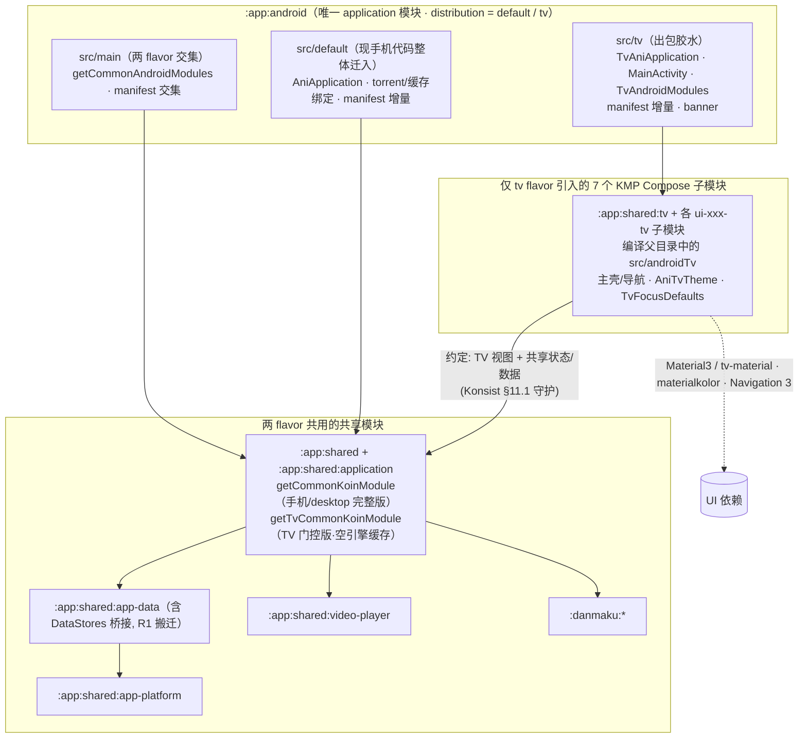

# Animeko Android TV 客户端架构设计

|             |                                                                                                                                                                            |
|-------------|----------------------------------------------------------------------------------------------------------------------------------------------------------------------------|
| 状态          | 实施中：工程骨架已落地，看番主链路与内容页已有实现，功能补齐和验收仍在进行                                                                                                                                      |
| 设计日期 / 最近核对 | 2026-08-01 / **2026-09-07**                                                                                                                                                |
| 核对基线        | 当前分支 `tv/m0-bootstrap-and-flavor`，提交 `e358a86be019fa14c950809ab5e275197c23b6bd` + 本工作区包名调整与共享目录下的 TV 子模块拆分                                                              |
| 范围          | `:app:android` 的 `tv` flavor，定位**纯在线播放端**；手机 APK 与 TV APK 独立安装、更新                                                                                                          |
| 交互参考        | [PR#3217](https://github.com/open-ani/animeko/pull/3217) 与设计镜像 [「Animeko TV」](https://claude.ai/design/2a3b7d37-075a-400b-bedb-ef2072b6caf3)；后续裁定见 §14，探索页已演进为 Prime 风格 v5 |
| 当前技术栈       | Kotlin 2.4.10 / AGP 9.1.1 / CMP 1.11.1 / minSdk 27 / compileSdk、targetSdk 37；Material3 + 存量 tv-material 1.1.0，Navigation 3、Sketch、mediamp 0.3.2                            |

> **阅读口径
**：根据当前分支源码、测试定义与 CI 配置核对，TV 文件位于共享模块的 `src/androidTv` / `src/androidTvTest`，由各模块下的 `tv` KMP Compose 子模块编译。此前 MVI 重构和播放器迭代已有本地 Android 16 / API 36 TV 模拟器回归，迁移后的构建、测试和启动导航验证也记录在 §12.2。正文区分「代码已实现」「待实现/待接线」「待验收」；历史验收不等同当前提交的完整设备矩阵通过。§12 是进度总表，§14 是开发约束；尚未实施的设计明确标为待办。

---

## 1. 目标与非目标

### 1.1 目标

1. **独立 TV APK**：在既有 `distribution` 维度增加与 `default` 平级的 `tv` flavor，applicationId 为
   `me.him188.ani.leanback`，提供 Leanback 启动器入口。
2. **独立 TV 视图层**：页面与组件位于
   `app/shared` 各模块的 `src/androidTv`。当前以 Material3 + Compose foundation 为主，保留 tv-material 组件；统一焦点调度、记忆和网格协议位于
   `ui-foundation/src/androidTv`。
3. **复用状态、领域和数据层
   **：各业务页面由 TV ViewModel 接收 Intent、提供只读状态；探索、追番、时间表、登录适配共享 ViewModel，详情复用共享状态工厂/加载器。视频画面、弹幕渲染及在线取源复用共享模块。
4. **遥控器完成核心流程
   **：探索/搜索/追番/时间表 → 详情 → 在线播放；逐层返回、焦点恢复、选集与选源已有实现，详细交互和验收缺口见 §7/§8/§12。
5. **手机端行为不回退
   **：保留手机 flavor 名、构建任务与产物路径。R1/R2 已完成；后续允许为状态复用重构共享层，但须同步适配消费者并回归，不能把「仅 M0 可改共享代码」作为现行限制。

### 1.2 非目标（明确裁剪）

**TV 定位为纯在线播放端**，下列能力不列入当前产品路线图：

| 裁剪能力                   | 当前落点                                                                                                                           |
|------------------------|--------------------------------------------------------------------------------------------------------------------------------|
| **视频离线缓存/下载系统**        | `getDisabledMediaCacheKoinModule()` 仍实例化 `MediaCacheManagerImpl`，但存储列表为空；不装配下载器与缓存引擎，无缓存页面。这里不包括图片、元数据、DataStore 等正常持久化        |
| **BT 源播放**             | torrent 平台绑定留在 `src/default`；TV 解析器没有 torrent/offline 链路，候选弹窗仅列 WEB；共享 classpath 仍可包含 torrent 符号                               |
| **发送评论**               | 详情页与播放器评论只读；当前 `CommonKoinModule` 没有 `TurnstileState` 绑定。Web 源解析必需的 `CaptchaBrowserFactory`/`ImageCaptchaRecognizer` 则已在 TV 注册 |
| **Bangumi OAuth 网页授权** | 没有 OAuth 回调清单或 TV 授权界面；仅邮箱 OTP 登录。手机端账号绑定后的服务端同步需在 TV 验收                                                                       |
| **编辑个人资料**             | TV 没有编辑入口；侧边栏显示账号头像/昵称，点击进入登录页，尚无独立账号管理页                                                                                       |

**架构边界**：

- TV 不引入共享手机页面的变体插槽，不直接复用手机页面 Composable；允许共享状态与白名单基建。
- 手机和 TV 共用原有 Android 库；TV 子模块与 `tv-material` 仅由应用的 `tv` flavor 引入，手机不引入它们。TV 仍可访问共享手机 UI，其访问边界由 import 约定、Konsist 和 DI 门控维护。Firebase/GMS 有单独的 TV classpath 排除。
- 不使用旧 Leanback UI 控件；Leanback launcher 的 manifest 声明仍然需要。
- 当前已有自建 `TvFocusScope`/
  `TvFocusMemory`/网格与长按原语，底层使用 Compose 焦点 API；早期「全部以官方组件替代」的设想已被实施修正。
- 一起看已通过 TV 专用状态与面板接入共享房间管理和播放同步；屏保、主屏频道尚未接线，应用内更新按维护者指示暂缓。

---

## 2. 当前架构速览

### 2.1 分层

`app/android` 是出包层，`src/main` 提供 Android 交集，`src/default` 与 `src/tv`
各自提供入口与平台绑定。原有 10 个独立 TV UI 库按功能整理到 **7 个现有 KMP 模块目录下**：
`:app:shared` 负责主壳，foundation、exploration、subject、episode、onboarding、settings
六个共享 UI 模块承载各功能的 `src/androidTv/kotlin`（§4.1）。

每处目录下新增一个 TV KMP Compose 子模块，功能模块位于 `ui-xxx/tv`，主壳位于 `shared-tv`，
均依赖原 KMP 模块，并编译其 TV 目录。
原 KMP 库不编译 TV 文件，TV 专用依赖也只加入子模块。应用通过 `tvImplementation(projects.app.shared.tv)`
引入 TV 主壳和各功能子模块；手机、desktop、iOS 不引入 TV 代码与专用依赖。
应用同时注册 `default` 与 `tv` 两个 flavor，可在同一次 Gradle 调用中构建两个 APK，无需构建开关。

### 2.2 当前代码事实与入口

| 主题       | 当前实现                                                                                                                                                     | 代码入口                                                                                                         |
|----------|----------------------------------------------------------------------------------------------------------------------------------------------------------|--------------------------------------------------------------------------------------------------------------|
| 构建约定     | 应用使用 `ani.android-application`；共享 UI 使用 `ani.kmp-compose`；TV 子模块同样使用 `ani.kmp-compose`，编译父目录下的 TV 文件                                | `app/android/build.gradle.kts`、`app/shared/**/tv/build.gradle.kts`、`build-logic/src/main/kotlin/`                                                |
| Compose  | CMP 1.11.1 + `kotlin.plugin.compose`，TV 同时使用 Material3 与 tv-material 1.1.0                                                                               | `gradle/libs.versions.toml`、`ui-foundation/src/androidTv`                                                               |
| DI       | `getCommonKoinModule` / `getTvCommonKoinModule` 共用核心装配，缓存模块分流；`SubjectDetailsStateFactory` 被 TV 复用的详情 VM 实际使用                                            | `app/shared/application/src/commonMain/kotlin/platform/CommonKoinModule.kt`                                  |
| 页面 VM 创建 | `TvAniAppContent` 统一通过 `tvViewModel { TvXxxViewModel(...) }` 显式构建 10 个 TV VM（含应用作用域的一起看 VM）；Koin 不注册 VM，`Tv*Route` 接收实例并收集状态，`Tv*Screen` 只渲染状态并发送 Intent | `app/shared/src/androidTv/kotlin/ui/main/TvAniAppContent.kt`、各 `Tv*Route.kt`                                                     |
| 导航       | Navigation 3：`rememberAniBackStack` / `AniNavigator.setBackStack` / `NavDisplay`；只注册 Main、SubjectDetail、EpisodeDetail                                    | `app/shared/src/androidTv/kotlin/ui/main/TvAniAppContent.kt`                                                                     |
| 播放       | TV 自建 `TvEpisodeViewModel`，复用 `EpisodeFetchSelectPlayState` 与扩展；Android 画面仍是 ExoPlayer + libass                                                          | `ui-episode/src/androidTv/kotlin/ui/episode/TvEpisodeViewModel.kt`、`src/main/kotlin/CommonAndroidModules.kt`                          |
| 图片       | 已迁移到 Sketch 4.6.0：`MainActivity` 提供 `LocalSketch`，页面继续使用共享 `AsyncImage`                                                                                  | `src/tv/kotlin/MainActivity.kt`、共享 `ui-foundation/.../AsyncImage.kt`                                         |
| TMDB/简介  | `TmdbImageService`、`TmdbEpisodeMatcher`、`BangumiSummaryService`、`StaleRefreshGate` 已存在；探索与详情已消费部分能力                                                      | `app/shared/app-data/src/commonMain/kotlin/data/network/`                                                    |
| 文案       | 可以复用 `app-lang`，但当前 TV 页面仍有大量中文字符串常量，不能视为 TV 多语言整理已完成                                                                                                    | `app/shared/**/src/androidTv/`                                                                              |
| 清单       | 三层拆分已落地；TV 无 torrent 服务，但交集保留禁用的 `AppLocalesMetadataHolderService`，不能写作「无任何 service」                                                                     | `app/android/src/{main,default,tv}/AndroidManifest.xml`                                                      |
| 发布       | 双包构建、TV workflow artifact 与 `uploadAndroidTvApk` 配置均在；本次未核验远端发布运行结果                                                                                      | `.github/workflows/src.main.kts`、`ci-helper/build.gradle.kts`、`build-logic/src/main/kotlin/ciHelperTasks.kt` |

### 2.3 PR#3217 的继承边界

继承 UI/UX 参考与可改造的低层基建；页面代码自行实现，不合入 PR 的共享页面变体架构。当前已按维护者裁定调整部分设计：探索页采用 Prime 风格，时间表复刻共享手机 Medium 档的多列布局，焦点协议统一封装。原 PR 的长按收藏、评分、完整播放器 DETAILS 等设计仍可作为后续参考，不能因此标为已实现。

---

## 3. 方案总览

### 3.1 核心决策

| #  | 决策           | 当前结论                                                                                                                |
|----|--------------|---------------------------------------------------------------------------------------------------------------------|
| D1 | 双 APK / 模块边界 | `distribution = default / tv`；TV 文件位于共享模块的 `src/androidTv` 目录，由各自的 `tv` 子模块编译。手机不引入 TV 子模块，TV 可访问共享 Android 库；双包可同次构建，TV 额外排除 Firebase/GMS |
| D2 | UI / 焦点技术    | Material3 + 存量 tv-material 1.1.0 + 标准 foundation lazy；使用统一事件驱动 `TvFocusScope`，滚动采用显式 `BringIntoViewSpec`            |
| D3 | 状态复用         | 优先复用共享 VM/状态对象；搜索、设置、播放保留 TV VM。视图层独立，禁止借白名单直接复用手机页面                                                                |
| D4 | DI           | 共享核心 + flavor 缓存门控。TV 使用空存储 `MediaCacheManagerImpl`，不注册下载器/缓存引擎/torrent 平台绑定；详情状态工厂已被 TV 使用，当前无 `TurnstileState` 绑定 |
| D5 | 导航           | 复用 `AniNavigator` / `NavRoutes` 的 Navigation 3 back stack；三个路由入口，六种主壳内容。深链只有 manifest 声明，Activity 解析待接              |
| D6 | 主题           | `AniTvTheme(seedColor)` 固定深色、非 AMOLED，默认 `#4F378B`；materialkolor 生成配色并同时提供两套 MaterialTheme。未订阅 `ThemeSettings`      |
| D7 | 焦点视觉         | `TvFocusDefaults` 集中定义 2.5dp 描边、3dp 间隙、11dp 圆角、无缩放；Hero 按钮和播放器控件使用各自反色样式                                            |
| D8 | 应用内更新        | 按维护者指示暂缓；当前只显示版本，没有更新按钮、安装器或 Release 二维码。服务端 `android-tv` 支持属于恢复开发的前置条件                                             |
| D9 | 产品范围         | 纯在线播放端；裁剪视频离线缓存、BT、评论发送、网页 OAuth 与资料编辑；共享底层依赖仍在，不能把运行时裁剪等同包体依赖已移除                                                   |

### 3.2 总体架构



手机端感知面：① `:app:shared:application` 的
`getCommonKoinModule` 内部重构为「核心 + 缓存模块」组合（对外签名与行为不变，desktop/iOS 零感知），并新增 TV 门控入口
`getTvCommonKoinModule`；② `:app:android` 现有 `src/main` 整体迁入 `src/default`，交集上提回
`src/main` 并做 manifest 分层。这是 M0 的重构范围；任务名与产物路径保留。后续共享状态层也有重构，手机行为不回退仍需持续回归（§14.3）。

---

## 4. 模块设计

### 4.1 模块与源码布局

以下共享模块继续使用 `ani.kmp-compose`，功能模块在 `tv/build.gradle.kts` 注册 `ui-xxx-tv` KMP Compose 子模块，
主壳模块 `:app:shared:tv` 则位于 `app/shared/shared-tv/build.gradle.kts`。
子模块同样使用 `ani.kmp-compose`，将 `../src/androidTv/kotlin` 加入自己的 `androidMain`，
将 `../src/androidTvTest/kotlin` 加入自己的 `androidHostTest`；父 KMP 模块不编译这两个目录：

| 目录所属共享模块（各有独立 TV 子模块） | androidTv 内容 |
|----------|----------------|
| `:app:shared` | `TvAniAppContent`、主壳/导航、VM 装配、应用依赖与架构守护测试 |
| `ui-foundation` | 双主题、焦点框架、锚点、侧栏、卡片、输入框与进度条 |
| `ui-exploration` | 探索、搜索、时间表 |
| `ui-subject` | 详情、人物/关联/评价卡片、追番分类网格 |
| `ui-episode` | 播放 VM、控制层、弹幕、选集、选源与设置面板 |
| `ui-onboarding` | TV 邮箱 OTP 登录 |
| `ui-settings` | TV 设置子集 |

`androidTv` 和 `androidTvTest` 是目录名，不是 KMP target 或 KotlinSourceSet。
源码包名为 `me.him188.ani.leanback.ui.*`。每个 TV 子模块依赖原 KMP 模块，访问其公开 API，
不能访问原模块的 `internal` 声明。原模块的 `androidMain` 继续提供两端需要的 Android `actual` 实现。
六个功能子模块的 namespace 为 `me.him188.ani.app.leanback.ui.<feature>`，主壳 namespace 为 `me.him188.ani.leanback`。
`tv-material` 位于 `:app:shared:ui-foundation-tv`，TV 测试依赖位于对应子模块的 `androidHostTest`，JUnit 和 Compose 配置由约定插件提供。
共享 `ExplorationPageViewModel` 已下移到 `ui-exploration/commonMain`，避免功能模块反向依赖 `:app:shared`。

应用继续依赖 `:app:shared`，并通过 `tvImplementation(projects.app.shared.tv)` 仅向 TV flavor
加入主壳子模块；主壳依赖其余六个 TV 子模块。父 KMP 模块不反向依赖 TV 子模块，避免循环依赖。

| 应用源集 | 当前内容 |
|----------|----------|
| `src/main` | 通用平台绑定、清单与 FileProvider |
| `src/default` | 手机 Application/Activity、torrent/缓存/更新绑定与手机清单 |
| `src/tv` | `TvAniApplication`、`MainActivity`、`TvAndroidModules`、Leanback 清单与 banner |

### 4.2 约定边界（import 规则，非依赖隔离）

| TV 代码引用                                                     | 规则 / 当前守护                                 |
|-------------------------------------------------------------|-------------------------------------------|
| Material3、tv-material、Compose foundation、Navigation 3       | 允许；Material3 禁令已删除，主题同时提供两套               |
| app-data / app-platform / app-lang / video-player / danmaku | 复用领域、数据和基建                                |
| `me.him188.ani.app.ui.*`                                    | 只允许共享状态与批准的基建，不直接调用手机页面 Composable        |
| torrent / 视频缓存具体引擎与存储                                       | TV 不直接引用；装配通过空缓存门控，Konsist 检查三个包前缀（§11.1） |

**当前白名单事实**：`TvArchitectureTest.uiFoundationInfraAllowList` 允许 `AsyncImage`、`LocalSketch`、
`rememberAniSketchInstance`、`AbstractViewModel`、Toast 等基建，以及探索/登录/时间表/追番/详情/评论等共享状态。现有测试采用
`startsWith`，部分条目是**包前缀
**，并不检查被导入符号是否为 Composable。因此，「禁止手机页面」仍须 review 配合；不能声称测试已逐类精确放行或已机械保证白名单包中没有页面调用。新增放行要求仍见 §14.3。

TV 不装配 torrent 平台绑定、缓存引擎与 `HttpDownloader`，但会实例化空存储的 `MediaCacheManagerImpl`。
`SubjectDetailsStateFactory` 也会因复用详情 VM 被实际解析，不能继续写作「所有共享 UI 状态绑定都惰性闲置」。

### 4.3 已完成的重构与共享层扩充

**R1 — 装配分流已完成**：

- `getCommonKoinModule` 使用共享核心 + `getMediaCacheKoinModule`；TV 使用核心 +
  `getDisabledMediaCacheKoinModule`。
- 空缓存模块绑定 `MediaCacheManagerImpl(storagesIncludingDisabled = emptyList())`，保留公共注入点；启动时
  `HttpDownloader` 不存在则跳过初始化，缓存恢复遍历为空。
- `Context.dataStores` 和平台 SettingsStore 桥接已归位 `app-data`；正常图片/元数据缓存不在视频离线缓存的裁剪范围内。

**R2 — Android 源集和清单分层已完成**：

| 位置            | 当前绑定                                                                                                     |
|---------------|----------------------------------------------------------------------------------------------------------|
| `src/main`    | `PermissionManager`、`HlsPlaybackPreparer`、ExoPlayer + libass 的 `MediampPlayerFactory` / surface provider |
| `src/default` | 手机应用和 Activity；torrent、下载/缓存、完整解析器、浏览器、更新安装、外部内容提供器等                                                     |
| `src/tv`      | `NoopBrowserNavigator`、TV `AppTerminator`、LocalFile/HttpStreaming/AndroidWeb 解析器、验证码浏览器与 ONNX 图片验证码识别器   |

TV Toast 已在 `MainActivity` 中实现并通过 `LocalToaster` 提供，不是待补的 Koin 绑定。
`UpdateInstaller` 仍未注册。

**R3 — 数据能力已落地，消费范围仍有差异**：

`TmdbImageService`、`TmdbEpisodeMatcher`、`BangumiSummaryService`、`StaleRefreshGate` 均已位于
`app-data`，TMDB/简介服务已注册到公共 Koin。探索使用横图和简介兜底，详情使用横图和分集剧照；播放器选集条也已接入分集剧照。共享
`SubjectDetailsStateLoader` 等状态层也已为复用调整，因此后续改动并非全部局限于 TV 目录。

M0 旧记录称手机合并清单与基线 78 个元素语义等价；这是历史验收记录。当前源码核对只能确认结构与配置，手机行为不回退和完整 APK 构建仍应按 §11/§14 回归。

### 4.4 当前目录结构

```text
app/
├── android/src/
│   ├── main/                 # 交集平台绑定与清单
│   ├── default/              # 手机入口与平台绑定
│   └── tv/                   # TV 入口、平台绑定、清单与资源
└── shared/
    ├── shared-tv/build.gradle.kts # :app:shared:tv 主壳，依赖原 shared 与各 ui-xxx-tv 子模块
    ├── src/androidTv/kotlin/ui/{main,di}/
    ├── src/androidTvTest/kotlin/ui/main/
    ├── ui-foundation/src/androidTv/kotlin/ui/foundation/
    ├── ui-exploration/src/androidTv/kotlin/ui/{exploration,search,schedule}/
    ├── ui-subject/src/androidTv/kotlin/ui/{subject,collection}/
    ├── ui-episode/src/androidTv/kotlin/ui/episode/
    ├── ui-onboarding/src/androidTv/kotlin/ui/login/
    └── ui-settings/src/androidTv/kotlin/ui/settings/
```

六个 `ui-*` 目录下也各有 `tv/build.gradle.kts`，依赖各自原 KMP 模块，编译同级的 TV 目录。
foundation、subject、episode 还各有 `src/androidTvTest/kotlin`，由对应子模块的 `androidHostTest` 编译。
原有 common/android/desktop/iOS 源集继续保留；TV 包名与手机包名独立，移动目录不改变页面职责与 MVI 边界。

### 4.5 方案演进史与备选记录

工程架构经历前三轮收敛，随后在其上迭代视图与焦点实现：

| 版本             | 方案                                                                                                                                                                                              | 结局                                                           |
|----------------|-------------------------------------------------------------------------------------------------------------------------------------------------------------------------------------------------|--------------------------------------------------------------|
| v1             | 独立 `:app:tv:application` 模块出包                                                                                                                                                                   | 不采用——双 application 模块 + 版本/签名台账重复；对比记录见 D1                   |
| v2             | flavor 出包 + **编译期隔离**：`:app:shared:app-bootstrap` 无 UI 装配模块 + `defaultImplementation`/`tvImplementation` 依赖收窄 + TV UI 独立库模块（`:app:tv:ui*`）。曾完整实施并通过验收                                           | 按维护者决策回退——判断「TV 不调用手机 UI」用约定约束即可，不值得为编译期强制付出 3 个新模块与更复杂的依赖拓扑 |
| **v3（历史工程边界）** | flavor 出包 + **约定边界**：两 flavor 共享完整依赖树（不收窄），差异收敛为 DI 门控（`getTvCommonKoinModule`）+ manifest 分层 + Konsist；TV UI 保持模块化——库模块置于 `app/android/` 下、`ui-<feature>-tv` 命名（叶名独立免坐标冲突），`src/tv` 只留出包胶水 | DI/约定边界保留，模块布局已由 §4.1 的 KMP 合并方案替代                                                |

v4 在 v3 工程边界上引入 Material3 双主题、共享状态复用与统一焦点框架；焦点实现随后改为全事件驱动。v5 更新探索页与布局锚点，不改变 flavor/模块边界。

v2→v3 保留下来的实施资产：缓存/BT 的装配级开关（v2 证明「不用就行」对被注入的基础设施不成立）、manifest 三层分治、
`DataStores` 归位 app-data、tv classpath 的 firebase 剔除。若未来需要更硬的隔离（如 TV 包体成为问题），沿 v2 路线重新收窄依赖即可，装配开关无需改动。

---

## 5. TV UI 技术栈

### 5.1 依赖与版本

当前 `gradle/libs.versions.toml` 中 TV 依赖为：

```toml
androidx-tv-material = { module = "androidx.tv:tv-material", version = "1.1.0" }
```

Material3 通过共享 UI 基建等依赖可用；列表使用标准 `LazyColumn`/`LazyRow`/`LazyVerticalGrid`，没有引入
`tv-foundation`。主壳使用 Navigation 3 runtime/UI 1.1.1 与 ViewModel navigation3 decorator。TV 所在共享模块的注册见
`settings.gradle.kts`，并非只注册 foundation/main 两个骨架模块。

### 5.2 当前组件映射

| UI 元素      | 当前实现                                                                                   |
|------------|----------------------------------------------------------------------------------------|
| 左侧展开导航     | 自建 `TvNavigationSideRail`，焦点进入展开、离开收起；不是 tv-material `NavigationDrawer`                |
| 探索 Hero 轮播 | `TvExplorationScreen` 管理下标和 6s 定时，`TvExplorationHero` 自绘指示器；不是官方 `Carousel`            |
| 海报/横图卡     | `TvPosterCard`、`TvLandscapeCard`，自绘聚焦环，标题跑马灯与记忆 ID                                     |
| Hero 操作按钮  | `TvHeroButton`，Material3 Surface + 聚焦反色                                                |
| 追番分类       | tv-material `TabRow`/`Tab`，聚焦即选中，分类数量角标                                                |
| 时间表        | 多天固定宽列 + 日期列头 + 各列独立时间线，无日期胶囊 TabRow                                                   |
| 设置项        | tv-material `ListItem`；当前仅四个开关和版本/占位项                                                  |
| 播放器控制/选源   | tv-material Surface 等组件 + 自绘控制布局；选源是页面内模态遮罩，焦点限定在列表内                                   |
| 详情简介弹窗     | Material3 `AlertDialog` + `TextButton`，尚未抽成通用 TV 对话框                                   |
| 滚动/恢复      | 显式 `BringIntoViewSpec` + `TvFocusScope` / `TvFocusMemory`；不使用 `focusRestorer` 作为当前恢复协议 |

### 5.3 通用件：已实现与待实现

| 能力                                    | 当前状态                                                                                  |
|---------------------------------------|---------------------------------------------------------------------------------------|
| `TvTextField`                         | 已有 BasicTextField + tv Surface，用于 OTP 登录；搜索页内另有相似的 `TvSearchField`，锚点直接挂内层输入框         |
| `TvSeekBar`                           | 已有 6dp 轨道、缓冲/已播分色、聚焦圆点及预览时间；按键处理在播放器根节点                                               |
| Toast                                 | `MainActivity` 使用原生 Android Toast 实现 `Toaster`，provide `LocalToaster`；无 `TvToastHost` |
| `TvScreenScaffold`                    | 工具函数存在，但当前页面使用各自的 `*PageLayout`，未统一调用它                                                |
| `TvSlider`                            | 未实现；弹幕高级参数/时间校准等遥控器步进输入仍待开发                                                           |
| `TvCenteredDialog` / `TvDropdownMenu` | 未实现；收藏管理、评分、搜索筛选等待办可据需要抽取。不能沿用延迟 300ms 送焦的旧方案（§14.4）                                  |

### 5.4 当前焦点与按键协议

| 问题域            | 当前实现 / 范围                                                                                              |
|----------------|--------------------------------------------------------------------------------------------------------|
| 程序化送焦          | `TvFocusScope.request(key)` + `Resolver()`，通过锚点附着和快照事件解析；没有轮询、帧等待或超时                                   |
| 页面/区域定向移动      | `tvFocusLink`、`tvFocusEnterGate`、`tvFocusExit`；跨大间距区域显式声明                                              |
| Lazy 网格目标与边缘切换 | `TvFocusGrid.kt`：等数据与布局 → 滚动使目标组合 → 请求动态锚点；追番跨分类已接入                                                    |
| 同页/跨路由恢复       | `TvFocusMemory` + `tvFocusMemorable(id)`；主壳记忆放在 `NavDisplay` 之上，识别返回后的目标 ID，用户操作可取消迟到恢复                |
| 锚定滚动           | `TvAnchoredBringIntoViewSpec`：聚焦项前缘对齐容器前缘 + 动态预留；探索页按行布局顶边 + 32dp，详情按区块顶边/选集卡底边                                      |
| 长按             | `TvKeys.kt` 已有 `tvLongPressKey` 与 `consumeHeldConfirmKey`；列表页尚未调用它们实现收藏菜单。播放器用自己的 `ConfirmHoldTracker` |
| 长按判定           | 系统首个自动重复 KeyDown 触发（通常约 400–500ms）；不是应用定时器保证精确 500ms                                                   |
| 返回键            | 各页面用 `BackHandler` 分层；播放器按键在根 `onPreviewKeyEvent` 收口                                                   |

### 5.4.1 统一焦点框架 `TvFocusScope`

框架文件：`TvFocusScope.kt`、`TvFocusModifiers.kt`、`TvFocusMemory.kt`、`TvFocusGrid.kt`，均位于
`ui-foundation/src/androidTv/kotlin/ui/foundation/focus`。

| API / 状态                             | 当前语义                                                  |
|--------------------------------------|-------------------------------------------------------|
| `TvFocusKey`                         | 页面私有 enum 或具名 key；列表可使用带身份的 key                       |
| `tvFocusAnchor(scope, key)`          | 挂 requester，并报告节点附着/脱离和焦点得失                           |
| `request(key)` + `Resolver()`        | 后发覆盖先发；目标已附着时尝试一次，成功才清 pending，失败等下一次附着/换代事件；成功后不追抢   |
| `tvFocusNavSignal` / `tvFocusHotkey` | 用户方向/确认键取消在途请求；主壳另用 `tvFocusHotkeyToggle` 实现菜单键往返     |
| `InitialFocus(key)`                  | 等 Lifecycle RESUMED，再优先处理跨 route 记忆，否则请求默认锚点；没有固定延迟   |
| `TvGridFocusState`                   | 等目标网格数据/列数，按同行近缘列计算落点并钳到末项；目标聚焦、用户操作或确认空数据时结束 pending |
| `TvFocusMemory`                      | 跨 route 目标认领、激活、迟到恢复、用户取消集中在一个协议内；无 ID 的组件只参与同页恢复     |

触屏设备运行 TV 壳时，`TvMainShell` 主动请求
`InputMode.Keyboard`。焦点框架已被页面使用，但各页接入深度不同：搜索/时间表仍有不少系统空间导航，详情滚动策略是页内实现，不能把框架存在等同所有页面交互已验收。

### 5.5 主题系统 `AniTvTheme`

当前签名为 `AniTvTheme(seedColor: Color = AniTvThemeDefaults.SeedColor, content)`：

- 默认种子色 `#4F378B`，`dynamicColorScheme(isDark = true, isAmoled = false, style = TonalSpot)`。
- 外层提供 Material3 MaterialTheme，内层提供经
  `toTvColorScheme()` 映射的 tv-material MaterialTheme。两套主题**有意共存**。
- `MainActivity` 调用默认主题，没有订阅
  `SettingsRepository.themeSettings`；主题编辑、跟随系统/用户选择、独立 TV 字体刻度仍未实现。
- 焦点尺寸集中于 `TvFocusDefaults`；Hero/backdrop、侧栏、海报与横图卡参数放在相应 `*Defaults` 对象。没有独立
  `TvColors.kt` 或 `AniTvTypography`。

### 5.6 其余基建复用方式

| 能力       | 当前方式                                                                                                                                |
|----------|-------------------------------------------------------------------------------------------------------------------------------------|
| 图片       | `MainActivity` 用 `HttpClientProvider.get(ANI)` + `rememberAniSketchInstance` provide `LocalSketch`；页面调用共享 `AsyncImage`，旧 Coil 装配已失效 |
| 字符串      | 可直接复用 `stringResource(Lang.xxx)`；TV 当前大量中文常量仍需资源化，旧文档「49 个 key 已沿用」不能作为完成结论                                                         |
| 状态对象     | 共享状态通过白名单使用，视图自绘；允许的实际前缀以 `TvArchitectureTest` 为准                                                                                   |
| backdrop | `TvImmersiveCards.kt` 内的渐隐函数与 `TvBackdropDefaults`，探索页再按双态高度和防抖控制                                                                   |
| 错误呈现     | 页面各自实现：时间表/详情有重试，登录有错误文案；搜索和选源空列表尚不能完整区分加载、失败与真正无结果                                                                                 |

---

## 6. 应用骨架

### 6.1 进程与启动

`TvAniApplication.onCreate` 初始化日志与根协程域，依次装配：

1. `getTvCommonKoinModule`：共享核心 + 空视频缓存存储。
2. `getCommonAndroidModules`：共享 Android 权限/HLS/播放器工厂。
3. `getTvAndroidModules`：Web 解析、验证码、Noop 浏览器与 TV 退出实现。
4. `startCommonKoinModule`：启动共享后台任务；没有 HTTP 下载器，缓存恢复为空。
5. 异步将 TV 独立 DataStore 的 `mediaSelectorSettings.preferKind` 写为 `WEB`。

Koin 仅装配业务与平台依赖，不注册 TV ViewModel；VM 的统一构建入口为 `TvAniAppContent`。

TV 不启动 torrent 服务连接，不初始化 Sentry/Firebase。`SubjectDetailsStateFactory` 会被详情页实际注入；旧注释提到的
`TurnstileState` 当前没有对应绑定。`CaptchaBrowserFactory` 和
`ImageCaptchaRecognizer` 服务于 Web 数据源解析，已注册。

### 6.2 Activity 与 Manifest

`MainActivity : AniComponentActivity`（基类在共享 application 模块），manifest 声明横屏、
`singleTask`，Activity 使用 edge-to-edge、`AniTvTheme`、Sketch 和原生 Toast。进入组合前通过
`TvAppDependencies.fromKoin` 取得 VM 所需的业务依赖，并创建图片客户端；依赖参数只交给根内容中的 VM 构造回调，页面不解析依赖、不调用仓库业务方法。

| 清单层           | 当前声明                                                                                                                                                                |
|---------------|---------------------------------------------------------------------------------------------------------------------------------------------------------------------|
| `src/main`    | INTERNET / ACCESS_NETWORK_STATE / WAKE_LOCK / REQUEST_INSTALL_PACKAGES；禁用的 `AppLocalesMetadataHolderService`、InitializationProvider、FileProvider 与通用 application 属性 |
| `src/default` | 手机 Application/Activity、torrent 服务与手机专属权限、OAuth 回调                                                                                                                  |
| `src/tv`      | 必需 Leanback、非必需触屏、TV Application/Activity、banner、LEANBACK_LAUNCHER、`ani://subjects/...` intent-filter                                                               |

应用模块 namespace 为 **`me.him188.ani.android`**；TV Kotlin 包为
`me.him188.ani.android.leanback`；TV UI 包为 `me.him188.ani.leanback.ui.*`，清单使用 `.leanback.*` 相对入口名。TV 没有 torrent 前台服务/进程，但不能写作「合并后没有任何 service」。
`tv_banner.xml` 已有 320×180 图形，黑色「あ」字形仍有 TODO，不能标为视觉全部完成。

**深链缺口**：虽然有 intent-filter，TV Activity 目前没有解析启动 Intent 或处理
`onNewIntent` 的代码；不能把系统能启动 Activity 等同已跳到条目详情。

### 6.3 导航

`TvAniAppContent` 创建 `rememberAniBackStack(NavRoutes.Main(Exploration))`，调用
`aniNavigator.setBackStack`，再用
`NavDisplay` 和保存状态/ViewModel 两个 decorator 展示页面。全部 10 个 TV VM 在这个函数内调用
`tvViewModel { ... }` 构建：一起看 VM 位于
`NavDisplay` 外，随应用界面保留房间和跟随状态；其余 VM 归属所在导航条目的
`ViewModelStore`。主壳功能 VM 在页面首次显示时创建并随主条目保留，详情/播放 VM 出栈时销毁。主壳的
当前页由 Main 条目内的 `rememberSaveable` 管理，主壳用 `SaveableStateHolder` 保留各功能页的 UI 状态。当前只注册：

| NavRoutes       | TV 落点                                                                                                                 |
|-----------------|-----------------------------------------------------------------------------------------------------------------------|
| `Main`          | `TvMainShell`；壳内保存 Search / Exploration / Schedule / Collection / Login / Settings 六种内容状态，当前未消费 Main 的 initialPage 参数 |
| `SubjectDetail` | `TvSubjectDetailsRoute` + TV VM/视图，VM 复用共享状态加载器；可跳播放页与关联条目                                                            |
| `EpisodeDetail` | `TvEpisodeViewModel` + TV 播放页；推荐面板可跳详情                                                                                |

搜索、时间表、设置、邮箱两步登录是**主壳内部内容**，没有各自独立 NavRoutes entry；
`Welcome`、缓存、OAuth 等也没有注册。当前没有首启「登录或跳过 + 主题确认」流程。
`ani://subjects/<id>` 解析仍待接入。

### 6.4 主壳 `TvMainShell`

- 自建 `TvNavigationSideRail` 浮于内容之上；头像 → 搜索 → 探索 → 时间表 → 追番 → 设置，收起宽 48dp。
- 进入侧栏优先落**当前页条目**，无选中条目才回退探索；不是固定聚焦探索。头像进入登录页。
- 菜单键在壳的内容区和侧栏之间往返；返回/右键/点击条目可恢复内容焦点，使用 `TvFocusMemory`。
- 菜单快捷键挂在**主壳**，独立的详情/播放 route 没有同一侧栏，不能称为全应用任意页面都可召出。
- 壳内换页用淡入淡出；换页清除旧焦点记忆。非探索内容返回探索，探索返回交给系统；页内返回先由对应 BackHandler 消费。

---

## 7. 页面架构

以下为**当前代码实现**，待开发的原设计另列。各业务页面均使用 `TvAniAppContent` 统一构建的
`TvXxxViewModel`；`TvXxxRoute(viewModel, ...)` 接收实例并完成生命周期/状态/导航接线，再传给
`TvXxxScreen(state, onIntent)` → 页面私有
`*PageLayout` → 区块/卡片组件。基础组件仍使用数据和回调，不为纯焦点/布局行为创建 VM。

| 页面           | 当前状态来源                                                                                                          |
|--------------|-----------------------------------------------------------------------------------------------------------------|
| 探索           | `TvExplorationViewModel` 适配共享探索 VM；媒体缓存和防抖/去重/并发加载在 TV VM 中，向视图暴露只读 `TvSubjectMediaUiState`                     |
| 时间表          | `TvScheduleViewModel` 适配共享 `ScheduleViewModel`；视图使用可保存的 `LazyListState` 保留横向及列内位置                               |
| 追番           | `TvCollectionViewModel` 适配共享 VM/状态；分类切换与边界判断走 Intent，分页复用；各分类网格位置由 UI 的 rememberLazyGridState 保存                                             |
| 详情           | `TvSubjectDetailsViewModel` 复用 `SubjectDetailsStateFactory` / `SubjectDetailsStateLoader`；VM 聚合只读展示状态并决定续播与图片加载 |
| 登录           | `TvLoginViewModel` 适配共享 `EmailLoginViewModel`；TV 步骤、请求忙碌态、倒计时、错误与导航结果由 VM 管理                                    |
| 搜索 / 设置 / 播放 | `TvSearchViewModel` / `TvSettingsViewModel` / `TvEpisodeViewModel`                                              |

### 7.1 探索页 `TvExplorationScreen`

| 维度                       | 设计                                                                                                                                                                                                                                                                                                                                                                                                                      |
|--------------------------|-------------------------------------------------------------------------------------------------------------------------------------------------------------------------------------------------------------------------------------------------------------------------------------------------------------------------------------------------------------------------------------------------------------------------|
| 数据                       | 共享 `ExplorationPageState` 的趋势/继续观看/推荐 pager；`TvExplorationViewModel` 在 `ShowHero`/`CardVisible` Intent 后加载条目信息/横图/空简介兜底，Hero 与卡片请求去重，横图并发上限 3；视图不持有仓库或加载器                                                                                                                                                                                                                                                               |
| 结构（v5，对齐 Prime Video 实测） | 根 `Box`：**backdrop 在页面根层（surface 背景级）**，16:9 贴右上，高度 = 屏高 ×（hero 两态比例 + 下探 0.10），左缘渐隐终点 0.42（不压简介文字），渐隐尾部延伸到卡片行下方；其上 `Column`：**常驻 hero**（左侧与列表共用 16dp 额外留白；高度两态插值 250ms：展开 0.66 / 收缩 0.46）+ 纵向行列表 `LazyColumn`（weight 1，底部留整屏 padding 让末行也能锚到顶）。行 = [行头 32dp]（仅有标题的行）+ 内容：「继续观看」为横向锚定 `LazyRow`；「为你推荐」为纵向自适应网格（列数按可用宽算、行内 weight 等分、尾行 Spacer 占位，仅首行带行头）。卡片统一 16:9 `TvLandscapeCard`（192dp、间距 16dp、TMDB backdrop w780，缺图退化海报裁切、卡内底部渐变叠标题） |
| hero 双态                  | 焦点在 hero → 展开：最高热度轮播条目 + 「更多详细内容」按钮 + 指示器**在整个 hero 底部水平居中**；焦点在卡片行 → 收缩：展示聚焦条目信息。**按钮/指示器的出现与消失就是 hero 高度动画本身**（高度与透明度跟随同一条插值进度，不另起淡入淡出）。文字即时切换，**backdrop 目标防抖 500ms** 再 crossfade（Prime 实测：快速划过卡片不闪图）                                                                                                                                                                                                                |
| 锚定滚动                     | **焦点卡顶边距列表上边界 32dp**：列的 `TvExplorationBringIntoViewSpec` 与详情页同样按布局边缘锚定，以可见行 offset + 行头高度计算卡片顶边，标题行与续行统一预留 32dp；继续观看横向行保留行首锚定。列表上下各 24dp 渐隐，分别随可向上/下滚动启用，透出原有 backdrop，避开聚焦描边；纯焦点事件驱动。继续观看行 `rememberSaveable` 横向位置（跨 route 返回后目标卡仍在组合中，焦点记忆可恢复）                                                                                                                                                                                   |
| 按键                       | hero 上 ←→ 切轮播；↓ 显式送焦行 0；继续观看行内 → 直接送焦下一张，← 先滚行让前一张重新组合再送焦（锚定后前一张已滚出组合，空间搜索找不到），首卡按左放行侧边栏；网格行内 ←→ 交给空间搜索；↑/↓ 行间导航一律显式：目标行被回收时先滚动使其组合，再送焦并由 BringIntoView 锚定（网格保持同列、继续观看回记住的卡；悬挂到锚点附着）；行 0 按上回 hero 按钮；确认 → 详情                                                                                                                                                                                                                                    |
| 状态                       | 行结构变化（Paging 后到的继续观看插首行）时 hero 聚焦态下列表滚回顶（LazyColumn 按 key 保位会把新首行藏在视口上方）；trending 空 → 无指示器                                                                                                                                                                                                                                                                                                                              |

继续观看卡已展示「继续 · 第 N 话 / 已看到第 N 话 / 开始观看 / 未开播 / 已看完」状态。确认卡片仍跳详情，由详情播放按钮选续播目标；未实现列表页播放键直接续播或独立播放历史页。轮播在 Hero 聚焦且静止时每 6s 前进，手动切换重置计时。

### 7.2 新番时间表 `TvScheduleScreen`

| 维度     | 当前实现                                                                                                              |
|--------|-------------------------------------------------------------------------------------------------------------------|
| 数据     | TV VM 暴露共享 `ScheduleViewModel.presentationFlow`；日期窗口与列表内容复用共享实现，横向及列内滚动位置由页面的可保存 `LazyListState` 管理               |
| 布局     | `LazyRow` 横向并排的固定 360dp 日期列，列间 16dp；列头 M/d + 星期；列内 `LazyColumn` 展示时间、56dp 封面、标题、集数、当前时间指示与占位骨架                    |
| 焦点     | 初始锚点在今天列**第一条番剧**；每张卡以条目/剧集 ID 参与焦点记忆。详情返回期间保持已保存视口，新的用户导航事件恢复 BringIntoView 滚动，避免转场临时焦点把列表滚走；跨列主要依赖 Compose 空间导航 |
| 状态     | 加载骨架、空日提示、失败文案与重试按钮已有实现                                                                                           |
| 待补/待验收 | 本轮已验证跨日浏览、详情返回原卡片与视口、返回后继续纵向滚动；长按收藏未接，空日/错误/跨列边界仍需专项回归                                                            |

旧的「15 天日期胶囊 + 当天网格 + 正交按键」方案已被 §14.5 的多列布局裁定替代，不能继续作为当前界面或未完成的必做布局。

### 7.3 搜索 `TvSearchScreen`

- `TvSearchViewModel` 直接调用
  `SubjectSearchRepository`；输入框 + 系统软键盘 Search 提交，结果为 Paging Adaptive 海报网格，点击跳详情。
- 当前是固定输入框加下方网格，没有输入态/结果态 Hero 的 500ms 过渡，也没有历史、补全、筛选弹窗。
- 初始焦点进输入框，Search 提交后主动收起系统键盘；有结果时，下键通过显式锚点进入首张卡片。卡片有记忆 ID，本轮已验证详情返回保留查询与卡片焦点；网格尚未实现旧设计的显式同列导航与「非首卡→首卡→输入态」返回链。
- 当前 `itemCount == 0` 统一显示「没有找到相关番剧」，未按 Paging LoadState 区分加载中、失败和真正无结果；加载/重试呈现仍待补。

**保留的待办设计
**：历史与 300ms 防抖补全、排序/最低评分/标签筛选及确认/取消语义；具体 TV 对话框与焦点接线需随实现补齐。

### 7.4 追番 `TvCollectionScreen`

- 共享
  `UserCollectionsViewModel/UserCollectionsState`，五分类 TabRow 在用户导航聚焦时选中并显示数量；每个分类保留分页与滚动状态，登录变化刷新由共享状态处理。页面恢复前的程序化临时焦点不触发分类切换，避免详情返回误选首分类。
- TV 展示流使用
  `WhileSubscribed`，等待 Route 在组合提交后订阅，避免后台提前读取新建 Compose snapshot 导致状态流终止。本轮已复现并修复「焦点移动但选中分类不变」，游客空态下五分类切换通过设备复测。
- 当前布局只有分类栏 + Adaptive 海报网格/空态，**没有**旧设计的 Hero、观看进度条或 560ms 横滑过渡。
- 网格边缘切相邻分类已接入
  `TvGridFocusState`：按目标网格列数落同行近缘列，越界钳到末项；切换中冻结聚焦即选中的副作用，且旧网格不能提前消费异步 Intent 对应的送焦请求。空列表判定同时等待 Paging 聚合、source 与 mediator 的 refresh 完成，避免 Room 尚在加载时错误取消送焦。
- 网格按上出区/返回回**当前分类**，首分类左缘可交给侧栏。分类下键通过网格请求先滚动、组合首项再送焦，支持首卡已被长列表回收的情况。
- **已登录设备回归通过
  **：五分类显示 4/14/10/8/41 项，首次进入分类、同行边缘切换/末项钳位、41 项长列表、上下/返回路径、侧栏往返及详情返回原卡片与视口均已复测；详见 §12.2。登录切换瞬间的刷新和数量请求仍需单独验收。
- **未接线
  **：长按五态收藏菜单、取消追番确认与修改后焦点落相邻卡。共享状态虽有修改能力，TV 视图没有入口；观看进度呈现与修改类交互仍待补。

### 7.5 条目详情 `TvSubjectDetailsScreen`

| 维度    | 当前实现                                                                                                             |
|-------|------------------------------------------------------------------------------------------------------------------|
| 状态    | TV VM 复用共享加载器的 Placeholder / Err / Ok；`Retry` 重载详情及图片，`Resume` 优先采用共享进度目标，再回退未看/首集；UI 不选择播放目标                    |
| 信息层   | Hero 首屏含播放/加载中按钮、日期/统计/标签、评分直方图；下方为简介展开、选集、角色、Staff、作品信息、关联与只读评价                                                 |
| 图片    | TMDB backdrop + `getEpisodeStills` / `matchToEpisodes` 已接；选集卡优先分集剧照，缺图回退 backdrop/海报。backdrop 用未解析/有图/无图三态避免进页闪替 |
| 选集/简介 | 226dp 宽、16:9 剧照卡，点击播放，已看状态减淡；简介可用 Material3 AlertDialog 展开                                                       |
| 初始焦点  | 播放按钮槽位常驻；`InitialFocus` 等 RESUMED；下方区块在首次播放钮聚焦或 RESUMED 后才组合                                                     |
| 当前滚动  | Hero 顶边 = 0；第二屏区块顶边保留 64dp；选集卡**下边缘 + 64dp 对齐视口下边缘**；角色、制作人员、关联条目、评价沿用平台默认纵向滚动。内层横向列表保留行首 + 48dp 锚定              |
| 返回    | 下方区块 → 选集 → Hero → 退出；播放钮/展开简介/选集间有显式方向链接                                                                        |
| 待实现   | 收藏/其他圆钮、标签菜单、选集网格菜单、播放钮长按跳当前集、选集长按详情/标记看过、交互评分弹窗                                                                 |

当前评分块是**展示**，没有 `TvRatingDialog` 或评分提交入口。详情页和播放器选集条均已接入分集剧照，不能再笼统列为未做。

### 7.6 设置（TV 子集）`TvSettingsScreen`

当前 `TvSettingsViewModel` 可读写四个开关，但**配置保存与播放行为接线必须分开验收**：

| 设置项        | 保存配置                                    | TV 播放链路                                                |
|------------|-----------------------------------------|--------------------------------------------------------|
| 显示弹幕       | 已读写 `SettingsRepository.danmakuEnabled` | 已接：VM 订阅总开关；播放器按状态显示弹幕层，操作栏可切换并持久化                     |
| 自动连播       | 已读写 `autoPlayNext`                      | 已挂载 `SwitchNextEpisodeExtension` 并消费配置；整集自动切下一集仍待验收    |
| 自动跳过 OP/ED | 已读写 `autoSkipOpEd`                      | 已接：TV VM 合并服务端规则与媒体章节，弹出 5 秒可取消提示，返回键取消本章跳过            |
| 播放出错自动换源   | 已读写 `autoSwitchMediaOnPlayerError`      | 已挂载 `SwitchMediaOnPlayerErrorExtension` 并消费配置；异常场景仍待验收 |

已有版本信息；设置主页的数据源/代理/主题/弹幕高级设置仍是占位，但播放页已有弹幕属性、来源、时间校准和重新匹配面板。手机和 TV 配置独立存储，占位文案不代表自动同步。

**待开发范围
**：全局设置页整理、弹幕正则编辑、WEB 数据源启停排序、代理与测试、主题选择、播放历史/同步管理。播放页已提供弹幕属性步进、类型开关、来源管理和时间校准。离线缓存和 BT 设置按 §1.2 裁剪。

### 7.7 登录 `TvLoginScreen`

`TvLoginViewModel` 适配共享
`EmailLoginViewModel`，视图发送修改邮箱/验证码、发送、提交、重输邮箱 Intent。请求在 VM 作用域执行；同步获取请求互斥锁，避免遥控器/IME 重复提交；取消不转为业务错误。步骤、忙碌态、倒计时和错误由 VM 下发。成功发出一次性导航事件，主壳在 UI 中切回探索；
`TvMainViewModel` 订阅登录态更新头像/昵称。

登录步切换当前直接 `focus.request(Field)`，并非所有页面都只通过
`InitialFocus` 送焦。登录是壳内内容，不是独立 Start/Verify 路由；没有欢迎向导、独立资料管理或 OAuth 入口。登录后的跨页数据联动仍需回归。

---

## 8. 播放器详设 `TvEpisodeScreen`

### 8.1 状态编排与实际复用范围

`TvEpisodeViewModel` 显式接收条目/剧集、平台上下文、共享播放管线所需的 Koin 及仓库/服务依赖。复用
`EpisodeFetchSelectPlayState`、`EpisodeSession`、
`PlayerSession`；TV 的取源、配置、预览、跳过、收藏等决策由 Intent 进入 VM，Composable 不查询仓库或容器。

**当前挂载的 9 个扩展**：

- `PlaybackSpeedExtension`、`RememberPlayProgressExtension`、`MarkAsWatchedExtension`；
- `SwitchNextEpisodeExtension`、`SwitchMediaOnPlayerErrorExtension`；
- `AutoSelectExtension`、`SaveMediaPreferenceExtension`、`ObserveWebMediaSourcePreferenceExtension`；
- `WatchTogetherPlayerExtension`。

进度保存、自动选源、连播、出错换源和房间同步复用共享实现。TV VM 另用
`TvAutoSkipController` 处理 OP/ED 提示和取消：读取服务端规则与媒体章节，遵循播放时长、首集和跟随房主时的跳过限制。每次媒体切换重置本次取消记录；没有固定 85 秒的手动跳过按钮。下一集边界及未播出条件由
`getNextEpisode` 判断。

**WEB 取源
**：固定 WEB 初始偏好；TV 选源状态从共享会话的原始候选及排除原因生成，只展示 WEB 实例，保持简单/详细模式独立于属性筛选。解析器由 LocalFile/HttpStreaming/AndroidWeb 组成，不含 torrent/offline 链路。

**生命周期**：Route 的 `UiReady` 幂等启动扩展；VM 订阅取源冷流；页面组合
`mediaResolver.ComposeContent()` 挂载 WebView 解析器。应用进入后台暂停播放并释放按住倍速，返回前台仅恢复自动暂停的播放；VM 退出关闭会话。一起看 VM 在应用界面作用域接收房间导航事件，播放器扩展处理原地同步；跟随房主时阻止本地 seek、切集和改速。

### 8.2 当前覆盖层与按键

`TvPlayerStateMachine` 发布不可变覆盖层状态，包括控制层、药丸面板、选集条、预览、长按倍速、选源和设置弹窗。没有另设完整 DETAILS 层。

| 状态 / 键          | 当前行为                                                                    |
|-----------------|-------------------------------------------------------------------------|
| HIDDEN + 确认短按   | 切换播停；暂停时显示控制层                                                           |
| HIDDEN + 确认长按   | 首个系统连发进入配置的长按倍速，松开还原                                                    |
| HIDDEN/进度条 + 左右 | 每次移动预览点 5 秒，显示时间及可用的视频帧；不立即 seek                                        |
| 预览 + 确认 / 返回    | 提交 seek / 取消；上下也取消预览并恢复对应控制导航                                           |
| 控制层操作栏 + 上 / 下  | 上键明确回到进度条；选集按钮展开药丸上方横条并聚焦当前集，下键沿用默认焦点导航                                              |
| 菜单键（含选源阶段）      | 显示控制层、关闭选源/弹窗/面板，聚焦选源按钮                                                 |
| 选源结果 + 左右       | 简单模式左右选择同一源的线路 chip，最后一条线路再按右进入详细模式；详细模式左右切换源，首个源左键回简单模式                |
| 播放页媒体键          | PlayPause 切换，Play/Pause 幂等，Next/FF 下一集、Previous/RW 上一集                  |
| 自动隐藏            | 播放且没有预览、面板、选源或弹窗时，5 秒后隐藏                                                |
| 返回顺序            | 优先取消正在提示的自动跳过；其后弹窗/选源 → 面板 → 预览 → 选集条 → 控制层 → 退出。一起看加入中先取消请求，退出确认中先取消退出 |

播放控制按键转成 Intent，由 VM/reducer 决定播放行为并下发焦点事件；选源模式、浏览 tab、排除项显示和确认提示在 UI 内处理。UI 等覆盖层、列表和锚点附着后送焦，不使用延时或轮询补焦。文本框的上下导航显式链接到相邻输入框与提交按钮。

### 8.3 组件状态

| 部件 | 当前实现 |
|---|---|
| 视频面 | 共享 `VideoPlayer` + ExoPlayer/libass；视频 View 不参与遥控器焦点 |
| 操作栏（进度条下） | 下一集、选集、弹幕总开关、选源、倍速、字幕、比例。弹幕使用共享端的 Subtitles/SubtitlesOff 图标；选源使用 DisplaySettings，选中资源后展示源 icon |
| 药丸行（进度条上） | 收藏状态在首位，其后推荐、评论、弹幕设置、画质增强、一起看 |
| 收藏 | 下拉更改收藏状态；移除前确认，设为看过后可选择标记全部剧集；有提交忙碌态和失败反馈 |
| 倍速 | 对话框首项为单个可聚焦的三段式 row，左/右键减速/加速，中间显示当前值；圆形方向图标不参与焦点，仅响应按键动画。另有记住倍速、默认速度和长按倍速设置；范围复用全局配置 |
| 字幕 | 纵向列出播放器暴露的字幕轨道，可关闭字幕；没有轨道时明确提示 |
| 弹幕 | 总开关持久化；字号、透明度、速度、密度、显示区域、描边、字重及顶/底/滚动/彩色类型；来源启停、±500ms 校准/归零、重新搜索条目并匹配剧集。设置底部的“弹幕列表”位于“重新匹配弹幕”上方，打开独立弹窗，返回恢复入口焦点 |
| 选集 | 直接在药丸上方展开横向剧照条，初始定位当前集；TMDB 分集剧照优先、缺图回退。长按打开播放/标记看过或未看操作，返回恢复原剧集卡片；收起横条后焦点回选集按钮 |
| 选源 | 居中窗口宽度为水平安全区的 2/3（960dp 屏幕上为 576dp），上下留出 28dp。顶部模式按钮聚焦即切换。简单模式只显示有可用线路的源，按 icon/名称分组，每组横向 chip row 仅显示线路名，末项右键进入详细模式。详细模式为源 tabrow、排除源 switch、详细结果单列；源 tab 的 leading icon 在查询中叠加环形加载动画，无结果、全排除或失败时叠加暗色遮罩。结果左右键按源层级切换，首源左键回简单模式；没有属性筛选，结果不显示包含剧集或链接 |
| 帧预览 | 位于药丸上方，使用 mediamp FramePreview 展示 192×108dp 画面与时间；2 秒采样网格、70ms 防抖及 12 帧缓存；不支持或提取失败时保留时间反馈 |
| 自动跳过 | OP/ED 起点前提示，至少留 5 秒取消窗口；返回键取消本章，本次媒体内不再自动跳该章 |
| 画质增强 | 三段式横向按钮选择原始画质、性能优先、画质优先，下方显示共享 Android 播放器统计 |
| 一起看 | 加入/创建房间、30 秒超时与取消、房间/成员/连接状态、跟随开关、退出确认；前台状态与共享播放同步接线 |
| 只读内容面板 | 推荐、当前集评论保留；按打开的面板订阅数据，推荐点击通过 Intent 导航。面板锚定打开它的药丸并限制在安全区内 |

播放页仅 seek 预览保留确认跳转、返回取消的操作提示；其他控制层、面板、弹窗和状态提示均不展示遥控器说明。

本节描述代码实现，设备通过范围与外部服务限制见 §12.2；不能等同全部边界场景已验收。

播放器视觉参照 Android 官方 TV 的 [布局](https://developer.android.com/design/ui/tv/guides/styles/layouts)、[焦点系统](https://developer.android.com/design/ui/tv/guides/styles/focus-system)、[按钮](https://developer.android.com/design/ui/tv/guides/components/buttons) 与 [文字层级](https://developer.android.com/design/ui/tv/guides/styles/typography)：安全边距、实色面板、清晰的主次文字、浅底深色焦点与独立的选中标记。
`TvPlayerSurfaces.kt` 集中定义共用样式；底部渐变独立于浮出面板高度，避免浅色视频导致控制栏失去对比度。

---

## 9. 数据与领域层复用清单

### 9.1 已复用

| 层         | 当前用途                                                                              |
|-----------|-----------------------------------------------------------------------------------|
| 播放编排/选源   | `EpisodeFetchSelectPlayState`、播放会话、MediaSelector、MediaFetchSession、9 个播放器扩展（§8.1） |
| 弹幕        | `EpisodeDanmakuLoader`、DanmakuRepository、DanmakuConfig、正则过滤列表与渲染层                 |
| 页面状态      | 探索/追番/时间表/详情/登录的共享 VM 或状态；搜索与设置通过 TV VM 访问仓库                                      |
| 会话/配置/持久化 | SessionManager、UserRepository、SettingsRepository、DataStore、Room；TV 与手机应用数据目录独立    |
| 导航        | app-platform 中 Navigation 3 版 AniNavigator、NavRoutes、back stack                   |
| 图片与详情     | Sketch AsyncImage、TMDB 横图/分集剧照匹配、BangumiSummaryService 简介兜底                       |

视频缓存管理器保留空存储实例以满足注入；torrent、离线下载和手机页面视图不接入 TV 运行链路。共享状态工厂属于实际复用范围。

### 9.2 已有数据能力与尚未消费的部分

| 能力                                        | 当前情况                                                    |
|-------------------------------------------|---------------------------------------------------------|
| `TmdbImageService` / `TmdbEpisodeMatcher` | 已在 app-data，包含持久化图片信息与分集匹配；探索横图、详情横图/剧照、播放器选集条剧照均已消费 |
| `BangumiSummaryService`                   | 已注册公共 Koin，探索 Hero 空简介兜底已用；不能据此推断每个 TV 页面都用了兜底          |
| `StaleRefreshGate`                        | 已存在并用于 TMDB 刷新控制，不再是 R3 待新增项                            |
| 低端设备降级                                    | TV 主题/布局没有设备分档接线；禁用复杂过渡、弹幕密度分档等仍待实现与测量                  |
| 配置消费                                      | 弹幕总开关、自动跳 OP/ED、倍速和增强模式已接入 TV VM；完整全局设置 UI 仍待补齐         |

---

## 10. 构建与发布

### 10.1 本地构建

手机和 TV 可以在同一次调用中构建，也可以只指定其中一个任务：

```shell
./gradlew :app:android:assembleDefaultDebug :app:android:assembleTvDebug
```

共享库供两端复用，TV 子模块及专用依赖只加入应用的 `tv` flavor；入口与清单也由 flavor 区分。
IDE 直接选择相应的 Build Variant。Release 与 install 任务同样按 flavor 选择，
APK 仍输出到 `outputs/apk/{default,tv}/{debug,release}`。

TMDB 需 `local.properties` 的 `ani.tmdb.api.token`；图片回归需核验设备上的实际图片来源。
仅构建成功或看到 Bangumi 回退图不能判为 TMDB 通过。

### 10.2 CI 与上传配置

工作流源为 `.github/workflows/src.main.kts`，生成结果为 `build.yml` / `release.yml`。当前已配置：

| 项                 | 实现                                                                                                                    |
|-------------------|-----------------------------------------------------------------------------------------------------------------------|
| Debug 构建          | 同一次调用执行 `assembleDefaultDebug assembleTvDebug`                                                         |
| Release 构建        | 同一次调用执行 `assembleDefaultRelease assembleTvRelease`，共享缓存与签名                                                           |
| Workflow artifact | 上传各 ABI 的 `app/android/build/outputs/apk/tv/release/android-tv-<arch>-release.apk`                                    |
| TV 发布任务           | `:ci-helper:uploadAndroidTvApk`，扫描 `outputs/apk/tv/release`，`flavor = "tv"`                                           |
| 发布命名              | `build-logic/src/main/kotlin/ciHelperTasks.kt` 中 `ReleaseArtifactNames.androidTvApp` 生成 `ani-tv-<version>-<arch>.apk` |

TV Debug 编译能发现 `src/main` 对仅在
`src/default` 定义符号的误引用，但无法拦截共享模块里的手机 UI；后者靠 §11.1。

通用 CI 测试步骤继续运行 `desktopTest` 和 `testAndroidHostTest`，覆盖共享代码。
Android APK job 另外调用四个 TV 子模块的 `testAndroidHostTest`，使用
`--tests 'me.him188.ani.leanback.*'` 覆盖迁移后的 61 项 TV 测试。
这是工作流配置，本次未查询远端 CI 或发布资产状态。

### 10.3 版本与并存策略

- 手机与 TV 在同一 application 模块，共用 versionCode/versionName 与签名配置；手机任务名/输出目录保持
  `default`。
- `me.him188.ani.leanback` 与手机应用可并存，但登录凭据、设置和本地数据库独立；账号体系支持的数据通过服务器同步，
  **手机设置不会自动复制到 TV**。
- TV 和手机是否在某次 release 都已成功发布，需要查对应流水线运行结果，不能仅以这份架构文档证明。

### 10.4 应用内更新

按维护者指示暂缓。当前 TV 设置只有版本显示，平台层未注册 `UpdateInstaller`，浏览器为
`NoopBrowserNavigator`，**没有 Release 地址二维码**。

恢复开发前需确认服务端支持
`clientPlatform = "android-tv"`，随后再接 TV 更新检查、下载和安装流程。本次未检查服务端仓库的实现状态。二维码浏览器降级仍是独立待办，不因更新暂缓而算已完成。

---

## 11. 质量保障

### 11.1 当前架构守护（Konsist）

位置：`app/shared/src/androidTvTest/kotlin/ui/main/TvArchitectureTest.kt`。任务：
`:app:shared:tv:testAndroidHostTest --tests 'me.him188.ani.leanback.ui.main.*'`。

测试自行向上定位 `settings.gradle.kts`，用 `scopeFromExternalDirectories` 扫描 7 个共享模块的
`src/androidTv` 与 `app/android/src/tv`。当前有 **10 条测试**：

1. 禁止导入白名单之外的手机 `me.him188.ani.app.ui.*`。
2. 禁止导入 `domain.torrent.*`、`domain.media.cache.engine.*`、`domain.media.cache.storage.*`。
3. 非 foundation 文件持有 `rememberTvFocusScope()` 时，必须含 Resolver 和导航/快捷键信号接线。
4. 焦点框架目录不得包含 `delay(` 或 `withFrameNanos`。
5. 非 foundation 文件不得调用原始 `requesterOf(`。
6. 含 Composable 的 TV 文件不得导入仓库、Service、UseCase 或 Koin，也不得使用已知业务层全限定引用。
7. TV 代码不得使用 `GlobalKoin` 或 `KoinComponent`/组件注入；业务依赖在装配处提供。
8. `Tv*Screen.kt` 不得调用/导入 ViewModel；VM 接线放在 Route。
9. TV ViewModel 构造调用和构造函数引用只能出现在 `TvAniAppContent.kt`。
10. `tvViewModel` 只能由根内容调用；其他文件不能绕过 helper 使用 Compose
    `viewModel`，Koin 模块不得注册 VM。

Material3 import 禁令已删除。以上部分规则是源码字符串/前缀检查，不是完整的调用图或类型分析；尤其白名单包内的手机 Composable 不会因此被自动区分（§4.2）。本轮执行结果见 §12.2。

### 11.2 已有测试与待补验证

| 范围        | 当前覆盖                                                                                                                                   |
|-----------|----------------------------------------------------------------------------------------------------------------------------------------|
| 焦点调度/网格状态 | `TvFocusScopeTest` 7 个单测，覆盖 pending、请求替换、用户取消、附着/焦点记账、网格请求取消，以及异步分类切换时旧网格不得消费送焦请求                                                      |
| 焦点记忆      | `TvFocusMemoryTest` 9 个单测，覆盖返回认领/激活/迟到恢复/取消/无 ID/清理等状态                                                                                 |
| 收藏分页      | `TvCollectionPagingTest` 2 个单测，覆盖 mediator 跳过刷新但 Room 仍在加载，以及 source/mediator 加载或失败不得被视为刷新完成                                           |
| 播放器覆盖层状态机 | `TvPlayerStateMachineTest` 与 `TvPlayerOptionsTest` 覆盖默认预览/提交/取消、边界、长按释放、返回分层、菜单键选源焦点、操作栏上键、弹窗自动隐藏保护、模式/源层级导航及自动跳过取消/迟到规则               |
| 详情续播      | 新增 `TvResumeEpisodeTest` 4 个单测，覆盖共享目标优先、目标失效、跳过已看/放弃集、全部看完与空列表                                                                         |
| 页面/配置接线   | 各 Route 的生命周期/导航、登录并发/错误、配置消费与加载/错误/无结果分支仍需更多集成/UI 回归                                                                                  |
| 可复用 UI 回归 | TV 模块当前没有交互截图测试；按仓库规范优先使用 `runAniComposeUiTest` 等可复用测试方式，必要时适配 TV 的 Android 库测试入口                                                      |
| 原生/设备验证   | 本轮 API 36 TV 模拟器已覆盖系统 IME、遥控器页面导航、已登录收藏五分类/长列表/详情返回、Web 源解析出画、播放控制、手动换源和配置持久化；16 KB 兼容提示与第二集某线路 `NoMatchingFile` 留存，其他设备/ROM 与完整播放矩阵待验 |

单测任务为
四个 TV 子模块的 `testAndroidHostTest`：`:app:shared:tv`、`:app:shared:ui-foundation-tv`、
`:app:shared:ui-episode-tv`、`:app:shared:ui-subject-tv`；可用 `--tests 'me.him188.ani.leanback.*'` 筛选 TV 测试。
设备行为与完整播放矩阵仍需按改动范围回归。

### 11.3 性能目标与当前限制

- 冷启动到探索首帧 ≤2.5s（中端盒子）仍是目标，未在本次取得测量结果。
- 当前共享图片加载器是 Sketch，`createDefaultSketch` 使用
  `DisabledMemoryCache` 与磁盘缓存，旧「Coil 内存缓存 10MB」描述已失效。
- 探索 backdrop 使用 TMDB w1280，卡片降到 w780；详情剧照消费原 URL，不能把图片服务提供降档函数等同所有消费端都已使用。
- 低端机弹幕密度、复杂过渡降级和 4K 设备内存/合成表现尚需实现或测量；不把未执行的性能预算写成达标结果。

---

## 12. 实施路线图

### 12.1 当前里程碑（代码核对）

| 里程碑                      | 当前已实现                                                                                             | 主要剩余工作                                                                                                          |
|--------------------------|---------------------------------------------------------------------------------------------------|-----------------------------------------------------------------------------------------------------------------|
| **M0 骨架** ✅ 工程落地         | flavor 双包、TV 文件按功能位于 7 个共享模块目录、各 `tv` 子模块编译 TV 代码与测试、DI 门控、清单分层、主题/主壳、TV Debug 构建配置                                         | 手机行为不回退属于持续回归要求；不能以 M0 历史验收替代当前提交验证                                                                             |
| **M1 看番主链路** 🔶 已有实现     | 探索 v5、续播、TMDB 横图/剧照、在线播放、9 个共享扩展；播放器 P0–P2 的预览 seek、双模式选源、倍速/字幕、弹幕开关与属性/匹配、自动跳过、横向选集/长按、收藏、画质增强、一起看 | 详情评分/长按/管理动作、完整 DETAILS；自动连播整集、异常换源、不同字幕轨道、房间多人同步及设备矩阵验收                                                        |
| **M2 内容浏览** 🔶 页面已有实现    | 追番五分类与网格边缘跨分类落位、关键词分页搜索、多天并排时间表；继续观看经详情续播                                                         | 长按收藏、搜索历史/补全/筛选、搜索与选源的加载/错误/无源区分、独立播放历史与列表播放键、深链解析、二维码浏览器、各页导航回归                                                |
| **M3 账号与设置** 🔶 基础界面已有实现 | 邮箱 OTP、侧栏账号、四个设置的保存与播放消费；播放器弹幕属性/来源/校准、收藏和房间入口                                                    | 设置主页整理、弹幕正则、WEB 源启停排序、代理/主题/同步管理、文案资源化和跨页联动验收                                                                   |
| **M4 系统与发布** 🔶 发布配置已接入  | 双包同次构建、TV 单测 CI 步骤、TV workflow artifact、`uploadAndroidTvApk` 和 `ani-tv-*` 资产命名                         | 16 KB 页大小下原生库 ELF 对齐兼容问题、可复用交互截图测试与完整播放器回归、真实设备矩阵、性能测量与降级、banner 字形；屏保/Watch Next 等后期能力；应用内更新按指示暂缓 |

M0 是骨架前置，后续里程碑已有并行实现，**并非 M1–M4 全部验收完成
**。共享状态和 app-data 已有后续改动，开发范围遵循 §14.3，不再限定「M1 起只能改 TV 目录」。

### 12.2 验收记录的口径

- 旧文档记录过魅族 18X 安装、主链路与页面交互验证，以及 M0 手机清单 78 元素语义等价。
- 当前代码注释还记录了 **TV 模拟器**上的焦点恢复、跨分类切换和详情页按键问题复现；不能继续笼统写「模拟器验证从未做过」。
- 这些历史记录不等同当前提交完整设备矩阵通过。MVI 重构后 `assembleTvDebug`、`assembleDefaultDebug` 均已本地通过；随后将全部 VM 构建集中到
  `TvAniAppContent`，重新通过 TV 构建及 main/foundation/episode/subject 四个 TV 模块的
  `testDebugUnitTest`，共 **41 个测试，0 失败/跳过
  **。此次集中构建改动及后续设备修复仅涉及 TV，未重跑手机构建，也未核验远端发布。
- **2026-09-06 设备回归**：使用既有
  `emulator-5554`，Android 16 / API 36、Google TV x86_64 16 KB 镜像、3840×2160。设备原有
  `me.him188.ani.tv.debug2` 与本机调试签名不同，因此用临时构建配置安装独立
  `me.him188.ani.tv.regression` 包，以游客状态测试，保留原应用及数据。
- **通过路径
  **：探索加载、侧栏切页、搜索提交/收起 IME/下键进入结果/详情返回、时间表跨日浏览/详情返回原焦点与视口/继续滚动、追番空态五分类切换、四开关读写及进程重启后保存；Fate/Zero 第一集实际出画、暂停、seek 预览/确认、倍速控件、手动换源后再次出画、逐层返回。登录只验证邮箱输入与下键到发送按钮，未发送 OTP。
- **本轮修复
  **：追番展示流过早读取 snapshot；搜索提交不收起 IME，并补齐下键焦点路径；时间表返回丢失滚动/焦点及转场 BringIntoView 抢滚动。同时补齐登录输入框到提交按钮的下键路径。最终包对修改页面复测通过，TV 构建与上述 41 个单测再次通过；最终应用进程日志未发现崩溃或未处理状态读取异常。
- **首次游客回归的遗留与边界
  **：首次启动有「16 KB 不兼容 / ELF alignment check failed」系统提示，允许兼容模式后可播放；Fate/Zero 在「线路1」手动切第二集时界面报
  `NoMatchingFile`，第二集该线路未出画。当时自动换源关闭，不能据此判定自动换源扩展失效。该轮未验证真实 OTP/已登录收藏、整集自动连播、弱网注入、音频及其他设备；已登录收藏的后续结果见下文。四开关持久化通过不代表 §7.6 两处播放接线缺口已修复。
- 本地操作、截图、日志、APK 摘要和构建结果见 [设备回归报告](build/reports/tv-device-regression/report.md)（
  `build/` 下的本地产物，不纳入版本控制）。回归包四开关已恢复为初始开启状态，模拟器保持运行。
- **2026-09-06 已登录收藏补测
  **：用户已在回归包登录；保留会话覆盖安装本轮修复包。五分类显示抛弃 4、想看 14、在看 10、搁置 8、看过 41；首次进入分类、左右边缘切分类、同行落位及短列表末项钳位、最右边界、41 项长列表、返回分类后下键进入首卡、侧栏往返、详情返回原分类/卡片/视口均通过。
- **收藏补测修复
  **：修复首次进入有缓存分类时误判空态、详情返回误选「抛弃」、首卡被回收后分类下键无法进入网格三处焦点问题；同时阻止旧网格消费异步分类切换的送焦请求。新增 3 项单测，最终 TV 构建和 main/foundation/collection 三模块共
  **28 个测试，0 失败/错误/跳过
  **；本轮未重跑未改动的 episode/subject 测试。最终应用日志未发现崩溃或 snapshot 读取异常。
- **收藏补测边界**：初次接手时列表有数据但数量角标缺失，旧进程日志存在登录前后的未授权数量请求；保留登录冷启动后恢复，最终
  `/v1/me` 返回 200。未复现登录切换全过程，不能将数量缺失标为已修复。没有修改收藏状态；真实空分类、登录切换、远端修改同步及弱网刷新仍待专项验收。报告和截图见 [已登录收藏回归](build/reports/tv-device-regression/collection-report.md)，结束时保留登录并停留在「在看」首卡。
- **2026-09-06 TMDB 回归更正与补测**：前两轮回归包漏带 `ani.tmdb.api.token`，生成的
  `tmdbApiToken` 为空，服务直接返回空图片结果；探索卡片/背景、详情背景/分集卡片使用的是 Bangumi 回退图，前述导航验证不能视为 TMDB 验证。用户补齐本地配置后保留登录覆盖安装，以同一条目 CLANNAD（Bangumi 51）对照，四处均恢复 TMDB；日志确认 TMDB 匹配到 TV 24835、backdrop 的 w780/w1280 下载成功、分集索引按播出日期返回 49 条记录，设备第 1～4 集呈现不同剧照。没有改回 UI 仓库访问或 Koin VM 注册。配置检查、TV 构建和 10 项架构测试通过，截图及最新 APK 摘要见 [TMDB 图片回归](build/reports/tv-device-regression/tmdb-report.md)。
- **2026-09-06 详情滚动调整**：按用户裁定移除角色、制作人员、关联条目、评价的纵向区块锚点，未登记锚点时委托页面覆盖前的
  `LocalBringIntoViewSpec`，恢复平台默认纵向行为；横向行首 + 48dp 锚定保留。已在同一 API 36 TV 模拟器保留登录覆盖安装，以 CLANNAD 验证四类卡片下行、同行左右切换、评价上键回关联条目、返回键回选集再回 Hero；简介 64dp 顶部预留与剧集 64dp 底部预留正常。TMDB 配置检查、TV 构建以及 main/subject 两模块共
  **14 个测试，0 失败/错误/跳过
  **。截图、坐标与 APK 摘要见 [详情滚动回归](build/reports/tv-device-regression/details-scroll-report.md)。
- **2026-09-06 提交前检查**：上述改动完成后补跑
  `:app:android:assembleDefaultDebug`，手机构建通过；结合已通过的 TV 构建与架构测试，完成本轮提交前检查。手机构建通过不代表手机行为已做设备回归。随后按用户要求撤回新增的 TMDB 配置检查任务及其配套构建说明；此前执行结果保留为历史记录，当前构建不再提供该任务。
- 后续验收应记录提交、设备/API、操作路径、截图/日志和测试结果，尤其是整集连播、两处设置消费修复、弱网/无源与登录切换。

- **2026-09-06 播放器 P0–P2
  **：实现 §8 的操作栏/药丸布局、双模式 WEB 选源及方向层级、菜单键定位选源、默认帧预览 seek、可取消自动跳过、倍速/字幕、弹幕属性/来源/校准/匹配、TMDB 剧集网格/长按、收藏、画质和一起看。新 TV VM 仍只在
  `TvAniAppContent` 用
  `tvViewModel` 创建。共享层仅把 Android 播放统计抽成 VM 可订阅的 Flow，手机原入口继续使用该 Flow。
- **本轮验证**：episode 22 项 + main 架构 10 项，共 **32 项测试全部通过**；`assembleTvDebug`、
  `assembleDefaultDebug` 通过。保留登录覆盖安装到同一 API 36 TV 模拟器，以 CLANNAD 第 3 集验证真实播放、双模式方向切换、排除 switch、菜单/操作栏焦点、帧预览确认和取消、OP 倒计时返回取消、弹幕开关/字号、倍速/字幕空态、收藏下拉、剧集剧照/长按及画质信息。一起看快速输入/上下导航、取消、密码错误和 30 秒超时已验证，但新房间加入请求仍超时，
  **多人房间同步未验收
  **；弹弹 play 请求出现 HTTP 403，重新匹配成功路径未验收；样本没有可切换的字幕轨道。详细证据和边界见 [播放器回归记录](build/reports/tv-player-features/report.md)。

- **2026-09-06 播放器交互细化**：移除后退/快进按钮，选集改为药丸上方的 TMDB 剧照横条；弹幕和选源使用共享端同款图标，已选源显示源图标。选源模式聚焦即切换，详细源标签提供加载遮罩及不可用暗色状态；修复简单模式末项切入详细模式时的焦点回跳。倍速改为单焦点三段式调节，画质增强改为三段选项，弹幕列表移至设置底部，遥控说明只保留在药丸上方的 seek 预览。
- **细化验证**：episode 27 项 + main 架构 10 项，共 **37 项测试，0 失败/错误/跳过**；TV/手机构建通过。保留登录覆盖安装到同一 API 36 TV 模拟器，验证选集/剧集操作/弹幕列表的返回焦点、倍速左右调节且箭头不可聚焦、字幕面板、画质增强、源图标加载/无结果/全排除状态、chip 边界与连续切源后模式聚焦切换；真实 seek 帧显示及返回取消通过，当前进程 crash buffer 为空。源码和回归范围见 [播放器交互细化回归](build/reports/tv-player-refinements/report.md)。本轮未扩展多人同步及弹幕重新匹配的服务验收。

- **2026-09-07 TV 代码合并到 KMP 模块**：将 10 个独立 TV UI 库的 82 个 Kotlin 文件合并到 7 个现有共享模块，生产代码位于 `src/androidTv`，测试位于 `src/androidTvTest`。迁移过程中曾由原 KMP 库无条件编译 TV 文件；随后按维护者选择改为每个共享模块下的 `tv` 子模块编译（见下方最新记录）。两个应用 flavor 同时可用，CI 的 Debug、Release 保留双包同次构建。共享 `ExplorationPageViewModel` 下移到 `ui-exploration`，避免模块循环依赖。
- **迁移初期验证（当时按开关分开构建）**：x86_64 的 TV Debug、手机 Debug 和 `:app:shared:compileKotlinDesktop` 均通过；迁移后的 **61 项 TV 测试，0 失败/错误/跳过**。当时检查编译源码目录和 APK DEX：手机包没有 TV UI 类或 `androidx.tv` 类，TV 包包含 1219 个 TV UI 类及 384 个 `androidx.tv` 类，两者均包含共享手机 UI；这是迁移初期配置的验证结果，当前子模块方案的验证见下方最新记录。覆盖安装 `me.him188.ani.leanback.regression` 到既有 API 36 TV 模拟器，启动、探索页加载、进入详情及返回恢复焦点通过，未发现该应用的崩溃记录。构建日志、源集模型、测试结果与截图保存在 `build/reports/tv-kmp-migration/`；该次设备验证范围为上述启动与导航路径。

- **中间方案验证（原 KMP 库无条件编译 TV，已被子模块方案替代）**：同一次 Gradle 调用完成手机与 TV 的 x86_64 Debug APK 构建、`:app:shared:compileKotlinDesktop` 和 **61 项 TV 测试，0 失败/错误/跳过**。源码模型确认 7 个共享模块的 75 个 TV 源文件及 7 个测试文件始终纳入 Android，desktop 不接入 TV 目录。两个 Debug APK 均含 1219 个 TV UI 类及 384 个 `androidx.tv` 类，TV Activity 入口只出现在 TV 包。构建日志和检查结果保存在 `build/reports/tv-kmp-migration/unconditional-*`。

- **2026-09-07 TV 子模块初版（随后改为 KMP Compose）**：在上述 7 个共享模块目录下分别新增 `tv/build.gradle.kts`，复用现有 `ani.android-library` 与 Compose 插件，依赖各自原 KMP 模块，编译父目录的 TV 生产代码和测试。应用仅通过 `tvImplementation(projects.app.shared.tv)` 引入 TV 子模块；共享 KMP 库不再接入 TV 目录和专用依赖。各子模块使用独立 `group`，避免同名 `tv` 的默认依赖坐标冲突。82 个 TV 源码与测试文件均未改动，CI 和构建文档已同步。
- **子模块初版验证（Android library）**：同一次调用完成手机与 TV 的 x86_64 Debug APK、桌面共享模块编译和 **61 项 TV 测试，0 失败/错误/跳过**；再次调用确认配置缓存可复用。源码模型确认 75 个 TV 源文件与 7 个测试文件只归属对应 TV 子模块，Debug/Release 的手机依赖均不含 TV 子模块或 `androidx.tv`。Debug APK 检查：手机包两类 TV 类数量均为 0；TV 包有 1219 个 TV 代码类、7 个子模块生成的 `R` 类及 384 个 `androidx.tv` 类，两端仍包含共享手机 UI。证据见 [TV 子模块验证记录](build/reports/tv-child-modules/report.md)。本轮未执行 Release APK 构建或设备/IDE 交互验证。

- **2026-09-07 子模块统一为 KMP Compose**：7 个 TV 子模块均使用 `ani.kmp-compose`，生产目录接入子模块的 `androidMain`，测试目录接入 `androidHostTest`，TV 专用依赖只加入 Android 源集。Compose、SDK、编译和 JUnit 配置改由统一约定提供，CI 切换到子模块的 `testAndroidHostTest`。探索、详情/收藏和播放统一依赖项目内 `paging-compose`，消除官方分页库遮蔽 `collectWithLifecycle` 的问题；82 个 TV 源码与测试文件均未改动。
- **KMP 子模块验证**：手机与 TV 的 x86_64 Debug 双包、共享桌面编译、7 个子模块的桌面编译任务及 **61 项 TV 测试全部通过，0 失败/错误/跳过**，配置缓存可复用。模型确认 TV 文件只进入子模块的 Android 编译，desktop/metadata 不接入 TV 目录；Debug/Release 手机依赖不含 TV 子模块及 `androidx.tv`。手机 APK 哈希与子模块初版一致，TV 包包含 1226 个 TV 类（含 7 个 `R` 类）及 384 个 `androidx.tv` 类。证据见 [KMP TV 子模块验证](build/reports/tv-kmp-child-modules/report.md)；本轮未构建 Release APK 或执行设备/IDE 交互验证。

### 12.3 本次核对的关键代码入口

| 范围                | 入口                                                                                                                                                                                                                                                                                                                                                                                                                                              |
|-------------------|-------------------------------------------------------------------------------------------------------------------------------------------------------------------------------------------------------------------------------------------------------------------------------------------------------------------------------------------------------------------------------------------------------------------------------------------------|
| flavor / 构建配置     | [build.gradle.kts](app/android/build.gradle.kts)                                                                                                                                                                                                                                                                                                                                                                                                |
| 平台装配 / 深链缺口       | [TvAndroidModules.kt](app/android/src/tv/kotlin/TvAndroidModules.kt)、[MainActivity.kt](app/android/src/tv/kotlin/MainActivity.kt)                                                                                                                                                                                                                                                                                                               |
| MVI / VM 装配       | [TvAniAppContent.kt](app/shared/src/androidTv/kotlin/ui/main/TvAniAppContent.kt)、[TvAppDependencies.kt](app/shared/src/androidTv/kotlin/ui/di/TvAppDependencies.kt)、[TvViewModel.kt](app/shared/ui-foundation/src/androidTv/kotlin/ui/foundation/TvViewModel.kt)、[TvNavigation.kt](app/shared/ui-foundation/src/androidTv/kotlin/ui/foundation/TvNavigation.kt) |
| 播放器 Intent 状态机    | [TvPlayerStateMachine.kt](app/shared/ui-episode/src/androidTv/kotlin/ui/episode/TvPlayerStateMachine.kt)、[TvPlayerStateMachineTest.kt](app/shared/ui-episode/src/androidTvTest/kotlin/ui/episode/TvPlayerStateMachineTest.kt)                                                                                                                                                                                       |
| Navigation 3 / 主壳 | [TvAniAppContent.kt](app/shared/src/androidTv/kotlin/ui/main/TvAniAppContent.kt)、[TvMainShell.kt](app/shared/src/androidTv/kotlin/ui/main/TvMainShell.kt)                                                                                                                                                                                                                                       |
| 主题 / 焦点           | [AniTvTheme.kt](app/shared/ui-foundation/src/androidTv/kotlin/ui/foundation/theme/AniTvTheme.kt)、[TvFocusScope.kt](app/shared/ui-foundation/src/androidTv/kotlin/ui/foundation/focus/TvFocusScope.kt)、[TvFocusGrid.kt](app/shared/ui-foundation/src/androidTv/kotlin/ui/foundation/focus/TvFocusGrid.kt)                                                                                        |
| 探索 / 时间表 / 追番     | [TvExplorationScreen.kt](app/shared/ui-exploration/src/androidTv/kotlin/ui/exploration/TvExplorationScreen.kt)、[TvScheduleScreen.kt](app/shared/ui-exploration/src/androidTv/kotlin/ui/schedule/TvScheduleScreen.kt)、[TvCollectionScreen.kt](app/shared/ui-subject/src/androidTv/kotlin/ui/collection/TvCollectionScreen.kt)                                                                    |
| 详情剧照 / 锚定         | [TvSubjectDetailsScreen.kt](app/shared/ui-subject/src/androidTv/kotlin/ui/subject/TvSubjectDetailsScreen.kt)                                                                                                                                                                                                                                                                                                                    |
| 播放扩展 / 配置消费       | [TvEpisodeViewModel.kt](app/shared/ui-episode/src/androidTv/kotlin/ui/episode/TvEpisodeViewModel.kt)、[TvEpisodeScreen.kt](app/shared/ui-episode/src/androidTv/kotlin/ui/episode/TvEpisodeScreen.kt)、[TvSettingsViewModel.kt](app/shared/ui-settings/src/androidTv/kotlin/ui/settings/TvSettingsViewModel.kt)                                                                                    |
| 架构测试 / CI         | [TvArchitectureTest.kt](app/shared/src/androidTvTest/kotlin/ui/main/TvArchitectureTest.kt)、[工作流源](.github/workflows/src.main.kts)、[发布任务](ci-helper/build.gradle.kts)                                                                                                                                                                                                                                                        |

---

## 13. 风险与开放问题

| #  | 风险/问题             | 当前判断与后续工作                                                       |
|----|-------------------|-----------------------------------------------------------------|
| 1  | 双端视图维护            | 通过共享 VM/状态、领域和仓库减少重复；视图与遥控器行为仍需要独立回归                            |
| 2  | 配置消费的验证范围         | 播放器已消费弹幕总开关、自动跳过和倍速等配置；仍需跨进程、跨剧集及外部服务异常的完整回归                    |
| 3  | 焦点/滚动在不同设备上的差异    | 已用附着/快照/生命周期事件修复一批竞态；仍需不同 API/ROM、空数据、慢加载、IME 和连发回归，禁止回退轮询/延时方案 |
| 4  | 更新与外链入口不完整        | 更新暂缓；浏览器仍 Noop，Release 二维码与深链解析均未接入                             |
| 5  | import 约定的机械守护不完整 | 共享手机 UI 可见，现有白名单含包前缀；需收窄或增加符号级检查，不能把当前 Konsist 等同编译期隔离          |
| 6  | TMDB 图片与资源退化      | 需要配置访问令牌和网络通路；探索/详情有缺图回退，但各消费端降档、代理场景和解码内存仍待验证                  |
| 7  | 发布配置与成功分发不同       | 当前可确认双包构建/上传配置；正式发布成功、安装升级与签名一致性需在实际流水线与设备验证                    |
| 8  | 产品范围预期            | 发布说明明确 TV 纯在线播放；缓存/BT 等属于裁剪，不作为未完成项；低端设备优化属于待办                  |
| 9  | 单维度混用形态与发行渠道      | 目前 `default/tv` 可满足双包；未来新增商店渠道时再评估拆维度，保留手机任务兼容要求                |
| 10 | manifest 声明泄漏     | 共用清单新增组件或权限仍需 review                |
| 11 | 自动化覆盖不足           | 现有架构/焦点单测需明确接入 CI；页面截图、播放器状态、配置消费和真实设备矩阵尚不足以支持「全部通过」结论          |

---

## 14. 开发规范与约束（实施期裁定汇总）

> 本章保留维护者与实施负责人逐轮裁定的开发约束。本次已同步前文的过时实现描述；规范与当前实现尚有差距的地方在正文明确列为待办，不把「代码存在」等同「已符合全部规范或已验收」。

### 14.1 参照与实现方式

1. **UI/UX 事实源 = PR#3217 的实机效果**，不是其源码，也不是文档。验证机需安装参考版（包名
   `me.him188.ani.leanback`，与 debug 包 `me.him188.ani.tv.debug2` 并存），逐页实机对照。
2. **参考 PR 源码只为理解布局与交互，禁止整体照搬**（曾尝试 merge 整个 PR 被否决并回滚）。裁定的折中：*
   *低层基建可改造借用**进 `ui-foundation/src/androidTv`（按键/卡片视觉/渐变曲线/侧边栏等），**页面代码一律自行实现
   **。本地已有 `pr3217` 分支时可用 `git show pr3217:<path>` 查阅。
3. **验证方式遵循仓库 [AGENTS.md](AGENTS.md)
   **：普通 UI/焦点交互优先留下可复用的交互截图测试；WebView、原生播放、系统 IME 和设备差异等自动化无法覆盖的部分再做模拟器/实机验证，并记录证据。设备对照可使用 adb +
   `tools/tv-remote`（菜单键=keyevent 82）。触屏设备跑 TV 界面需壳里请求 `InputMode.Keyboard`。

### 14.2 UI 技术栈（v4 现实）

1. TV 侧新组件一律读 **Material3
   ** 主题，并使用统一焦点框架；主题同时 provide Material3 与 tv-material 两套，供存量组件使用。Konsist 的 Material3 禁令已删除。
2. **视觉规格
   **以实机对照校准：色圈+留白聚焦（2.5dp primary 描边 + 3dp 间隙）、Prime 风格灰底按钮（聚焦整颗反色）、smootherstep 采样渐变（附录 A 参数仍有效）。

### 14.3 状态层复用（D3 强化为硬性要求）

1. **"尽量做到 ViewModel 和 state object 复用"
   **：TV 页面优先复用手机端 VM/状态对象（UserCollections/Schedule/EmailLogin/ExplorationPage/SubjectDetails 等已落地），只有视图层允许双份。
2. 复用受阻于公共层设计糟糕时，**允许重构公共层**使架构更好（例：
   `SubjectDetailsStateLoader` 重构为非空状态流 + 单一 `load(force)` 入口），须同步适配全部消费者并保证手机端行为不变。
3. UI 改动过大的页面不硬套：播放页当前保留 TV VM，未来共享播放器状态层具备适合 TV 的复用入口时再评估迁移；设置页保留薄 VM（手机版多 tab 状态机不必为 4 个开关整体引入）。
4. 每次新增复用需在 Konsist 白名单**逐条**放行（状态层放行、composable 仍禁），不得整包放开。**当前差距
   **：已有测试包含包前缀白名单，尚不能机械保证仅放行状态对象，收窄/加强检查见 §4.2/§11.1。

### 14.3.1 MVI 单向数据流（硬性要求）

1. **状态向下，Intent 向上**：业务页面以只读状态/分页数据和
   `onIntent` 为接口；仓库/服务、加载缓存、持久化、选集/选源决策、错误处理均由 VM 或其复用的状态/领域层承担。
2. **Composable 永远不访问 Repository**，也不通过 `GlobalKoin`、`getKoin`、`inject` 或手动创建服务绕过边界。
   `LaunchedEffect`/`rememberCoroutineScope` 不是业务请求的豁免入口；数据加载只能通过 Intent 交给 VM。
3. **所有 TV ViewModel 必须在 `TvAniAppContent` 内通过 `tvViewModel { TvXxxViewModel(...) }`
   显式构建，禁止在 Koin 中提供 VM，也禁止 Route/Screen 自行创建 VM。
   ** 构建调用保留在对应导航条目中，由 Navigation 3 管理生命周期。`MainActivity` 在进入组合前取得
   `TvAppDependencies` 和图片客户端；根内容仅将依赖传入 VM 构造函数。
   `Tv*Route` 接收 VM，只收集只读状态、转发 Intent 和执行一次性导航/平台渲染。
4. **纯 UI 状态由 View 持有，不为统一 MVI 而塞入 VM 的 UiState**。只改变展示的操作使用本地回调，
   不增加仅执行 `copy` 的 Intent；需要恢复时使用 `rememberSaveable`/`SaveableStateHolder`。
   当前包括选源模式、浏览的数据源 tab、显示排除项、主壳当前页、各收藏分类的网格位置、剧集操作目标、
   收藏确认/后续提示、一起看退出确认与播放器时钟。选源数据加载/选择播放、收藏提交等业务操作仍经 Intent 交给 VM；
   收藏提交成功后 VM 发结果事件，UI 决定后续提示。焦点、滚动几何、动画仍在 View，VM 不持有 `FocusRequester`。
   登录/搜索/弹幕匹配的表单与请求状态、持久化设置，以及参与帧预览请求、自动跳过和长按倍速的播放交互状态留在 VM。
5. 复用共享 VM 的 TV 适配器沿用同一作用域/生命周期，不在 Composable 中调用共享状态的业务变更方法，也不创建不受管理的嵌套 VM。

### 14.4 焦点工程规范

1. **必须使用统一焦点框架 `TvFocusScope`**（§5.4.1）声明焦点关系：页面私有 `TvFocusKey` 枚举 +
   `tvFocusAnchor/tvFocusLink/tvFocusEnterGate/tvFocusExit/tvFocusHotkey`；禁止散落手写 requestFocus 轮询。每页根部挂
   `Resolver()` 与 `tvFocusNavSignal`。
2. **不与用户抢焦点**：程序化送焦（
   `request(key)`）在用户按方向键的瞬间放弃；按住连发（repeatCount>0）不重复触发快捷键/边缘切换。
3. **跨大间距/跨区块的焦点移动一律显式声明**（link/exit 重定向），不信任空间搜索；
   `focusProperties.onExit` 内 requestFocus 重定向已实机验证可用。
4. **Lazy 容器内的焦点目标先保证组合
   **：目标 item 可能已被回收，须先滚动使目标组合再 request，框架以锚点附着事件送达，不做轮询。
5. 已知陷阱：切换数据源导致聚焦节点销毁时，焦点会瞬时跌落到布局中**第一个可聚焦节点
   **——若该节点有"聚焦即选中"语义须在过渡期冻结（读
   `TvGridFocusState.switching`，追番页边缘切 tab 的实测教训）。
6. **多方参与的焦点协议单文件收口**：焦点记忆（同页/跨 route 恢复）全协议在 `TvFocusMemory.kt`（组件只挂
   `tvFocusMemorable(id)`），网格聚焦第 N 项/边缘切换在
   `TvFocusGrid.kt`——新增此类协议时照此模式，禁止把步骤散进壳/组件/页面各写一段。
7. 本节 1/2 的可静态检查部分已固化为 Konsist 测试（TvArchitectureTest：持有 scope 必装 Resolver+信号、
   `requesterOf` 仅框架内部可用——裸 requester 无锚点上报，事件驱动解析无法感知目标）；框架纯逻辑（调度/记忆/网格状态机）有单元测试守护（ui-foundation/src/androidTvTest）。
8. **焦点处理必须全事件驱动，禁止轮询与延时**（用户裁定，Konsist 守护框架目录禁 `delay`/
   `withFrameNanos`）。可用的确定性信号包括：**节点附着事件**（`tvFocusAnchor` 上报，悬挂中的
   `request` 在目标附着瞬间送达——这是对 Compose"对未附着节点 requestFocus 静默失败且无附着回调"缺口的补齐）、
   **焦点得失事件**（onFocusChanged 上报）、**快照状态变化**（
   `snapshotFlow`，如用户交互代数、分页 itemCount）、**数据层完成事件**（如 Paging
   `LoadState` 判定"确无数据"）、**生命周期事件
   **（如 RESUMED）。失败语义 = 单发不抢：送焦后被后到分配抢走不追抢，用户按键即取消在途请求；"目标可能永不出现"一律用数据层事件判定，不准用超时猜测。历史教训：轮询+延时版本在慢设备上暴露整族时序竞态（烧满轮询抢用户焦点、时序窗口内按键误伤），全部源于"猜时间"。
9. **自定义滚动锚点必须通过 BringIntoView 策略给定**（
   `LocalBringIntoViewSpec`）。Compose 在 Android TV 上的平台默认是 **pivot 30%
   **；首屏和需要锚定的行应覆盖此行为，避免 hero 被滚掉半屏或行错位。自定义锚点取布局的边，框架原语
   `TvAnchoredBringIntoViewSpec`（ui-foundation/src/androidTv/kotlin/ui/foundation/focus：聚焦项对齐容器前缘 + 可动态的预留量）供各页复用：探索页列按可见行布局边缘计算卡片顶边，统一预留 32dp / 继续观看行 = 行首；详情页列仅为
   **hero、简介和选集设置纵向锚点
   **（hero 顶边 = 0；第二屏简介区顶边预留 64dp；选集卡下边缘 + 64dp 对齐视口下边缘，且底边规则优先）。*
   *从角色卡片开始，包含制作人员、关联条目和评价，恢复平台默认纵向滚动，仅保留横向锚定
   **（用户裁定）：这些区块不登记纵向锚点，纵向 spec 未匹配锚点时委托页面覆盖前的默认 spec，不能用自写的最小露出规则代替平台默认；实现见
   `TvDetailsScrollAnchors`/
   `TvDetailsBringIntoViewSpec`。列内横向行 = 行首 + contentPadding，详情页为 48dp。**嵌套的横向滚动容器须独立提供
   spec**，避免继承外层纵向策略；行内容不比视口宽或到达末尾时锚定受滚动边界约束。**不要
   **在焦点回调里手写滚动去和 BIV 抢。spec 需要"是谁聚焦"时用状态 lambda：焦点回调同步写入，BIV 的距离计算在其后的协程里读取。
10. **进页初始焦点在 RESUMED 后送达**（
    `InitialFocus` 对所有路径统一等 Lifecycle RESUMED）：转场中的 requestFocus 会被转场收尾冲掉，push/pop 皆然，真人按键时序下稳定复现。
    `Resolver` 送焦被拒不清 pending（目标下次附着重试），用户按键仍可取消。进页期间页面上应只有默认锚点一个可聚焦节点（详情页：播放钮槽位常驻，第二屏等首次播放钮聚焦或 RESUMED 后再组合），杂散按键无处可落。

### 14.5 交互细则（逐轮验收裁定，视为验收标准）

| 范围    | 裁定                                                                                                                                                                                                                                                                                              |
|-------|-------------------------------------------------------------------------------------------------------------------------------------------------------------------------------------------------------------------------------------------------------------------------------------------------|
| 主壳    | 菜单键在内容区/侧栏往返，进入落点=**当前页**条目（`selected` 标记，回退 defaultFocus）；这套侧栏只在 Main route。竖版 `TvPosterCard` 与探索横版 `TvLandscapeCard` 标题在卡内，聚焦跑马灯、失焦截断                                                                                                                                                         |
| 探索页   | **v5 Prime 式**：backdrop 在页面根层（surface 背景级，随 hero 两态 + 下探 0.10）；hero 常驻双态（焦点在 hero=轮播展开 0.66 + 按钮 + 居中指示器；焦点在卡片行=收缩 0.46 显示聚焦条目，按钮/指示器随同一条高度动画收放，backdrop 防抖 500ms）；下方纵向列表 = 继续观看横向锚定行 + 为你推荐纵向自适应网格，16:9 横版卡 TMDB 横图；Hero 与列表左缘对齐；焦点卡距列表顶 32dp（BringIntoViewSpec 按布局边缘锚定），上下各 24dp 滚动渐隐；网格上下保持同列；首卡按左放行侧边栏；行 0 按上回 hero |
| 追番页   | tab 聚焦即选中；网格按上/按返回回**当前**分类 tab（不是几何最近的）；列表左右缘按左右=切相邻分类并落"对应位置"（同行近缘列、钳到末项）；首 tab 左缘交给侧边栏；tab 行再按返回才交壳回探索                                                                                                                                                                                       |
| 时间表   | 手机 **Medium 档多列布局**复刻（360dp 定宽列 + DayOfWeekHeadline 列头，无 TabRow/无 pager），复用共享 presentation，页面保存滚动状态并恢复原卡片焦点；`HorizontalScrollControlScaffoldOnDesktop` 不可复用（hover 驱动，TV 无此事件源）                                                                                                                  |
| 详情页   | 返回键三级分层（下方区块→选集轮播→Hero→退出）；backdrop 三态；简介区顶边预留 64dp，选集卡下边缘 + 64dp 对齐视口底边，播放钮聚焦回页顶；角色及之后的卡片恢复平台默认纵向滚动，仅保留横向行首 + 48dp 锚定                                                                                                                                                                          |
| 通用 UI | 横竖屏两个极端都要顾及：竖屏顾小屏幕、横屏顾超宽屏幕，不做两态硬切                                                                                                                                                                                                                                                               |

### 14.6 工程与流程

1. **架构边界**：保留共享依赖树、MVI 与 DI 门控；TV 源码位于共享模块 `src/androidTv`，由各自 `tv` 子模块编译并依赖原 KMP 模块；应用只在 `tv` flavor 引入这些子模块。两个 flavor 同时可用；应用 `src/tv` 只留出包胶水。
2. **提交前回归**：`assembleDefaultDebug`（手机构建回归）和
   `:app:shared:tv:testAndroidHostTest --tests 'me.him188.ani.leanback.ui.main.*'`（Konsist）。
   这些检查不单独证明手机行为零变化；涉及焦点框架另跑
   `:app:shared:ui-foundation-tv:testAndroidHostTest --tests 'me.him188.ani.leanback.*'`，行为与设备回归按改动范围补齐。
3. **分层提交**：每个 commit 独立可编译，按里程碑/功能切分。
4. 应用内更新按维护者指示暂缓（服务端 `android-tv` 支持就绪前 TV 端保持关闭）。
5. 构建环境：需设置 `ANDROID_HOME`；TMDB 需 `local.properties` 配
   `ani.tmdb.api.token`（未配置全链路静默退化）。TMDB 图片回归需在设备上核对图片来源与独立分集剧照。

### 14.7 代码组织与风格

1. **Defaults 惯例**：调参常量不散落顶层 `TV_XXX`，一律归入对应组件/页面的
   `XXXDefaults` object（Compose 官方 `CardDefaults`/`NavigationRailDefaults` 惯例）。组件级先例：
   `TvFocusDefaults`（焦点视觉唯一出口，D7，含 `RingWidth/RingInset/RingCornerRadius`，自绘色圈也从这里取值）、
   `TvPosterCardDefaults`、`TvBackdropDefaults`/`TvHeroDefaults`/`TvPageDefaults`/
   `TvPortraitCardDefaults`（TvImmersiveCards.kt）、
   `TvNavigationRailDefaults`；页面级用页内 private/internal object（`TvExplorationDefaults`/
   `TvCollectionDefaults` 等）。调用方可能想改的尺寸/形状/颜色提升为 composable 参数、默认值取自 Defaults（如
   `TvPosterCard(width = TvPosterCardDefaults.Width)`、
   `TvHeroButton(shape = TvHeroDefaults.ButtonShape)`）；纯内部实现细节只进 Defaults 不进参数，不过度参数化。
2. **Layout 骨架惯例**：页面拆三层——`XXXScreen`（状态接线 + 行为/按键逻辑）→
   `XXXPageLayout`（chrome 骨架：底色、焦点接线、滚动容器，slot 参数接内容）→ 区块 composable /
   `LazyListScope` section 扩展（内容填充）。先例：`TvExplorationPageLayout` +
   `tvContinueWatchingSection`/`tvRecommendationsSection`（TvExplorationScreen.kt）、
   `TvCollectionPageLayout` + `TvCollectionTabRow`/`TvCollectionGrid`、
   `TvSubjectDetailsPageLayout` + Hero/Episodes/Below 区块。页面私有的
   `TvFocusKey` 不外泄给纯视图组件：锚点/链接/按键处理在 Screen 组装成 `Modifier` 注入（如 hero 的
   `buttonModifier`）。
3. **组织风格以手机 compose 代码为准**：slot 骨架参照 `CollectionPageLayout`（CollectionPage.kt）/
   `SubjectDetailsPageLayout`/`EmailLoginScreenLayout`，section 扩展参照
   `recommendationItems`，状态类 hoisting 参照
   `ExplorationPageState`，文件划分参照 exploration 的 followed/recommend 拆分。只模仿组织方式，布局骨架
   **不得 import 手机 composable**（Konsist 边界 §4.2 不变）。

---

## 附录 A · 交互参数与参考设计

> 原 PR/设计镜像仍可作为未实现交互的参考；本表把当前参数和待办分开，避免将旧设计值视为现状。精确常量以各组件
`*Defaults` 为准。

| 范围            | 当前实现                                                                                                                                                                                                          |
|---------------|---------------------------------------------------------------------------------------------------------------------------------------------------------------------------------------------------------------|
| 长按            | 系统首个自动重复 KeyDown 触发，通常约 400–500ms；不保证精确 500ms                                                                                                                                                                 |
| 播放 seek / 控制层 | 5s 步长、默认预览且确认才 seek、192×108dp 帧预览、5s 自动隐藏；选集条过渡 250ms                                                                                                                                                         |
| 探索 Hero       | 展开 0.66 / 收缩 0.46；高度过渡 250ms；背景目标防抖 500ms；未缓存详情请求防抖 300ms；轮播每 6000ms 前进                                                                                                                                       |
| 焦点视觉          | 2.5dp primary 描边，3dp 间隙，11dp 圆角，无缩放；Hero/播放器按钮反色                                                                                                                                                              |
| 探索布局          | 横版卡 192dp、16:9、间距 16dp；行头 32dp；Hero 与列表共用左侧 16dp 留白；焦点卡距列表顶 32dp，上下渐隐 24dp                                                                                                                                                                  |
| 详情布局          | 选集卡宽 226dp、16:9；简介区顶边预留 64dp，选集卡下边缘 +64dp 对齐视口底边                                                                                                                                                              |
| 时间表           | 多天并排，固定列宽 360dp、间距 16dp，无日期胶囊/当天网格                                                                                                                                                                            |
| 播放器选集 / 面板    | 药丸上方横条卡片 204×114.75dp，间距 12dp，上下内容留白 8dp。内容及设置面板宽 400dp（推荐/一起看 360dp、收藏 248dp）、最高 276dp，距药丸 12dp；设置弹窗宽 480dp、最高 460dp；选源宽度为水平安全区（两侧各 48dp）的 2/3，纵向留出 28dp。面板圆角 20dp、行圆角 12dp，聚焦反色、选中淡紫底加对勾 |
| 侧栏            | 收起宽 48dp，进入落当前页；主壳菜单键切换侧栏，播放页菜单键进入选源控制                                                                                                                                                                        |
| 文案            | TV 页面仍有大量中文常量，后续资源化；不再按「PR 的 49 条 TV key 已全部沿用」计完成                                                                                                                                                            |

**尚未实现的原参考交互
**：列表长按收藏/窥视、列表播放键直接播及长按刷新、评分弹窗（原稿 380dp）、播放器完整 DETAILS；弹幕设置和帧预览已按 §8 的 TV 方案实现。原「对话框焦点延迟 300ms」方案已废弃，任何新弹窗都必须遵循 §14.4 的事件驱动焦点规范。

## 附录 B · 术语

| 术语           | 含义                                                                  |
|--------------|---------------------------------------------------------------------|
| 10-foot UI   | 3 米观看距离的电视界面设计（大字号、强焦点、少层级）                                         |
| 锚点行          | 聚焦卡固定在行首、按键滚动列表本身的横向列表（Prime Video 式）                               |
| 拖拽预览 (scrub) | 进度圆点脱离播放位置移动、确认才 seek 的预览态                                          |
| overscan     | 电视裁切画面边缘的历史行为；当前页通过各自 Layout/Defaults 设置安全留白，未统一调用 TvScreenScaffold |
| CMP          | Compose Multiplatform（org.jetbrains.compose）                        |
