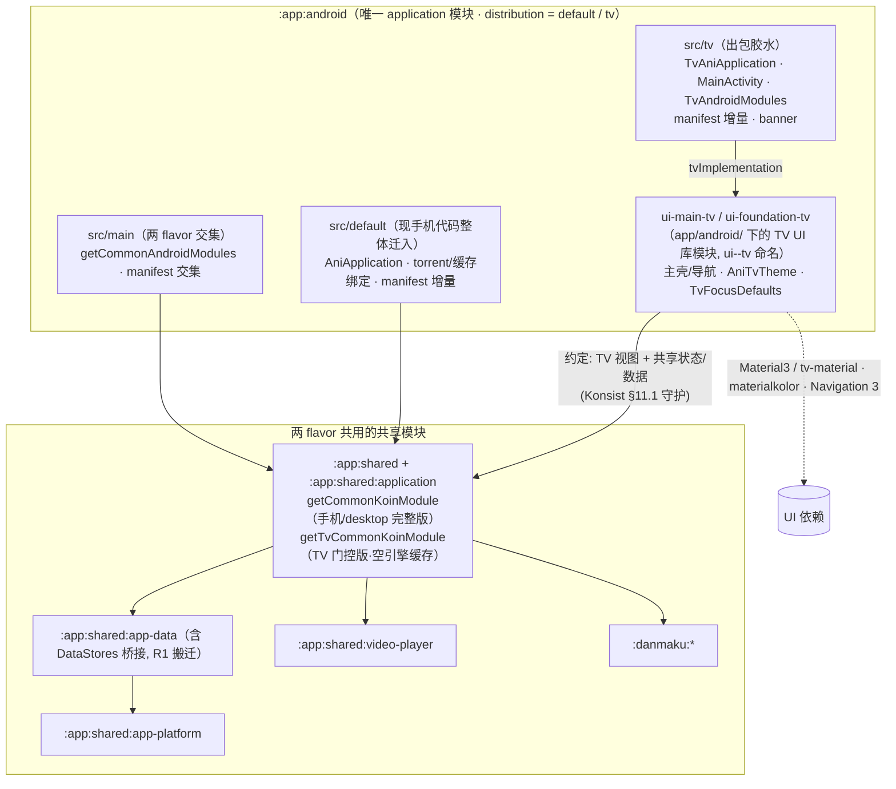

# Animeko Android TV 客户端架构设计

| | |
|---|---|
| 状态 | 实施中：工程骨架已落地，看番主链路与内容页已有实现，功能补齐和验收仍在进行 |
| 设计日期 / 最近核对 | 2026-08-01 / **2026-09-06** |
| 核对基线 | 当前分支 `tv/m0-bootstrap-and-flavor`，提交 `a692f476797ad04dbb8bd685f37b585d1e3e547a` + 本工作区 TV MVI 重构与设备回归修复 |
| 范围 | `:app:android` 的 `tv` flavor，定位**纯在线播放端**；手机 APK 与 TV APK 独立安装、更新 |
| 交互参考 | [PR#3217](https://github.com/open-ani/animeko/pull/3217) 与设计镜像 [「Animeko TV」](https://claude.ai/design/2a3b7d37-075a-400b-bedb-ef2072b6caf3)；后续裁定见 §14，探索页已演进为 Prime 风格 v5 |
| 当前技术栈 | Kotlin 2.4.10 / AGP 9.1.1 / CMP 1.11.1 / minSdk 27 / compileSdk、targetSdk 37；Material3 + 存量 tv-material 1.1.0，Navigation 3、Sketch、mediamp 0.3.2 |

> **阅读口径**：本次根据当前分支源码、测试定义与 CI 配置核对，并重构 TV 的 MVI 边界；已在本地 Android 16 / API 36 TV 模拟器进行设备回归，构建、测试、通过路径与遗留问题记录在 §12.2。正文区分「代码已实现」「待实现/待接线」「待验收」；旧文档中的真机通过记录保留为历史记录，本轮单台模拟器结果不代表完整设备矩阵通过。§12 是进度总表，§14 是开发约束；尚未实施的设计明确标为待办。

---

## 1. 目标与非目标

### 1.1 目标

1. **独立 TV APK**：在既有 `distribution` 维度增加与 `default` 平级的 `tv` flavor，applicationId 为 `me.him188.ani.tv`，提供 Leanback 启动器入口。
2. **独立 TV 视图层**：页面与组件位于 `app/android/ui-*-tv`。当前以 Material3 + Compose foundation 为主，保留 tv-material 组件；统一焦点调度、记忆和网格协议位于 `ui-foundation-tv`。
3. **复用状态、领域和数据层**：各业务页面由 TV ViewModel 接收 Intent、提供只读状态；探索、追番、时间表、登录适配共享 ViewModel，详情复用共享状态工厂/加载器。视频画面、弹幕渲染及在线取源复用共享模块。
4. **遥控器完成核心流程**：探索/搜索/追番/时间表 → 详情 → 在线播放；逐层返回、焦点恢复、选集与选源已有实现，详细交互和验收缺口见 §7/§8/§12。
5. **手机端行为不回退**：保留手机 flavor 名、构建任务与产物路径。R1/R2 已完成；后续允许为状态复用重构共享层，但须同步适配消费者并回归，不能把「仅 M0 可改共享代码」作为现行限制。

### 1.2 非目标（明确裁剪）

**TV 定位为纯在线播放端**，下列能力不列入当前产品路线图：

| 裁剪能力 | 当前落点 |
|---|---|
| **视频离线缓存/下载系统** | `getDisabledMediaCacheKoinModule()` 仍实例化 `MediaCacheManagerImpl`，但存储列表为空；不装配下载器与缓存引擎，无缓存页面。这里不包括图片、元数据、DataStore 等正常持久化 |
| **BT 源播放** | torrent 平台绑定留在 `src/default`；TV 解析器没有 torrent/offline 链路，候选弹窗仅列 WEB；共享 classpath 仍可包含 torrent 符号 |
| **发送评论** | 详情页与播放器评论只读；当前 `CommonKoinModule` 没有 `TurnstileState` 绑定。Web 源解析必需的 `CaptchaBrowserFactory`/`ImageCaptchaRecognizer` 则已在 TV 注册 |
| **Bangumi OAuth 网页授权** | 没有 OAuth 回调清单或 TV 授权界面；仅邮箱 OTP 登录。手机端账号绑定后的服务端同步需在 TV 验收 |
| **编辑个人资料** | TV 没有编辑入口；侧边栏显示账号头像/昵称，点击进入登录页，尚无独立账号管理页 |

**架构边界**：

- TV 不引入共享手机页面的变体插槽，不直接复用手机页面 Composable；允许共享状态与白名单基建。
- 两 flavor 共用共享依赖树，边界由 import 约定、Konsist 和 DI 门控维护，**不是编译期 UI 依赖隔离**；Firebase/GMS 有单独的 TV classpath 排除。
- 不使用旧 Leanback UI 控件；Leanback launcher 的 manifest 声明仍然需要。
- 当前已有自建 `TvFocusScope`/`TvFocusMemory`/网格与长按原语，底层使用 Compose 焦点 API；早期「全部以官方组件替代」的设想已被实施修正。
- 一起看、屏保和主屏频道属于后期能力，当前没有 TV 接线；应用内更新按维护者指示暂缓。

---

## 2. 当前架构速览

### 2.1 分层

`app/android` 是出包层，`src/main` 提供 Android 交集，`src/default` 与 `src/tv` 各自提供应用入口与平台绑定。TV 已拆成 **10 个 UI 库模块**：foundation、main 与 8 个功能模块（§4.1）。共享 `app-data` 负责仓库、会话与播放编排；部分共享 `ui-*` 模块提供可复用状态对象，TV 自行实现视图。

### 2.2 当前代码事实与入口

| 主题 | 当前实现 | 代码入口 |
|---|---|---|
| 构建约定 | 应用使用 `ani.android-application`，TV 库使用 `ani.android-library`，KMP 库使用 `ani.kmp-library`；构建逻辑已从旧 `buildSrc` 迁往 `build-logic` | `app/android/build.gradle.kts`、`build-logic/src/main/kotlin/` |
| Compose | CMP 1.11.1 + `kotlin.plugin.compose`，TV 同时使用 Material3 与 tv-material 1.1.0 | `gradle/libs.versions.toml`、`ui-foundation-tv` |
| DI | `getCommonKoinModule` / `getTvCommonKoinModule` 共用核心装配，缓存模块分流；`SubjectDetailsStateFactory` 被 TV 复用的详情 VM 实际使用 | `app/shared/application/src/commonMain/kotlin/platform/CommonKoinModule.kt` |
| 页面 VM 创建 | `TvAniAppContent` 统一通过 `tvViewModel { TvXxxViewModel(...) }` 显式构建 9 个 TV VM；Koin 不注册 VM，`Tv*Route` 接收实例并收集状态，`Tv*Screen` 只渲染状态并发送 Intent | `ui-main-tv/.../main/TvAniAppContent.kt`、各 `Tv*Route.kt` |
| 导航 | Navigation 3：`rememberAniBackStack` / `AniNavigator.setBackStack` / `NavDisplay`；只注册 Main、SubjectDetail、EpisodeDetail | `ui-main-tv/.../main/TvAniAppContent.kt` |
| 播放 | TV 自建 `TvEpisodeViewModel`，复用 `EpisodeFetchSelectPlayState` 与扩展；Android 画面仍是 ExoPlayer + libass | `ui-episode-tv/.../TvEpisodeViewModel.kt`、`src/main/kotlin/CommonAndroidModules.kt` |
| 图片 | 已迁移到 Sketch 4.6.0：`MainActivity` 提供 `LocalSketch`，页面继续使用共享 `AsyncImage` | `src/tv/kotlin/MainActivity.kt`、共享 `ui-foundation/.../AsyncImage.kt` |
| TMDB/简介 | `TmdbImageService`、`TmdbEpisodeMatcher`、`BangumiSummaryService`、`StaleRefreshGate` 已存在；探索与详情已消费部分能力 | `app/shared/app-data/src/commonMain/kotlin/data/network/` |
| 文案 | 可以复用 `app-lang`，但当前 TV 页面仍有大量中文字符串常量，不能视为 TV 多语言整理已完成 | `app/android/ui-*-tv/src/main/` |
| 清单 | 三层拆分已落地；TV 无 torrent 服务，但交集保留禁用的 `AppLocalesMetadataHolderService`，不能写作「无任何 service」 | `app/android/src/{main,default,tv}/AndroidManifest.xml` |
| 发布 | 双包构建、TV workflow artifact 与 `uploadAndroidTvApk` 配置均在；本次未核验远端发布运行结果 | `.github/workflows/src.main.kts`、`ci-helper/build.gradle.kts`、`build-logic/src/main/kotlin/ciHelperTasks.kt` |

### 2.3 PR#3217 的继承边界

继承 UI/UX 参考与可改造的低层基建；页面代码自行实现，不合入 PR 的共享页面变体架构。当前已按维护者裁定调整部分设计：探索页采用 Prime 风格，时间表复刻共享手机 Medium 档的多列布局，焦点协议统一封装。原 PR 的长按收藏、评分、完整播放器 DETAILS 等设计仍可作为后续参考，不能因此标为已实现。

---

## 3. 方案总览

### 3.1 核心决策

| # | 决策 | 当前结论 |
|---|---|---|
| D1 | 双 APK / 模块边界 | 单一 `distribution = default / tv` 维度；`ui-*-tv` 独立视图模块，`src/tv` 为出包胶水。共享依赖树不为 UI/BT 做编译期收窄，TV 额外排除 Firebase/GMS |
| D2 | UI / 焦点技术 | Material3 + 存量 tv-material 1.1.0 + 标准 foundation lazy；使用统一事件驱动 `TvFocusScope`，滚动采用显式 `BringIntoViewSpec` |
| D3 | 状态复用 | 优先复用共享 VM/状态对象；搜索、设置、播放保留 TV VM。视图层独立，禁止借白名单直接复用手机页面 |
| D4 | DI | 共享核心 + flavor 缓存门控。TV 使用空存储 `MediaCacheManagerImpl`，不注册下载器/缓存引擎/torrent 平台绑定；详情状态工厂已被 TV 使用，当前无 `TurnstileState` 绑定 |
| D5 | 导航 | 复用 `AniNavigator` / `NavRoutes` 的 Navigation 3 back stack；三个路由入口，六种主壳内容。深链只有 manifest 声明，Activity 解析待接 |
| D6 | 主题 | `AniTvTheme(seedColor)` 固定深色、非 AMOLED，默认 `#4F378B`；materialkolor 生成配色并同时提供两套 MaterialTheme。未订阅 `ThemeSettings` |
| D7 | 焦点视觉 | `TvFocusDefaults` 集中定义 2.5dp 描边、3dp 间隙、11dp 圆角、无缩放；Hero 按钮和播放器控件使用各自反色样式 |
| D8 | 应用内更新 | 按维护者指示暂缓；当前只显示版本，没有更新按钮、安装器或 Release 二维码。服务端 `android-tv` 支持属于恢复开发的前置条件 |
| D9 | 产品范围 | 纯在线播放端；裁剪视频离线缓存、BT、评论发送、网页 OAuth 与资料编辑；共享底层依赖仍在，不能把运行时裁剪等同包体依赖已移除 |

### 3.2 总体架构



手机端感知面：① `:app:shared:application` 的 `getCommonKoinModule` 内部重构为「核心 + 缓存模块」组合（对外签名与行为不变，desktop/iOS 零感知），并新增 TV 门控入口 `getTvCommonKoinModule`；② `:app:android` 现有 `src/main` 整体迁入 `src/default`，交集上提回 `src/main` 并做 manifest 分层。这是 M0 的重构范围；任务名与产物路径保留。后续共享状态层也有重构，手机行为不回退仍需持续回归（§14.3）。

---

## 4. 模块设计

### 4.1 模块与源集布局

10 个模块均已在 `settings.gradle.kts` 注册，目录为 `app/android/ui-<feature>-tv`，Gradle 坐标为 `:app:android:ui-<feature>-tv`：

| 模块叶名 | 当前职责 |
|---|---|
| `ui-foundation-tv` | 双主题、焦点框架/记忆/网格/按键、滚动锚点、侧边栏、海报/横图卡、Hero/backdrop、输入框、进度条 |
| `ui-main-tv` | `TvAniAppContent`（统一构建 VM）、`TvMainRoute`/`TvMainShell`、应用依赖参数与架构守护测试 |
| `ui-exploration-tv` | 探索页、Hero、继续观看与推荐行 |
| `ui-subject-tv` | 详情页及剧照、人物、关联、评价卡片 |
| `ui-episode-tv` | 播放 VM、控制层、弹幕层、选集条、选源弹窗与五个内容面板 |
| `ui-collection-tv` | 追番分类网格 |
| `ui-search-tv` | 搜索页与 TV 搜索 VM |
| `ui-schedule-tv` | 多天并排的时间表 |
| `ui-login-tv` | 邮箱 OTP 登录视图 |
| `ui-settings-tv` | 设置子集与 TV 设置 VM |

库模块使用 `ani.android-library` + Compose 插件；foundation 以 `api` 暴露 tv-material、app-platform 和 foundation，main 聚合功能模块。应用仅通过 `"tvImplementation"(projects.app.android.uiMainTv)` 追加 TV UI。

| 源集 | 当前内容 |
|---|---|
| `src/main` | `CommonAndroidModules.kt`、通用清单与 FileProvider 路径 |
| `src/default` | 手机 `AniApplication`、Activity、平台绑定与手机清单，包含 torrent/缓存/更新等专属链路 |
| `src/tv` | `TvAniApplication`、`MainActivity`、`TvAndroidModules`、Leanback 清单、banner 与 app_name |

### 4.2 约定边界（import 规则，非依赖隔离）

| TV 代码引用 | 规则 / 当前守护 |
|---|---|
| Material3、tv-material、Compose foundation、Navigation 3 | 允许；Material3 禁令已删除，主题同时提供两套 |
| app-data / app-platform / app-lang / video-player / danmaku | 复用领域、数据和基建 |
| `me.him188.ani.app.ui.*` | 只允许共享状态与批准的基建，不直接调用手机页面 Composable |
| torrent / 视频缓存具体引擎与存储 | TV 不直接引用；装配通过空缓存门控，Konsist 检查三个包前缀（§11.1） |

**当前白名单事实**：`TvArchitectureTest.uiFoundationInfraAllowList` 允许 `AsyncImage`、`LocalSketch`、`rememberAniSketchInstance`、`AbstractViewModel`、Toast 等基建，以及探索/登录/时间表/追番/详情/评论等共享状态。现有测试采用 `startsWith`，部分条目是**包前缀**，并不检查被导入符号是否为 Composable。因此，「禁止手机页面」仍须 review 配合；不能声称测试已逐类精确放行或已机械保证白名单包中没有页面调用。新增放行要求仍见 §14.3。

TV 不装配 torrent 平台绑定、缓存引擎与 `HttpDownloader`，但会实例化空存储的 `MediaCacheManagerImpl`。`SubjectDetailsStateFactory` 也会因复用详情 VM 被实际解析，不能继续写作「所有共享 UI 状态绑定都惰性闲置」。

### 4.3 已完成的重构与共享层扩充

**R1 — 装配分流已完成**：

- `getCommonKoinModule` 使用共享核心 + `getMediaCacheKoinModule`；TV 使用核心 + `getDisabledMediaCacheKoinModule`。
- 空缓存模块绑定 `MediaCacheManagerImpl(storagesIncludingDisabled = emptyList())`，保留公共注入点；启动时 `HttpDownloader` 不存在则跳过初始化，缓存恢复遍历为空。
- `Context.dataStores` 和平台 SettingsStore 桥接已归位 `app-data`；正常图片/元数据缓存不在视频离线缓存的裁剪范围内。

**R2 — Android 源集和清单分层已完成**：

| 位置 | 当前绑定 |
|---|---|
| `src/main` | `PermissionManager`、`HlsPlaybackPreparer`、ExoPlayer + libass 的 `MediampPlayerFactory` / surface provider |
| `src/default` | 手机应用和 Activity；torrent、下载/缓存、完整解析器、浏览器、更新安装、外部内容提供器等 |
| `src/tv` | `NoopBrowserNavigator`、TV `AppTerminator`、LocalFile/HttpStreaming/AndroidWeb 解析器、验证码浏览器与 ONNX 图片验证码识别器 |

TV Toast 已在 `MainActivity` 中实现并通过 `LocalToaster` 提供，不是待补的 Koin 绑定。`UpdateInstaller` 仍未注册。

**R3 — 数据能力已落地，消费范围仍有差异**：

`TmdbImageService`、`TmdbEpisodeMatcher`、`BangumiSummaryService`、`StaleRefreshGate` 均已位于 `app-data`，TMDB/简介服务已注册到公共 Koin。探索使用横图和简介兜底，详情使用横图和分集剧照；播放器选集条尚未接剧照。共享 `SubjectDetailsStateLoader` 等状态层也已为复用调整，因此后续改动并非全部局限于 TV 目录。

M0 旧记录称手机合并清单与基线 78 个元素语义等价；这是历史验收记录。当前源码核对只能确认结构与配置，手机行为不回退和完整 APK 构建仍应按 §11/§14 回归。

### 4.4 当前目录结构

```text
app/android/
├── src/main/                 # CommonAndroidModules + 通用 manifest
├── src/default/              # 手机入口/平台绑定/manifest
├── src/tv/
│   ├── kotlin/               # TvAniApplication / MainActivity / TvAndroidModules
│   ├── AndroidManifest.xml
│   └── res/                  # tv_banner / app_name
├── ui-foundation-tv/
│   └── src/main/kotlin/me/him188/ani/tv/ui/foundation/
│       ├── theme/            # AniTvTheme / TvColorMapping
│       ├── focus/            # TvFocusScope / Modifiers / Memory / Grid / Keys / BringIntoView
│       ├── layout/           # TvScreenScaffold（当前页面未调用）
│       └── widgets/          # SideRail / PosterCard / LandscapeCard / ImmersiveCards / TextField / SeekBar
├── ui-main-tv/               # NavDisplay / 主壳 MVI / VM 统一构建 / 架构测试
├── ui-exploration-tv/
├── ui-subject-tv/
├── ui-episode-tv/
├── ui-collection-tv/
├── ui-search-tv/
├── ui-schedule-tv/
├── ui-login-tv/
└── ui-settings-tv/
```

`TvSlider`、`TvCenteredDialog`、`TvDropdownMenu`、`TvToastHost`、独立 `TvTypography`/`TvColors` 文件目前均不存在；待实现组件不能作为现有目录列出。

### 4.5 方案演进史与备选记录

工程架构经历前三轮收敛，随后在其上迭代视图与焦点实现：

| 版本 | 方案 | 结局 |
|---|---|---|
| v1 | 独立 `:app:tv:application` 模块出包 | 不采用——双 application 模块 + 版本/签名台账重复；对比记录见 D1 |
| v2 | flavor 出包 + **编译期隔离**：`:app:shared:app-bootstrap` 无 UI 装配模块 + `defaultImplementation`/`tvImplementation` 依赖收窄 + TV UI 独立库模块（`:app:tv:ui*`）。曾完整实施并通过验收 | 按维护者决策回退——判断「TV 不调用手机 UI」用约定约束即可，不值得为编译期强制付出 3 个新模块与更复杂的依赖拓扑 |
| **v3（现行工程边界）** | flavor 出包 + **约定边界**：两 flavor 共享完整依赖树（不收窄），差异收敛为 DI 门控（`getTvCommonKoinModule`）+ manifest 分层 + Konsist/清单守护；TV UI 保持模块化——库模块置于 `app/android/` 下、`ui-<feature>-tv` 命名（叶名独立免坐标冲突），`src/tv` 只留出包胶水 | ✅ 现行方案（D1/D4） |

v4 在 v3 工程边界上引入 Material3 双主题、共享状态复用与统一焦点框架；焦点实现随后改为全事件驱动。v5 更新探索页与布局锚点，不改变 flavor/模块边界。

v2→v3 保留下来的实施资产：缓存/BT 的装配级开关（v2 证明「不用就行」对被注入的基础设施不成立）、manifest 三层分治、`DataStores` 归位 app-data、tv classpath 的 firebase 剔除、清单守护任务。若未来需要更硬的隔离（如 TV 包体成为问题），沿 v2 路线重新收窄依赖即可，装配开关无需改动。

---

## 5. TV UI 技术栈

### 5.1 依赖与版本

当前 `gradle/libs.versions.toml` 中 TV 依赖为：

```toml
androidx-tv-material = { module = "androidx.tv:tv-material", version = "1.1.0" }
```

Material3 通过共享 UI 基建等依赖可用；列表使用标准 `LazyColumn`/`LazyRow`/`LazyVerticalGrid`，没有引入 `tv-foundation`。主壳使用 Navigation 3 runtime/UI 1.1.1 与 ViewModel navigation3 decorator。10 个 TV 模块的注册见 `settings.gradle.kts`，并非只注册 foundation/main 两个骨架模块。

### 5.2 当前组件映射

| UI 元素 | 当前实现 |
|---|---|
| 左侧展开导航 | 自建 `TvNavigationSideRail`，焦点进入展开、离开收起；不是 tv-material `NavigationDrawer` |
| 探索 Hero 轮播 | `TvExplorationScreen` 管理下标和 6s 定时，`TvExplorationHero` 自绘指示器；不是官方 `Carousel` |
| 海报/横图卡 | `TvPosterCard`、`TvLandscapeCard`，自绘聚焦环，标题跑马灯与记忆 ID |
| Hero 操作按钮 | `TvHeroButton`，Material3 Surface + 聚焦反色 |
| 追番分类 | tv-material `TabRow`/`Tab`，聚焦即选中，分类数量角标 |
| 时间表 | 多天固定宽列 + 日期列头 + 各列独立时间线，无日期胶囊 TabRow |
| 设置项 | tv-material `ListItem`；当前仅四个开关和版本/占位项 |
| 播放器控制/选源 | tv-material Surface 等组件 + 自绘控制布局；选源是页面内模态遮罩，焦点限定在列表内 |
| 详情简介弹窗 | Material3 `AlertDialog` + `TextButton`，尚未抽成通用 TV 对话框 |
| 滚动/恢复 | 显式 `BringIntoViewSpec` + `TvFocusScope` / `TvFocusMemory`；不使用 `focusRestorer` 作为当前恢复协议 |

### 5.3 通用件：已实现与待实现

| 能力 | 当前状态 |
|---|---|
| `TvTextField` | 已有 BasicTextField + tv Surface，用于 OTP 登录；搜索页内另有相似的 `TvSearchField`，锚点直接挂内层输入框 |
| `TvSeekBar` | 已有 6dp 轨道、缓冲/已播分色、聚焦圆点及预览时间；按键处理在播放器根节点 |
| Toast | `MainActivity` 使用原生 Android Toast 实现 `Toaster`，provide `LocalToaster`；无 `TvToastHost` |
| `TvScreenScaffold` | 工具函数存在，但当前页面使用各自的 `*PageLayout`，未统一调用它 |
| `TvSlider` | 未实现；弹幕高级参数/时间校准等遥控器步进输入仍待开发 |
| `TvCenteredDialog` / `TvDropdownMenu` | 未实现；收藏管理、评分、搜索筛选等待办可据需要抽取。不能沿用延迟 300ms 送焦的旧方案（§14.4） |

### 5.4 当前焦点与按键协议

| 问题域 | 当前实现 / 范围 |
|---|---|
| 程序化送焦 | `TvFocusScope.request(key)` + `Resolver()`，通过锚点附着和快照事件解析；没有轮询、帧等待或超时 |
| 页面/区域定向移动 | `tvFocusLink`、`tvFocusEnterGate`、`tvFocusExit`；跨大间距区域显式声明 |
| Lazy 网格目标与边缘切换 | `TvFocusGrid.kt`：等数据与布局 → 滚动使目标组合 → 请求动态锚点；追番跨分类已接入 |
| 同页/跨路由恢复 | `TvFocusMemory` + `tvFocusMemorable(id)`；主壳记忆放在 `NavDisplay` 之上，识别返回后的目标 ID，用户操作可取消迟到恢复 |
| 锚定滚动 | `TvAnchoredBringIntoViewSpec`：聚焦项前缘对齐容器前缘 + 动态预留；详情另有区块顶边/选集卡底边策略 |
| 长按 | `TvKeys.kt` 已有 `tvLongPressKey` 与 `consumeHeldConfirmKey`；列表页尚未调用它们实现收藏菜单。播放器用自己的 `ConfirmHoldTracker` |
| 长按判定 | 系统首个自动重复 KeyDown 触发（通常约 400–500ms）；不是应用定时器保证精确 500ms |
| 返回键 | 各页面用 `BackHandler` 分层；播放器按键在根 `onPreviewKeyEvent` 收口 |

### 5.4.1 统一焦点框架 `TvFocusScope`

框架文件：`TvFocusScope.kt`、`TvFocusModifiers.kt`、`TvFocusMemory.kt`、`TvFocusGrid.kt`，均位于 `ui-foundation-tv/focus`。

| API / 状态 | 当前语义 |
|---|---|
| `TvFocusKey` | 页面私有 enum 或具名 key；列表可使用带身份的 key |
| `tvFocusAnchor(scope, key)` | 挂 requester，并报告节点附着/脱离和焦点得失 |
| `request(key)` + `Resolver()` | 后发覆盖先发；目标已附着时尝试一次，成功才清 pending，失败等下一次附着/换代事件；成功后不追抢 |
| `tvFocusNavSignal` / `tvFocusHotkey` | 用户方向/确认键取消在途请求；主壳另用 `tvFocusHotkeyToggle` 实现菜单键往返 |
| `InitialFocus(key)` | 等 Lifecycle RESUMED，再优先处理跨 route 记忆，否则请求默认锚点；没有固定延迟 |
| `TvGridFocusState` | 等目标网格数据/列数，按同行近缘列计算落点并钳到末项；目标聚焦、用户操作或确认空数据时结束 pending |
| `TvFocusMemory` | 跨 route 目标认领、激活、迟到恢复、用户取消集中在一个协议内；无 ID 的组件只参与同页恢复 |

触屏设备运行 TV 壳时，`TvMainShell` 主动请求 `InputMode.Keyboard`。焦点框架已被页面使用，但各页接入深度不同：搜索/时间表仍有不少系统空间导航，详情滚动策略是页内实现，不能把框架存在等同所有页面交互已验收。

### 5.5 主题系统 `AniTvTheme`

当前签名为 `AniTvTheme(seedColor: Color = AniTvThemeDefaults.SeedColor, content)`：

- 默认种子色 `#4F378B`，`dynamicColorScheme(isDark = true, isAmoled = false, style = TonalSpot)`。
- 外层提供 Material3 MaterialTheme，内层提供经 `toTvColorScheme()` 映射的 tv-material MaterialTheme。两套主题**有意共存**。
- `MainActivity` 调用默认主题，没有订阅 `SettingsRepository.themeSettings`；主题编辑、跟随系统/用户选择、独立 TV 字体刻度仍未实现。
- 焦点尺寸集中于 `TvFocusDefaults`；Hero/backdrop、侧栏、海报与横图卡参数放在相应 `*Defaults` 对象。没有独立 `TvColors.kt` 或 `AniTvTypography`。

### 5.6 其余基建复用方式

| 能力 | 当前方式 |
|---|---|
| 图片 | `MainActivity` 用 `HttpClientProvider.get(ANI)` + `rememberAniSketchInstance` provide `LocalSketch`；页面调用共享 `AsyncImage`，旧 Coil 装配已失效 |
| 字符串 | 可直接复用 `stringResource(Lang.xxx)`；TV 当前大量中文常量仍需资源化，旧文档「49 个 key 已沿用」不能作为完成结论 |
| 状态对象 | 共享状态通过白名单使用，视图自绘；允许的实际前缀以 `TvArchitectureTest` 为准 |
| backdrop | `TvImmersiveCards.kt` 内的渐隐函数与 `TvBackdropDefaults`，探索页再按双态高度和防抖控制 |
| 错误呈现 | 页面各自实现：时间表/详情有重试，登录有错误文案；搜索和选源空列表尚不能完整区分加载、失败与真正无结果 |

---

## 6. 应用骨架

### 6.1 进程与启动

`TvAniApplication.onCreate` 初始化日志与根协程域，依次装配：

1. `getTvCommonKoinModule`：共享核心 + 空视频缓存存储。
2. `getCommonAndroidModules`：共享 Android 权限/HLS/播放器工厂。
3. `getTvAndroidModules`：Web 解析、验证码、Noop 浏览器与 TV 退出实现。
4. `startCommonKoinModule`：启动共享后台任务；没有 HTTP 下载器，缓存恢复为空。
5. 异步将 TV 独立 DataStore 的 `mediaSelectorSettings.preferKind` 写为 `WEB`。

Koin 仅装配业务与平台依赖，不注册 TV ViewModel；VM 的统一构建入口为 `TvAniAppContent`。

TV 不启动 torrent 服务连接，不初始化 Sentry/Firebase。`SubjectDetailsStateFactory` 会被详情页实际注入；旧注释提到的 `TurnstileState` 当前没有对应绑定。`CaptchaBrowserFactory` 和 `ImageCaptchaRecognizer` 服务于 Web 数据源解析，已注册。

### 6.2 Activity 与 Manifest

`MainActivity : AniComponentActivity`（基类在共享 application 模块），manifest 声明横屏、`singleTask`，Activity 使用 edge-to-edge、`AniTvTheme`、Sketch 和原生 Toast。进入组合前通过 `TvAppDependencies.fromKoin` 取得 VM 所需的业务依赖，并创建图片客户端；依赖参数只交给根内容中的 VM 构造回调，页面不解析依赖、不调用仓库业务方法。

| 清单层 | 当前声明 |
|---|---|
| `src/main` | INTERNET / ACCESS_NETWORK_STATE / WAKE_LOCK / REQUEST_INSTALL_PACKAGES；禁用的 `AppLocalesMetadataHolderService`、InitializationProvider、FileProvider 与通用 application 属性 |
| `src/default` | 手机 Application/Activity、torrent 服务与手机专属权限、OAuth 回调 |
| `src/tv` | 必需 Leanback、非必需触屏、TV Application/Activity、banner、LEANBACK_LAUNCHER、`ani://subjects/...` intent-filter |

应用模块 namespace 为 **`me.him188.ani.android`**；TV Kotlin 包为 `me.him188.ani.tv`，清单使用全限定类名。TV 没有 torrent 前台服务/进程，但不能写作「合并后没有任何 service」。`tv_banner.xml` 已有 320×180 图形，黑色「あ」字形仍有 TODO，不能标为视觉全部完成。

**深链缺口**：虽然有 intent-filter，TV Activity 目前没有解析启动 Intent 或处理 `onNewIntent` 的代码；不能把系统能启动 Activity 等同已跳到条目详情。

### 6.3 导航

`TvAniAppContent` 创建 `rememberAniBackStack(NavRoutes.Main(Exploration))`，调用 `aniNavigator.setBackStack`，再用 `NavDisplay` 和保存状态/ViewModel 两个 decorator 展示页面。全部 9 个 TV VM 在这个函数内调用 `tvViewModel { ... }` 构建，实例仍归属所在导航条目的 `ViewModelStore`；主壳功能 VM 在页面首次显示时创建并随主条目保留，详情/播放 VM 出栈时销毁。主壳的 `SavedStateHandle` 来自条目的 `CreationExtras`。当前只注册：

| NavRoutes | TV 落点 |
|---|---|
| `Main` | `TvMainShell`；壳内保存 Search / Exploration / Schedule / Collection / Login / Settings 六种内容状态，当前未消费 Main 的 initialPage 参数 |
| `SubjectDetail` | `TvSubjectDetailsRoute` + TV VM/视图，VM 复用共享状态加载器；可跳播放页与关联条目 |
| `EpisodeDetail` | `TvEpisodeViewModel` + TV 播放页；推荐面板可跳详情 |

搜索、时间表、设置、邮箱两步登录是**主壳内部内容**，没有各自独立 NavRoutes entry；`Welcome`、缓存、OAuth 等也没有注册。当前没有首启「登录或跳过 + 主题确认」流程。`ani://subjects/<id>` 解析仍待接入。

### 6.4 主壳 `TvMainShell`

- 自建 `TvNavigationSideRail` 浮于内容之上；头像 → 搜索 → 探索 → 时间表 → 追番 → 设置，收起宽 48dp。
- 进入侧栏优先落**当前页条目**，无选中条目才回退探索；不是固定聚焦探索。头像进入登录页。
- 菜单键在壳的内容区和侧栏之间往返；返回/右键/点击条目可恢复内容焦点，使用 `TvFocusMemory`。
- 菜单快捷键挂在**主壳**，独立的详情/播放 route 没有同一侧栏，不能称为全应用任意页面都可召出。
- 壳内换页用淡入淡出；换页清除旧焦点记忆。非探索内容返回探索，探索返回交给系统；页内返回先由对应 BackHandler 消费。

---

## 7. 页面架构

以下为**当前代码实现**，待开发的原设计另列。各业务页面均使用 `TvAniAppContent` 统一构建的 `TvXxxViewModel`；`TvXxxRoute(viewModel, ...)` 接收实例并完成生命周期/状态/导航接线，再传给 `TvXxxScreen(state, onIntent)` → 页面私有 `*PageLayout` → 区块/卡片组件。基础组件仍使用数据和回调，不为纯焦点/布局行为创建 VM。

| 页面 | 当前状态来源 |
|---|---|
| 探索 | `TvExplorationViewModel` 适配共享探索 VM；媒体缓存和防抖/去重/并发加载在 TV VM 中，向视图暴露只读 `TvSubjectMediaUiState` |
| 时间表 | `TvScheduleViewModel` 适配共享 `ScheduleViewModel`；视图使用可保存的 `LazyListState` 保留横向及列内位置 |
| 追番 | `TvCollectionViewModel` 适配共享 VM/状态；分类切换与边界判断走 Intent，分页与各分类滚动状态继续复用 |
| 详情 | `TvSubjectDetailsViewModel` 复用 `SubjectDetailsStateFactory` / `SubjectDetailsStateLoader`；VM 聚合只读展示状态并决定续播与图片加载 |
| 登录 | `TvLoginViewModel` 适配共享 `EmailLoginViewModel`；TV 步骤、请求忙碌态、倒计时、错误与导航结果由 VM 管理 |
| 搜索 / 设置 / 播放 | `TvSearchViewModel` / `TvSettingsViewModel` / `TvEpisodeViewModel` |

### 7.1 探索页 `TvExplorationScreen`

| 维度 | 设计 |
|---|---|
| 数据 | 共享 `ExplorationPageState` 的趋势/继续观看/推荐 pager；`TvExplorationViewModel` 在 `ShowHero`/`CardVisible` Intent 后加载条目信息/横图/空简介兜底，Hero 与卡片请求去重，横图并发上限 3；视图不持有仓库或加载器 |
| 结构（v5，对齐 Prime Video 实测） | 根 `Box`：**backdrop 在页面根层（surface 背景级）**，16:9 贴右上，高度 = 屏高 ×（hero 两态比例 + 下探 0.10），左缘渐隐终点 0.42（不压简介文字），渐隐尾部延伸到卡片行下方；其上 `Column`：**常驻 hero**（高度两态插值 250ms：展开 0.66 / 收缩 0.46）+ 纵向行列表 `LazyColumn`（weight 1，底部留整屏 padding 让末行也能锚到顶）。行 = [行头 32dp]（仅有标题的行）+ 内容：「继续观看」为横向锚定 `LazyRow`；「为你推荐」为纵向自适应网格（列数按可用宽算、行内 weight 等分、尾行 Spacer 占位，仅首行带行头）。卡片统一 16:9 `TvLandscapeCard`（192dp、间距 16dp、TMDB backdrop w780，缺图退化海报裁切、卡内底部渐变叠标题） |
| hero 双态 | 焦点在 hero → 展开：最高热度轮播条目 + 「更多详细内容」按钮 + 指示器**在整个 hero 底部水平居中**；焦点在卡片行 → 收缩：展示聚焦条目信息。**按钮/指示器的出现与消失就是 hero 高度动画本身**（高度与透明度跟随同一条插值进度，不另起淡入淡出）。文字即时切换，**backdrop 目标防抖 500ms** 再 crossfade（Prime 实测：快速划过卡片不闪图） |
| 锚定滚动 | **焦点行恒贴 hero 下缘**：用 `BringIntoViewSpec`（`TvAnchoredBringIntoViewSpec`）—— 继续观看行内 spec 把焦点卡对齐行首，列 spec 把焦点卡对齐顶部并预留行头高度（预留量动态：聚焦行有行头留 32dp、网格续行留 0，焦点回调同步写入、滚动计算稍后读取）；纯焦点事件驱动。继续观看行 `rememberSaveable` 横向位置（跨 route 返回后目标卡仍在组合中，焦点记忆可恢复） |
| 按键 | hero 上 ←→ 切轮播；↓ 显式送焦行 0；继续观看行内 → 直接送焦下一张，← 先滚行让前一张重新组合再送焦（锚定后前一张已滚出组合，空间搜索找不到），首卡按左放行侧边栏；网格行内 ←→ 交给空间搜索；↑/↓ 行间导航一律显式 = 滚列表 + 送焦目标行（网格保持同列、继续观看回记住的卡；悬挂到锚点附着）；行 0 按上回 hero 按钮；确认 → 详情 |
| 状态 | 行结构变化（Paging 后到的继续观看插首行）时 hero 聚焦态下列表滚回顶（LazyColumn 按 key 保位会把新首行藏在视口上方）；trending 空 → 无指示器 |

继续观看卡已展示「继续 · 第 N 话 / 已看到第 N 话 / 开始观看 / 未开播 / 已看完」状态。确认卡片仍跳详情，由详情播放按钮选续播目标；未实现列表页播放键直接续播或独立播放历史页。轮播在 Hero 聚焦且静止时每 6s 前进，手动切换重置计时。

### 7.2 新番时间表 `TvScheduleScreen`

| 维度 | 当前实现 |
|---|---|
| 数据 | TV VM 暴露共享 `ScheduleViewModel.presentationFlow`；日期窗口与列表内容复用共享实现，横向及列内滚动位置由页面的可保存 `LazyListState` 管理 |
| 布局 | `LazyRow` 横向并排的固定 360dp 日期列，列间 16dp；列头 M/d + 星期；列内 `LazyColumn` 展示时间、56dp 封面、标题、集数、当前时间指示与占位骨架 |
| 焦点 | 初始锚点在今天列**第一条番剧**；每张卡以条目/剧集 ID 参与焦点记忆。详情返回期间保持已保存视口，新的用户导航事件恢复 BringIntoView 滚动，避免转场临时焦点把列表滚走；跨列主要依赖 Compose 空间导航 |
| 状态 | 加载骨架、空日提示、失败文案与重试按钮已有实现 |
| 待补/待验收 | 本轮已验证跨日浏览、详情返回原卡片与视口、返回后继续纵向滚动；长按收藏未接，空日/错误/跨列边界仍需专项回归 |

旧的「15 天日期胶囊 + 当天网格 + 正交按键」方案已被 §14.5 的多列布局裁定替代，不能继续作为当前界面或未完成的必做布局。

### 7.3 搜索 `TvSearchScreen`

- `TvSearchViewModel` 直接调用 `SubjectSearchRepository`；输入框 + 系统软键盘 Search 提交，结果为 Paging Adaptive 海报网格，点击跳详情。
- 当前是固定输入框加下方网格，没有输入态/结果态 Hero 的 500ms 过渡，也没有历史、补全、筛选弹窗。
- 初始焦点进输入框，Search 提交后主动收起系统键盘；有结果时，下键通过显式锚点进入首张卡片。卡片有记忆 ID，本轮已验证详情返回保留查询与卡片焦点；网格尚未实现旧设计的显式同列导航与「非首卡→首卡→输入态」返回链。
- 当前 `itemCount == 0` 统一显示「没有找到相关番剧」，未按 Paging LoadState 区分加载中、失败和真正无结果；加载/重试呈现仍待补。

**保留的待办设计**：历史与 300ms 防抖补全、排序/最低评分/标签筛选及确认/取消语义；具体 TV 对话框与焦点接线需随实现补齐。

### 7.4 追番 `TvCollectionScreen`

- 共享 `UserCollectionsViewModel/UserCollectionsState`，五分类 TabRow 在用户导航聚焦时选中并显示数量；每个分类保留分页与滚动状态，登录变化刷新由共享状态处理。页面恢复前的程序化临时焦点不触发分类切换，避免详情返回误选首分类。
- TV 展示流使用 `WhileSubscribed`，等待 Route 在组合提交后订阅，避免后台提前读取新建 Compose snapshot 导致状态流终止。本轮已复现并修复「焦点移动但选中分类不变」，游客空态下五分类切换通过设备复测。
- 当前布局只有分类栏 + Adaptive 海报网格/空态，**没有**旧设计的 Hero、观看进度条或 560ms 横滑过渡。
- 网格边缘切相邻分类已接入 `TvGridFocusState`：按目标网格列数落同行近缘列，越界钳到末项；切换中冻结聚焦即选中的副作用，且旧网格不能提前消费异步 Intent 对应的送焦请求。空列表判定同时等待 Paging 聚合、source 与 mediator 的 refresh 完成，避免 Room 尚在加载时错误取消送焦。
- 网格按上出区/返回回**当前分类**，首分类左缘可交给侧栏。分类下键通过网格请求先滚动、组合首项再送焦，支持首卡已被长列表回收的情况。
- **已登录设备回归通过**：五分类显示 4/14/10/8/41 项，首次进入分类、同行边缘切换/末项钳位、41 项长列表、上下/返回路径、侧栏往返及详情返回原卡片与视口均已复测；详见 §12.2。登录切换瞬间的刷新和数量请求仍需单独验收。
- **未接线**：长按五态收藏菜单、取消追番确认与修改后焦点落相邻卡。共享状态虽有修改能力，TV 视图没有入口；观看进度呈现与修改类交互仍待补。

### 7.5 条目详情 `TvSubjectDetailsScreen`

| 维度 | 当前实现 |
|---|---|
| 状态 | TV VM 复用共享加载器的 Placeholder / Err / Ok；`Retry` 重载详情及图片，`Resume` 优先采用共享进度目标，再回退未看/首集；UI 不选择播放目标 |
| 信息层 | Hero 首屏含播放/加载中按钮、日期/统计/标签、评分直方图；下方为简介展开、选集、角色、Staff、作品信息、关联与只读评价 |
| 图片 | TMDB backdrop + `getEpisodeStills` / `matchToEpisodes` 已接；选集卡优先分集剧照，缺图回退 backdrop/海报。backdrop 用未解析/有图/无图三态避免进页闪替 |
| 选集/简介 | 226dp 宽、16:9 剧照卡，点击播放，已看状态减淡；简介可用 Material3 AlertDialog 展开 |
| 初始焦点 | 播放按钮槽位常驻；`InitialFocus` 等 RESUMED；下方区块在首次播放钮聚焦或 RESUMED 后才组合 |
| 当前滚动 | Hero 顶边 = 0；第二屏区块顶边保留 64dp；选集卡**下边缘 + 64dp 对齐视口下边缘**；角色、制作人员、关联条目、评价沿用平台默认纵向滚动。内层横向列表保留行首 + 48dp 锚定 |
| 返回 | 下方区块 → 选集 → Hero → 退出；播放钮/展开简介/选集间有显式方向链接 |
| 待实现 | 收藏/其他圆钮、标签菜单、选集网格菜单、播放钮长按跳当前集、选集长按详情/标记看过、交互评分弹窗 |

当前评分块是**展示**，没有 `TvRatingDialog` 或评分提交入口。详情页分集剧照和区块锚定已实现，不能再与播放器选集条剧照一起笼统列为未做。

### 7.6 设置（TV 子集）`TvSettingsScreen`

当前 `TvSettingsViewModel` 可读写四个开关，但**配置保存与播放行为接线必须分开验收**：

| 设置项 | 保存配置 | TV 播放链路 |
|---|---|---|
| 显示弹幕 | 已读写 `SettingsRepository.danmakuEnabled` | **未接**：`TvEpisodeScreen` 始终组合 `TvPlayerDanmakuHost`，VM/Host 未消费该总开关 |
| 自动连播 | 已读写 `autoPlayNext` | 已挂载 `SwitchNextEpisodeExtension` 并消费配置；整集自动切下一集仍待验收 |
| 自动跳过 OP/ED | 已读写 `autoSkipOpEd` | **未接**：跳过逻辑在手机 `EpisodeViewModel`，TV VM 未复用该逻辑或提供等价接线 |
| 播放出错自动换源 | 已读写 `autoSwitchMediaOnPlayerError` | 已挂载 `SwitchMediaOnPlayerErrorExtension` 并消费配置；异常场景仍待验收 |

已有版本信息；数据源/代理/主题/弹幕高级设置仅显示「请在手机端配置（与 TV 端独立存储）」占位。该文案不代表手机设置会同步到 TV。

**待开发范围**：先补两处设置消费，再做弹幕 7 项步进/类型/正则配置、源管理与时间校准、WEB 数据源启停排序、代理与测试、主题选择、播放历史/同步管理。离线缓存和 BT 设置按 §1.2 裁剪。

### 7.7 登录 `TvLoginScreen`

`TvLoginViewModel` 适配共享 `EmailLoginViewModel`，视图发送修改邮箱/验证码、发送、提交、重输邮箱 Intent。请求在 VM 作用域执行；同步获取请求互斥锁，避免遥控器/IME 重复提交；取消不转为业务错误。步骤、忙碌态、倒计时和错误由 VM 下发。成功发出一次性导航事件，主壳通过 Intent 回探索；`TvMainViewModel` 订阅登录态更新头像/昵称。

登录步切换当前直接 `focus.request(Field)`，并非所有页面都只通过 `InitialFocus` 送焦。登录是壳内内容，不是独立 Start/Verify 路由；没有欢迎向导、独立资料管理或 OAuth 入口。登录后的跨页数据联动仍需回归。

---

## 8. 播放器详设 `TvEpisodeScreen`

### 8.1 状态编排与实际复用范围

`TvEpisodeViewModel` 显式接收条目/剧集、平台上下文、Koin 及仓库/服务依赖，使用共享 `EpisodeFetchSelectPlayState` / `EpisodeSession` / `PlayerSession`，自行提供 TV presentation。

**当前挂载的 8 个扩展**：

- `PlaybackSpeedExtension`、`RememberPlayProgressExtension`、`MarkAsWatchedExtension`；
- `SwitchNextEpisodeExtension`、`SwitchMediaOnPlayerErrorExtension`；
- `AutoSelectExtension`、`SaveMediaPreferenceExtension`、`ObserveWebMediaSourcePreferenceExtension`。

因此进度保存、自动选源、连播与出错换源已有接线，但 OP/ED 自动跳过不在其中；不能沿用「手机播放器能力已全部复用」的说法。列表边界/下一集未播出时的自动连播条件由 TV 提供的 `getNextEpisode` 判断。

**WEB 取源**：启动时固定偏好 WEB；空缓存存储不产生本地缓存源；`mediaCandidates` 再按 `MediaSourceKind.WEB` 过滤。TV 解析器由 LocalFile/HttpStreaming/AndroidWeb 组成，不含 torrent/offline 解析。保留 LocalFile resolver 不等同开放离线下载功能。

**三个已经接好的生命周期入口**：

1. Route 首次组合发送 `UiReady` Intent，VM 幂等启动扩展。
2. VM 持续订阅 `mediaFetchSession.cumulativeResults`，使冷流取源实际运行。
3. 页面组合 `mediaResolver.ComposeContent()`，挂载 WebView 解析器。

退出 VM 时调用 `fetchPlayState.onClose()`。弹幕通过 `EpisodeDanmakuLoader`、共享事件流与 `DanmakuHost` 渲染，已订阅 `danmakuConfig`，但总开关缺口见 §7.6。

### 8.2 当前覆盖层与按键

VM 持有 `TvPlayerStateMachine`，发布不可变 `TvPlayerOverlayState`，用 `controlsVisible` 表达 HIDDEN/CONTROLS，另有 `activePanel`、`stripExpanded`、`scrubMillis`、`speedHolding`、`sourceDialogVisible`。**没有 DETAILS 层**；旧三层状态机中的 DETAILS 仍属待办。

| 状态 / 键 | 当前行为 |
|---|---|
| HIDDEN + 确认短按 | 切换播停；暂停时唤出控制层 |
| HIDDEN + 确认长按 | 本节点起手后首个系统连发触发 2.5x，松开还原；不是精确计时 500ms |
| HIDDEN/进度条 + 左右 | 单按 ±5s seek；约 620ms 内连按进入预览，显示预览时间 |
| HIDDEN + 上下 | 显示控制层，焦点进度条 |
| 预览 + 左右 / 确认 / 返回 | 移动预览点 / 确认 seek / 取消；上下也会取消预览 |
| 图标行 + 下 | 展开选集条，等数据后滚到当前集并送焦 |
| 播放页媒体键 | MediaPlayPause 切换；MediaPlay/MediaPause 分别只播放/只暂停，忽略连发；FF/Next 切下一集，RW/Previous 切上一集；不是列表页全局播放语义 |
| 自动隐藏 | 控制层有 5s 自动隐藏逻辑，暂停、预览、选源、内容面板打开时保留；需要交互回归 |
| 返回顺序 | 选源弹窗 → 内容面板 → 预览 → 选集条 → 控制层 → 退出播放页 |

播放器根 `onPreviewKeyEvent` 仅将平台按键、连发、事件时间和当前焦点区域转换为 `RemoteKey` Intent。VM/reducer 决定消费、seek/预览、播停和返回分层；计时器与播放位置读取也在 VM。焦点请求以事件下发，由 UI 等待锚点和列表就绪后执行。路由离开或生命周期暂停时释放按住倍速。

### 8.3 组件状态

| 部件 | 当前实现 / 剩余工作 |
|---|---|
| 视频面 | 共享 `VideoPlayer` + ExoPlayer/libass；视频 View 不参与键盘焦点 |
| 弹幕层 | VM 转发弹幕事件、同步暂停状态；`TvPlayerDanmakuHost` 只渲染；总开关、源管理、时间校准待接 |
| 控制层 | 标题、集名、来源标签、时钟、缓冲/已播进度、后退 10s / 前进 30s / 下一集 / 选源 / 倍速 / 画面比例 |
| 倍速/比例 | 使用 mediamp PlaybackSpeed/VideoAspectRatio；倍速按钮按 0.5、0.75、1、1.25、1.5、2 循环，当前仅会话生效 |
| 选集条 | 204×114.75dp 卡、12dp 间距，当前/已看/未看状态，250ms 滑入淡入；卡片仍为纯色渐变 + 文本，**尚未接 TMDB 剧照和显式行首锚定 spec** |
| 五个浮出面板 | 推荐、Staff、角色、当前集只读评论、已加载弹幕；玻璃条目，宽 420/240dp、最高 300dp；弹幕列表 reverseLayout 吸底 |
| 面板订阅 | VM 根据 `activePanel` 选择对应的推荐/Staff/角色/弹幕数据流；评论分页仅在评论面板组合时订阅。推荐点击上报 Intent 后跳详情，人物/评论/弹幕条目没有对应详情动作 |
| 选源弹窗 | 页面内 0.72 宽 × 0.8 高遮罩，只列 WEB；初始焦点到选中项或首项，焦点被限制在弹窗；空候选统一「正在查询…」，无源/失败结束态尚待区分 |
| 预览 | 当前只有时间反馈，TV 未调用 FramePreview；160×90 帧浮窗仍待实现 |
| DETAILS / 弹幕设置 | 未实现完整 DETAILS、7 项 Slider 弹幕弹窗或独立选集 sheet |

---

## 9. 数据与领域层复用清单

### 9.1 已复用

| 层 | 当前用途 |
|---|---|
| 播放编排/选源 | `EpisodeFetchSelectPlayState`、播放会话、MediaSelector、MediaFetchSession、8 个播放器扩展（§8.1） |
| 弹幕 | `EpisodeDanmakuLoader`、DanmakuRepository、DanmakuConfig、正则过滤列表与渲染层 |
| 页面状态 | 探索/追番/时间表/详情/登录的共享 VM 或状态；搜索与设置通过 TV VM 访问仓库 |
| 会话/配置/持久化 | SessionManager、UserRepository、SettingsRepository、DataStore、Room；TV 与手机应用数据目录独立 |
| 导航 | app-platform 中 Navigation 3 版 AniNavigator、NavRoutes、back stack |
| 图片与详情 | Sketch AsyncImage、TMDB 横图/分集剧照匹配、BangumiSummaryService 简介兜底 |

视频缓存管理器保留空存储实例以满足注入；torrent、离线下载和手机页面视图不接入 TV 运行链路。共享状态工厂属于实际复用范围。

### 9.2 已有数据能力与尚未消费的部分

| 能力 | 当前情况 |
|---|---|
| `TmdbImageService` / `TmdbEpisodeMatcher` | 已在 app-data，包含持久化图片信息与分集匹配；探索横图、详情横图/剧照已消费，播放器剧照未接 |
| `BangumiSummaryService` | 已注册公共 Koin，探索 Hero 空简介兜底已用；不能据此推断每个 TV 页面都用了兜底 |
| `StaleRefreshGate` | 已存在并用于 TMDB 刷新控制，不再是 R3 待新增项 |
| 低端设备降级 | TV 主题/布局没有设备分档接线；禁用复杂过渡、弹幕密度分档等仍待实现与测量 |
| 配置消费 | 弹幕总开关、自动跳 OP/ED 仍需在 TV 播放层接线（§7.6），不属于数据仓库缺失 |

---

## 10. 构建与发布

### 10.1 当前构建配置

`app/android/build.gradle.kts` 使用 `ani.android-application`，保留共享的 SDK、版本、签名、ABI splits 与 buildTypes；flavor 配置为：

```kotlin
flavorDimensions += "distribution"
productFlavors {
    create("default") { dimension = "distribution" }
    create("tv") {
        dimension = "distribution"
        applicationId = "me.him188.ani.tv"
    }
}
```

共享依赖仍为 `implementation(projects.app.shared)` 和 `implementation(projects.app.shared.application)`，TV 额外追加 `tvImplementation(projects.app.android.uiMainTv)`。

TV 专属处理已经落地：

- 禁用 `processTv*GoogleServices`，从 TV classpath 排除 GitLive Firebase 桥、Firebase/GMS，避免手机分析组件的权限与服务进入 TV 清单。
- `src/tv/res/values/strings.xml` 覆写应用名为 Animeko TV，启动图标复用共享资源。
- 默认 debug 后缀 `.debug2`，可通过 `ani.android.debug.applicationIdSuffix` 覆写；TV debug 通常为 `me.him188.ani.tv.debug2`。
- 本地默认 ABI 为 arm64-v8a，构建参数 `ani.android.abis` 可指定其他 ABI；是否成功构建应以实际运行结果为准。
- TMDB 图片依赖构建时的 `ani.tmdb.api.token`；图片回归先执行 `:app:shared:app-platform:verifyTmdbConfiguration` 检查配置非空，再核验设备上的实际图片来源。仅构建成功或看到 Bangumi 回退图不能判为 TMDB 通过。

### 10.2 CI 与上传配置

工作流源为 `.github/workflows/src.main.kts`，生成结果为 `build.yml` / `release.yml`。当前已配置：

| 项 | 实现 |
|---|---|
| Debug 构建 | `assembleDefaultDebug assembleTvDebug verifyTvManifestPurity` |
| Release 构建 | 同 job 执行 `assembleDefaultRelease assembleTvRelease`，共享缓存与签名 |
| Workflow artifact | 上传各 ABI 的 `app/android/build/outputs/apk/tv/release/android-tv-<arch>-release.apk` |
| TV 发布任务 | `:ci-helper:uploadAndroidTvApk`，扫描 `outputs/apk/tv/release`，`flavor = "tv"` |
| 发布命名 | `build-logic/src/main/kotlin/ciHelperTasks.kt` 中 `ReleaseArtifactNames.androidTvApp` 生成 `ani-tv-<version>-<arch>.apk` |
| 清单守护 | `verifyTvManifestPurity` 依赖 `processTvDebugManifest`；检查文本不含 torrent、uses-permission 在白名单（含动态接收器权限例外） |

清单守护**没有断言「无任何 service」**。TV Debug 编译能发现 `src/main` 对仅在 `src/default` 定义符号的误引用，但无法拦截共享模块里的手机 UI；后者靠 §11.1。

通用 CI 测试步骤目前是 `desktopTest` 和 `testAndroidHostTest`，工作流没有显式调用五个 TV 库的 `testDebugUnitTest`。不能由 APK 构建步骤存在推断 TV 架构/焦点等单测已经在 CI 执行。本次核对确认配置存在，未查询远端 CI 或发布资产状态。

### 10.3 版本与并存策略

- 手机与 TV 在同一 application 模块，共用 versionCode/versionName 与签名配置；手机任务名/输出目录保持 `default`。
- `me.him188.ani.tv` 与手机应用可并存，但登录凭据、设置和本地数据库独立；账号体系支持的数据通过服务器同步，**手机设置不会自动复制到 TV**。
- TV 和手机是否在某次 release 都已成功发布，需要查对应流水线运行结果，不能仅以这份架构文档证明。

### 10.4 应用内更新

按维护者指示暂缓。当前 TV 设置只有版本显示，平台层未注册 `UpdateInstaller`，浏览器为 `NoopBrowserNavigator`，**没有 Release 地址二维码**。

恢复开发前需确认服务端支持 `clientPlatform = "android-tv"`，随后再接 TV 更新检查、下载和安装流程。本次未检查服务端仓库的实现状态。二维码浏览器降级仍是独立待办，不因更新暂缓而算已完成。

---

## 11. 质量保障

### 11.1 当前架构守护（Konsist）

位置：`app/android/ui-main-tv/src/test/kotlin/me/him188/ani/tv/ui/main/TvArchitectureTest.kt`。任务：`:app:android:ui-main-tv:testDebugUnitTest`。

测试自行向上定位 `settings.gradle.kts`，用 `scopeFromExternalDirectories` 扫描 10 个 TV 库的 `src/main` 与 `app/android/src/tv`。当前有 **10 条测试**：

1. 禁止导入白名单之外的手机 `me.him188.ani.app.ui.*`。
2. 禁止导入 `domain.torrent.*`、`domain.media.cache.engine.*`、`domain.media.cache.storage.*`。
3. 非 foundation 文件持有 `rememberTvFocusScope()` 时，必须含 Resolver 和导航/快捷键信号接线。
4. 焦点框架目录不得包含 `delay(` 或 `withFrameNanos`。
5. 非 foundation 文件不得调用原始 `requesterOf(`。
6. 含 Composable 的 TV 文件不得导入仓库、Service、UseCase 或 Koin，也不得使用已知业务层全限定引用。
7. TV 代码不得使用 `GlobalKoin` 或 `KoinComponent`/组件注入；业务依赖在装配处提供。
8. `Tv*Screen.kt` 不得调用/导入 ViewModel；VM 接线放在 Route。
9. TV ViewModel 构造调用和构造函数引用只能出现在 `TvAniAppContent.kt`。
10. `tvViewModel` 只能由根内容调用；其他文件不能绕过 helper 使用 Compose `viewModel`，Koin 模块不得注册 VM。

Material3 import 禁令已删除。以上部分规则是源码字符串/前缀检查，不是完整的调用图或类型分析；尤其白名单包内的手机 Composable 不会因此被自动区分（§4.2）。本轮执行结果见 §12.2。

### 11.2 已有测试与待补验证

| 范围 | 当前覆盖 |
|---|---|
| 焦点调度/网格状态 | `TvFocusScopeTest` 7 个单测，覆盖 pending、请求替换、用户取消、附着/焦点记账、网格请求取消，以及异步分类切换时旧网格不得消费送焦请求 |
| 焦点记忆 | `TvFocusMemoryTest` 9 个单测，覆盖返回认领/激活/迟到恢复/取消/无 ID/清理等状态 |
| 收藏分页 | `TvCollectionPagingTest` 2 个单测，覆盖 mediator 跳过刷新但 Room 仍在加载，以及 source/mediator 加载或失败不得被视为刷新完成 |
| 播放器覆盖层状态机 | 新增 `TvPlayerStateMachineTest` 12 个单测，覆盖首按/连按预览、确认/取消、边界、长按释放、返回分层、选源焦点保护、自动隐藏、媒体键幂等与反馈过期 |
| 详情续播 | 新增 `TvResumeEpisodeTest` 4 个单测，覆盖共享目标优先、目标失效、跳过已看/放弃集、全部看完与空列表 |
| 页面/配置接线 | 各 Route 的生命周期/导航、登录并发/错误、配置消费与加载/错误/无结果分支仍需更多集成/UI 回归 |
| 可复用 UI 回归 | TV 模块当前没有交互截图测试；按仓库规范优先使用 `runAniComposeUiTest` 等可复用测试方式，必要时适配 TV 的 Android 库测试入口 |
| 原生/设备验证 | 本轮 API 36 TV 模拟器已覆盖系统 IME、遥控器页面导航、已登录收藏五分类/长列表/详情返回、Web 源解析出画、播放控制、手动换源和配置持久化；16 KB 兼容提示与第二集某线路 `NoMatchingFile` 留存，其他设备/ROM 与完整播放矩阵待验 |

单测任务为 `:app:android:ui-{main,foundation,episode,subject,collection}-tv:testDebugUnitTest`（花括号表示五个独立模块）。架构、焦点、播放器、详情和收藏五个 TV 单测任务还应明确接入 CI（§10.2）。设备矩阵保留 Android TV 模拟器、低配盒子和不同 Android 版本的验收目标；完整自动连播、登录联动、弱网/无源/错误与焦点恢复不能仅靠源码存在判断通过。

### 11.3 性能目标与当前限制

- 冷启动到探索首帧 ≤2.5s（中端盒子）仍是目标，未在本次取得测量结果。
- 当前共享图片加载器是 Sketch，`createDefaultSketch` 使用 `DisabledMemoryCache` 与磁盘缓存，旧「Coil 内存缓存 10MB」描述已失效。
- 探索 backdrop 使用 TMDB w1280，卡片降到 w780；详情剧照消费原 URL，不能把图片服务提供降档函数等同所有消费端都已使用。
- 低端机弹幕密度、复杂过渡降级和 4K 设备内存/合成表现尚需实现或测量；不把未执行的性能预算写成达标结果。

---

## 12. 实施路线图

### 12.1 当前里程碑（代码核对）

| 里程碑 | 当前已实现 | 主要剩余工作 |
|---|---|---|
| **M0 骨架** ✅ 工程落地 | flavor 双包、10 个 TV UI 模块、DI 门控、清单分层、主题/主壳、TV Debug 和清单检查配置 | 手机行为不回退属于持续回归要求；不能以 M0 历史验收替代当前提交验证 |
| **M1 看番主链路** 🔶 已有实现 | 探索 v5、继续观看状态、详情续播/TMDB 剧照、区块/选集底边滚动锚点、在线取源播放、弹幕、控制层/预览时间/倍速/切集/选源、五面板、焦点记忆、8 个共享扩展 | **弹幕总开关和 OP/ED 自动跳过接线**；播放器 DETAILS、选集条剧照/锚定、帧预览；详情评分/长按/管理动作；自动连播整集与异常回归 |
| **M2 内容浏览** 🔶 页面已有实现 | 追番五分类与网格边缘跨分类落位、关键词分页搜索、多天并排时间表；继续观看经详情续播 | 长按收藏、搜索历史/补全/筛选、搜索与选源的加载/错误/无源区分、独立播放历史与列表播放键、深链解析、二维码浏览器、各页导航回归 |
| **M3 账号与设置** 🔶 基础界面已有实现 | 共享邮箱 OTP VM、登录反馈/倒计时、侧栏账号信息、四个配置开关的读写、版本/Toast；架构与焦点单测已定义 | 两处开关缺口见 M1；弹幕高级配置/源管理/校准、WEB 源启停排序、代理/主题/同步管理、文案资源化、登录后跨页联动验收 |
| **M4 系统与发布** 🔶 发布配置已接入 | 双包 release 构建、TV workflow artifact、`uploadAndroidTvApk` 和 `ani-tv-*` 资产命名 | 16 KB 页大小下原生库 ELF 对齐兼容问题、TV 单测显式接入 CI、可复用交互截图测试与完整播放器回归、真实设备矩阵、性能测量与降级、banner 字形；屏保/Watch Next 等后期能力；应用内更新按指示暂缓 |

M0 是骨架前置，后续里程碑已有并行实现，**并非 M1–M4 全部验收完成**。共享状态和 app-data 已有后续改动，开发范围遵循 §14.3，不再限定「M1 起只能改 TV 目录」。

### 12.2 验收记录的口径

- 旧文档记录过魅族 18X 安装、主链路与页面交互验证，以及 M0 手机清单 78 元素语义等价。
- 当前代码注释还记录了 **TV 模拟器**上的焦点恢复、跨分类切换和详情页按键问题复现；不能继续笼统写「模拟器验证从未做过」。
- 这些历史记录不等同当前提交完整设备矩阵通过。MVI 重构后 `assembleTvDebug`、`assembleDefaultDebug`、`verifyTvManifestPurity` 均已本地通过；随后将全部 VM 构建集中到 `TvAniAppContent`，重新通过 TV 构建、清单校验及 main/foundation/episode/subject 四个 TV 模块的 `testDebugUnitTest`，共 **41 个测试，0 失败/跳过**。此次集中构建改动及后续设备修复仅涉及 TV，未重跑手机构建，也未核验远端发布。
- **2026-09-06 设备回归**：使用既有 `emulator-5554`，Android 16 / API 36、Google TV x86_64 16 KB 镜像、3840×2160。设备原有 `me.him188.ani.tv.debug2` 与本机调试签名不同，因此用临时构建配置安装独立 `me.him188.ani.tv.regression` 包，以游客状态测试，保留原应用及数据。
- **通过路径**：探索加载、侧栏切页、搜索提交/收起 IME/下键进入结果/详情返回、时间表跨日浏览/详情返回原焦点与视口/继续滚动、追番空态五分类切换、四开关读写及进程重启后保存；Fate/Zero 第一集实际出画、暂停、seek 预览/确认、倍速控件、手动换源后再次出画、逐层返回。登录只验证邮箱输入与下键到发送按钮，未发送 OTP。
- **本轮修复**：追番展示流过早读取 snapshot；搜索提交不收起 IME，并补齐下键焦点路径；时间表返回丢失滚动/焦点及转场 BringIntoView 抢滚动。同时补齐登录输入框到提交按钮的下键路径。最终包对修改页面复测通过，TV 构建、清单与上述 41 个单测再次通过；最终应用进程日志未发现崩溃或未处理状态读取异常。
- **首次游客回归的遗留与边界**：首次启动有「16 KB 不兼容 / ELF alignment check failed」系统提示，允许兼容模式后可播放；Fate/Zero 在「线路1」手动切第二集时界面报 `NoMatchingFile`，第二集该线路未出画。当时自动换源关闭，不能据此判定自动换源扩展失效。该轮未验证真实 OTP/已登录收藏、整集自动连播、弱网注入、音频及其他设备；已登录收藏的后续结果见下文。四开关持久化通过不代表 §7.6 两处播放接线缺口已修复。
- 本地操作、截图、日志、APK 摘要和构建结果见 [设备回归报告](build/reports/tv-device-regression/report.md)（`build/` 下的本地产物，不纳入版本控制）。回归包四开关已恢复为初始开启状态，模拟器保持运行。
- **2026-09-06 已登录收藏补测**：用户已在回归包登录；保留会话覆盖安装本轮修复包。五分类显示抛弃 4、想看 14、在看 10、搁置 8、看过 41；首次进入分类、左右边缘切分类、同行落位及短列表末项钳位、最右边界、41 项长列表、返回分类后下键进入首卡、侧栏往返、详情返回原分类/卡片/视口均通过。
- **收藏补测修复**：修复首次进入有缓存分类时误判空态、详情返回误选「抛弃」、首卡被回收后分类下键无法进入网格三处焦点问题；同时阻止旧网格消费异步分类切换的送焦请求。新增 3 项单测，最终 TV 构建、清单和 main/foundation/collection 三模块共 **28 个测试，0 失败/错误/跳过**；本轮未重跑未改动的 episode/subject 测试。最终应用日志未发现崩溃或 snapshot 读取异常。
- **收藏补测边界**：初次接手时列表有数据但数量角标缺失，旧进程日志存在登录前后的未授权数量请求；保留登录冷启动后恢复，最终 `/v1/me` 返回 200。未复现登录切换全过程，不能将数量缺失标为已修复。没有修改收藏状态；真实空分类、登录切换、远端修改同步及弱网刷新仍待专项验收。报告和截图见 [已登录收藏回归](build/reports/tv-device-regression/collection-report.md)，结束时保留登录并停留在「在看」首卡。
- **2026-09-06 TMDB 回归更正与补测**：前两轮回归包漏带 `ani.tmdb.api.token`，生成的 `tmdbApiToken` 为空，服务直接返回空图片结果；探索卡片/背景、详情背景/分集卡片使用的是 Bangumi 回退图，前述导航验证不能视为 TMDB 验证。用户补齐本地配置后保留登录覆盖安装，以同一条目 CLANNAD（Bangumi 51）对照，四处均恢复 TMDB；日志确认 TMDB 匹配到 TV 24835、backdrop 的 w780/w1280 下载成功、分集索引按播出日期返回 49 条记录，设备第 1～4 集呈现不同剧照。没有改回 UI 仓库访问或 Koin VM 注册。配置检查、TV 构建、清单和 10 项架构测试通过，截图及最新 APK 摘要见 [TMDB 图片回归](build/reports/tv-device-regression/tmdb-report.md)。
- **2026-09-06 详情滚动调整**：按用户裁定移除角色、制作人员、关联条目、评价的纵向区块锚点，未登记锚点时委托页面覆盖前的 `LocalBringIntoViewSpec`，恢复平台默认纵向行为；横向行首 + 48dp 锚定保留。已在同一 API 36 TV 模拟器保留登录覆盖安装，以 CLANNAD 验证四类卡片下行、同行左右切换、评价上键回关联条目、返回键回选集再回 Hero；简介 64dp 顶部预留与剧集 64dp 底部预留正常。TMDB 配置检查、TV 构建、清单以及 main/subject 两模块共 **14 个测试，0 失败/错误/跳过**。截图、坐标与 APK 摘要见 [详情滚动回归](build/reports/tv-device-regression/details-scroll-report.md)。
- **2026-09-06 提交前检查**：上述改动完成后补跑 `:app:android:assembleDefaultDebug`，手机构建通过；结合已通过的 TV 构建、架构测试和清单校验，完成本轮提交前检查。手机构建通过不代表手机行为已做设备回归。
- 后续验收应记录提交、设备/API、操作路径、截图/日志和测试结果，尤其是整集连播、两处设置消费修复、弱网/无源与登录切换。

### 12.3 本次核对的关键代码入口

| 范围 | 入口 |
|---|---|
| flavor / 清单守护 | [build.gradle.kts](app/android/build.gradle.kts) |
| 平台装配 / 深链缺口 | [TvAndroidModules.kt](app/android/src/tv/kotlin/TvAndroidModules.kt)、[MainActivity.kt](app/android/src/tv/kotlin/MainActivity.kt) |
| MVI / VM 装配 | [TvAniAppContent.kt](app/android/ui-main-tv/src/main/kotlin/me/him188/ani/tv/ui/main/TvAniAppContent.kt)、[TvAppDependencies.kt](app/android/ui-main-tv/src/main/kotlin/me/him188/ani/tv/ui/di/TvAppDependencies.kt)、[TvViewModel.kt](app/android/ui-foundation-tv/src/main/kotlin/me/him188/ani/tv/ui/foundation/TvViewModel.kt)、[TvNavigation.kt](app/android/ui-foundation-tv/src/main/kotlin/me/him188/ani/tv/ui/foundation/TvNavigation.kt) |
| 播放器 Intent 状态机 | [TvPlayerStateMachine.kt](app/android/ui-episode-tv/src/main/kotlin/me/him188/ani/tv/ui/episode/TvPlayerStateMachine.kt)、[TvPlayerStateMachineTest.kt](app/android/ui-episode-tv/src/test/kotlin/me/him188/ani/tv/ui/episode/TvPlayerStateMachineTest.kt) |
| Navigation 3 / 主壳 | [TvAniAppContent.kt](app/android/ui-main-tv/src/main/kotlin/me/him188/ani/tv/ui/main/TvAniAppContent.kt)、[TvMainShell.kt](app/android/ui-main-tv/src/main/kotlin/me/him188/ani/tv/ui/main/TvMainShell.kt) |
| 主题 / 焦点 | [AniTvTheme.kt](app/android/ui-foundation-tv/src/main/kotlin/me/him188/ani/tv/ui/foundation/theme/AniTvTheme.kt)、[TvFocusScope.kt](app/android/ui-foundation-tv/src/main/kotlin/me/him188/ani/tv/ui/foundation/focus/TvFocusScope.kt)、[TvFocusGrid.kt](app/android/ui-foundation-tv/src/main/kotlin/me/him188/ani/tv/ui/foundation/focus/TvFocusGrid.kt) |
| 探索 / 时间表 / 追番 | [TvExplorationScreen.kt](app/android/ui-exploration-tv/src/main/kotlin/me/him188/ani/tv/ui/exploration/TvExplorationScreen.kt)、[TvScheduleScreen.kt](app/android/ui-schedule-tv/src/main/kotlin/me/him188/ani/tv/ui/schedule/TvScheduleScreen.kt)、[TvCollectionScreen.kt](app/android/ui-collection-tv/src/main/kotlin/me/him188/ani/tv/ui/collection/TvCollectionScreen.kt) |
| 详情剧照 / 锚定 | [TvSubjectDetailsScreen.kt](app/android/ui-subject-tv/src/main/kotlin/me/him188/ani/tv/ui/subject/TvSubjectDetailsScreen.kt) |
| 播放扩展 / 配置消费 | [TvEpisodeViewModel.kt](app/android/ui-episode-tv/src/main/kotlin/me/him188/ani/tv/ui/episode/TvEpisodeViewModel.kt)、[TvEpisodeScreen.kt](app/android/ui-episode-tv/src/main/kotlin/me/him188/ani/tv/ui/episode/TvEpisodeScreen.kt)、[TvSettingsViewModel.kt](app/android/ui-settings-tv/src/main/kotlin/me/him188/ani/tv/ui/settings/TvSettingsViewModel.kt) |
| 架构测试 / CI | [TvArchitectureTest.kt](app/android/ui-main-tv/src/test/kotlin/me/him188/ani/tv/ui/main/TvArchitectureTest.kt)、[工作流源](.github/workflows/src.main.kts)、[发布任务](ci-helper/build.gradle.kts) |

---

## 13. 风险与开放问题

| # | 风险/问题 | 当前判断与后续工作 |
|---|---|---|
| 1 | 双端视图维护 | 通过共享 VM/状态、领域和仓库减少重复；视图与遥控器行为仍需要独立回归 |
| 2 | 设置界面先于播放接线 | 弹幕总开关/自动跳 OP/ED 当前仅保存值；优先补消费端，防止「开关可操作但行为不变」 |
| 3 | 焦点/滚动在不同设备上的差异 | 已用附着/快照/生命周期事件修复一批竞态；仍需不同 API/ROM、空数据、慢加载、IME 和连发回归，禁止回退轮询/延时方案 |
| 4 | 更新与外链入口不完整 | 更新暂缓；浏览器仍 Noop，Release 二维码与深链解析均未接入 |
| 5 | import 约定的机械守护不完整 | 共享手机 UI 可见，现有白名单含包前缀；需收窄或增加符号级检查，不能把当前 Konsist 等同编译期隔离 |
| 6 | TMDB 图片与资源退化 | 需要配置访问令牌和网络通路；探索/详情有缺图回退，但各消费端降档、代理场景和解码内存仍待验证 |
| 7 | 发布配置与成功分发不同 | 当前可确认双包构建/上传配置；正式发布成功、安装升级与签名一致性需在实际流水线与设备验证 |
| 8 | 产品范围预期 | 发布说明明确 TV 纯在线播放；缓存/BT 等属于裁剪，不作为未完成项；低端设备优化属于待办 |
| 9 | 单维度混用形态与发行渠道 | 目前 `default/tv` 可满足双包；未来新增商店渠道时再评估拆维度，保留手机任务兼容要求 |
| 10 | manifest 声明泄漏 | 清单检查防 torrent 和越权权限，但不限制所有服务类型；共用清单新增组件仍需 review |
| 11 | 自动化覆盖不足 | 现有架构/焦点单测需明确接入 CI；页面截图、播放器状态、配置消费和真实设备矩阵尚不足以支持「全部通过」结论 |

---

## 14. 开发规范与约束（实施期裁定汇总）

> 本章保留维护者与实施负责人逐轮裁定的开发约束。本次已同步前文的过时实现描述；规范与当前实现尚有差距的地方在正文明确列为待办，不把「代码存在」等同「已符合全部规范或已验收」。

### 14.1 参照与实现方式

1. **UI/UX 事实源 = PR#3217 的实机效果**，不是其源码，也不是文档。验证机需安装参考版（包名 `me.him188.ani.tv`，与 debug 包 `me.him188.ani.tv.debug2` 并存），逐页实机对照。
2. **参考 PR 源码只为理解布局与交互，禁止整体照搬**（曾尝试 merge 整个 PR 被否决并回滚）。裁定的折中：**低层基建可改造借用**进 `ui-foundation-tv`（按键/卡片视觉/渐变曲线/侧边栏等），**页面代码一律自行实现**。本地已有 `pr3217` 分支时可用 `git show pr3217:<path>` 查阅。
3. **验证方式遵循仓库 [AGENTS.md](AGENTS.md)**：普通 UI/焦点交互优先留下可复用的交互截图测试；WebView、原生播放、系统 IME 和设备差异等自动化无法覆盖的部分再做模拟器/实机验证，并记录证据。设备对照可使用 adb + `tools/tv-remote`（菜单键=keyevent 82）。触屏设备跑 TV 界面需壳里请求 `InputMode.Keyboard`。

### 14.2 UI 技术栈（v4 现实）

1. TV 侧新组件一律读 **Material3** 主题，并使用统一焦点框架；主题同时 provide Material3 与 tv-material 两套，供存量组件使用。Konsist 的 Material3 禁令已删除。
2. **视觉规格**以实机对照校准：色圈+留白聚焦（2.5dp primary 描边 + 3dp 间隙）、Prime 风格灰底按钮（聚焦整颗反色）、smootherstep 采样渐变（附录 A 参数仍有效）。

### 14.3 状态层复用（D3 强化为硬性要求）

1. **"尽量做到 ViewModel 和 state object 复用"**：TV 页面优先复用手机端 VM/状态对象（UserCollections/Schedule/EmailLogin/ExplorationPage/SubjectDetails 等已落地），只有视图层允许双份。
2. 复用受阻于公共层设计糟糕时，**允许重构公共层**使架构更好（例：`SubjectDetailsStateLoader` 重构为非空状态流 + 单一 `load(force)` 入口），须同步适配全部消费者并保证手机端行为不变。
3. UI 改动过大的页面不硬套：播放页当前保留 TV VM，未来共享播放器状态层具备适合 TV 的复用入口时再评估迁移；设置页保留薄 VM（手机版多 tab 状态机不必为 4 个开关整体引入）。
4. 每次新增复用需在 Konsist 白名单**逐条**放行（状态层放行、composable 仍禁），不得整包放开。**当前差距**：已有测试包含包前缀白名单，尚不能机械保证仅放行状态对象，收窄/加强检查见 §4.2/§11.1。

### 14.3.1 MVI 单向数据流（硬性要求）

1. **状态向下，Intent 向上**：业务页面以只读状态/分页数据和 `onIntent` 为接口；仓库/服务、加载缓存、持久化、选集/选源决策、错误处理均由 VM 或其复用的状态/领域层承担。
2. **Composable 永远不访问 Repository**，也不通过 `GlobalKoin`、`getKoin`、`inject` 或手动创建服务绕过边界。`LaunchedEffect`/`rememberCoroutineScope` 不是业务请求的豁免入口；数据加载只能通过 Intent 交给 VM。
3. **所有 TV ViewModel 必须在 `TvAniAppContent` 内通过 `tvViewModel { TvXxxViewModel(...) }` 显式构建，禁止在 Koin 中提供 VM，也禁止 Route/Screen 自行创建 VM。** 构建调用保留在对应导航条目中，由 Navigation 3 管理生命周期。`MainActivity` 在进入组合前取得 `TvAppDependencies` 和图片客户端；根内容仅将依赖传入 VM 构造函数。`Tv*Route` 接收 VM，只收集只读状态、转发 Intent 和执行一次性导航/平台渲染。
4. 焦点锚点、滚动几何、动画等纯 UI 状态留在 View；焦点变化若要加载业务数据，发送 Intent。VM 不持有 `FocusRequester`，播放器只下发抽象焦点事件。
5. 复用共享 VM 的 TV 适配器沿用同一作用域/生命周期，不在 Composable 中调用共享状态的业务变更方法，也不创建不受管理的嵌套 VM。

### 14.4 焦点工程规范

1. **必须使用统一焦点框架 `TvFocusScope`**（§5.4.1）声明焦点关系：页面私有 `TvFocusKey` 枚举 + `tvFocusAnchor/tvFocusLink/tvFocusEnterGate/tvFocusExit/tvFocusHotkey`；禁止散落手写 requestFocus 轮询。每页根部挂 `Resolver()` 与 `tvFocusNavSignal`。
2. **不与用户抢焦点**：程序化送焦（`request(key)`）在用户按方向键的瞬间放弃；按住连发（repeatCount>0）不重复触发快捷键/边缘切换。
3. **跨大间距/跨区块的焦点移动一律显式声明**（link/exit 重定向），不信任空间搜索；`focusProperties.onExit` 内 requestFocus 重定向已实机验证可用。
4. **Lazy 容器内的焦点目标先保证组合**：目标 item 可能已被回收，须先滚动使目标组合再 request，框架以锚点附着事件送达，不做轮询。
5. 已知陷阱：切换数据源导致聚焦节点销毁时，焦点会瞬时跌落到布局中**第一个可聚焦节点**——若该节点有"聚焦即选中"语义须在过渡期冻结（读 `TvGridFocusState.switching`，追番页边缘切 tab 的实测教训）。
6. **多方参与的焦点协议单文件收口**：焦点记忆（同页/跨 route 恢复）全协议在 `TvFocusMemory.kt`（组件只挂 `tvFocusMemorable(id)`），网格聚焦第 N 项/边缘切换在 `TvFocusGrid.kt`——新增此类协议时照此模式，禁止把步骤散进壳/组件/页面各写一段。
7. 本节 1/2 的可静态检查部分已固化为 Konsist 测试（TvArchitectureTest：持有 scope 必装 Resolver+信号、`requesterOf` 仅框架内部可用——裸 requester 无锚点上报，事件驱动解析无法感知目标）；框架纯逻辑（调度/记忆/网格状态机）有单元测试守护（ui-foundation-tv/src/test）。
8. **焦点处理必须全事件驱动，禁止轮询与延时**（用户裁定，Konsist 守护框架目录禁 `delay`/`withFrameNanos`）。可用的确定性信号包括：**节点附着事件**（`tvFocusAnchor` 上报，悬挂中的 `request` 在目标附着瞬间送达——这是对 Compose"对未附着节点 requestFocus 静默失败且无附着回调"缺口的补齐）、**焦点得失事件**（onFocusChanged 上报）、**快照状态变化**（`snapshotFlow`，如用户交互代数、分页 itemCount）、**数据层完成事件**（如 Paging `LoadState` 判定"确无数据"）、**生命周期事件**（如 RESUMED）。失败语义 = 单发不抢：送焦后被后到分配抢走不追抢，用户按键即取消在途请求；"目标可能永不出现"一律用数据层事件判定，不准用超时猜测。历史教训：轮询+延时版本在慢设备上暴露整族时序竞态（烧满轮询抢用户焦点、时序窗口内按键误伤），全部源于"猜时间"。
9. **自定义滚动锚点必须通过 BringIntoView 策略给定**（`LocalBringIntoViewSpec`）。Compose 在 Android TV 上的平台默认是 **pivot 30%**；首屏和需要锚定的行应覆盖此行为，避免 hero 被滚掉半屏或行错位。自定义锚点取布局的边，框架原语 `TvAnchoredBringIntoViewSpec`（ui-foundation-tv/focus：聚焦项对齐容器前缘 + 可动态的预留量）供各页复用：探索页列 = 行头预留 / 继续观看行 = 行首；详情页列仅为 **hero、简介和选集设置纵向锚点**（hero 顶边 = 0；第二屏简介区顶边预留 64dp；选集卡下边缘 + 64dp 对齐视口下边缘，且底边规则优先）。**从角色卡片开始，包含制作人员、关联条目和评价，恢复平台默认纵向滚动，仅保留横向锚定**（用户裁定）：这些区块不登记纵向锚点，纵向 spec 未匹配锚点时委托页面覆盖前的默认 spec，不能用自写的最小露出规则代替平台默认；实现见 `TvDetailsScrollAnchors`/`TvDetailsBringIntoViewSpec`。列内横向行 = 行首 + contentPadding，详情页为 48dp。**嵌套的横向滚动容器须独立提供 spec**，避免继承外层纵向策略；行内容不比视口宽或到达末尾时锚定受滚动边界约束。**不要**在焦点回调里手写滚动去和 BIV 抢。spec 需要"是谁聚焦"时用状态 lambda：焦点回调同步写入，BIV 的距离计算在其后的协程里读取。
10. **进页初始焦点在 RESUMED 后送达**（`InitialFocus` 对所有路径统一等 Lifecycle RESUMED）：转场中的 requestFocus 会被转场收尾冲掉，push/pop 皆然，真人按键时序下稳定复现。`Resolver` 送焦被拒不清 pending（目标下次附着重试），用户按键仍可取消。进页期间页面上应只有默认锚点一个可聚焦节点（详情页：播放钮槽位常驻，第二屏等首次播放钮聚焦或 RESUMED 后再组合），杂散按键无处可落。

### 14.5 交互细则（逐轮验收裁定，视为验收标准）

| 范围 | 裁定 |
|---|---|
| 主壳 | 菜单键在内容区/侧栏往返，进入落点=**当前页**条目（`selected` 标记，回退 defaultFocus）；这套侧栏只在 Main route。竖版 `TvPosterCard` 与探索横版 `TvLandscapeCard` 标题在卡内，聚焦跑马灯、失焦截断 |
| 探索页 | **v5 Prime 式**：backdrop 在页面根层（surface 背景级，随 hero 两态 + 下探 0.10）；hero 常驻双态（焦点在 hero=轮播展开 0.66 + 按钮 + 居中指示器；焦点在卡片行=收缩 0.46 显示聚焦条目，按钮/指示器随同一条高度动画收放，backdrop 防抖 500ms）；下方纵向列表 = 继续观看横向锚定行 + 为你推荐纵向自适应网格，16:9 横版卡 TMDB 横图；焦点行恒贴 hero 下缘（BringIntoViewSpec 锚定，行头预留动态）；网格上下保持同列；首卡按左放行侧边栏；行 0 按上回 hero |
| 追番页 | tab 聚焦即选中；网格按上/按返回回**当前**分类 tab（不是几何最近的）；列表左右缘按左右=切相邻分类并落"对应位置"（同行近缘列、钳到末项）；首 tab 左缘交给侧边栏；tab 行再按返回才交壳回探索 |
| 时间表 | 手机 **Medium 档多列布局**复刻（360dp 定宽列 + DayOfWeekHeadline 列头，无 TabRow/无 pager），复用共享 presentation，页面保存滚动状态并恢复原卡片焦点；`HorizontalScrollControlScaffoldOnDesktop` 不可复用（hover 驱动，TV 无此事件源） |
| 详情页 | 返回键三级分层（下方区块→选集轮播→Hero→退出）；backdrop 三态；简介区顶边预留 64dp，选集卡下边缘 + 64dp 对齐视口底边，播放钮聚焦回页顶；角色及之后的卡片恢复平台默认纵向滚动，仅保留横向行首 + 48dp 锚定 |
| 通用 UI | 横竖屏两个极端都要顾及：竖屏顾小屏幕、横屏顾超宽屏幕，不做两态硬切 |

### 14.6 工程与流程

1. **架构边界**：v3 约定边界不动摇（共享依赖树 + DI 门控）；TV 模块命名 `app/android/ui-<feature>-tv`；`src/tv` 只留出包胶水；不为隔离引入新模块。
2. **每轮回归三件套全绿**后才提交：`assembleDefaultDebug`（手机构建回归）、`:app:android:ui-main-tv:testDebugUnitTest`（Konsist）、`verifyTvManifestPurity`。这三项不单独证明手机行为零变化；涉及焦点框架另跑 `:app:android:ui-foundation-tv:testDebugUnitTest`，行为与设备回归按改动范围补齐。
3. **分层提交**：每个 commit 独立可编译，按里程碑/功能切分。
4. 应用内更新按维护者指示暂缓（服务端 `android-tv` 支持就绪前 TV 端保持关闭）。
5. 构建环境：需设置 `ANDROID_HOME`；TMDB 需 `local.properties` 配 `ani.tmdb.api.token`（未配置全链路静默退化）。TMDB 图片回归前必须运行 `:app:shared:app-platform:verifyTmdbConfiguration`，并在设备上核对图片来源与独立分集剧照；该任务只检查配置非空，不保证鉴权或网络成功。

### 14.7 代码组织与风格

1. **Defaults 惯例**：调参常量不散落顶层 `TV_XXX`，一律归入对应组件/页面的 `XXXDefaults` object（Compose 官方 `CardDefaults`/`NavigationRailDefaults` 惯例）。组件级先例：`TvFocusDefaults`（焦点视觉唯一出口，D7，含 `RingWidth/RingInset/RingCornerRadius`，自绘色圈也从这里取值）、`TvPosterCardDefaults`、`TvBackdropDefaults`/`TvHeroDefaults`/`TvPageDefaults`/`TvPortraitCardDefaults`（TvImmersiveCards.kt）、`TvNavigationRailDefaults`；页面级用页内 private/internal object（`TvExplorationDefaults`/`TvCollectionDefaults` 等）。调用方可能想改的尺寸/形状/颜色提升为 composable 参数、默认值取自 Defaults（如 `TvPosterCard(width = TvPosterCardDefaults.Width)`、`TvHeroButton(shape = TvHeroDefaults.ButtonShape)`）；纯内部实现细节只进 Defaults 不进参数，不过度参数化。
2. **Layout 骨架惯例**：页面拆三层——`XXXScreen`（状态接线 + 行为/按键逻辑）→ `XXXPageLayout`（chrome 骨架：底色、焦点接线、滚动容器，slot 参数接内容）→ 区块 composable / `LazyListScope` section 扩展（内容填充）。先例：`TvExplorationPageLayout` + `tvContinueWatchingSection`/`tvRecommendationsSection`（TvExplorationScreen.kt）、`TvCollectionPageLayout` + `TvCollectionTabRow`/`TvCollectionGrid`、`TvSubjectDetailsPageLayout` + Hero/Episodes/Below 区块。页面私有的 `TvFocusKey` 不外泄给纯视图组件：锚点/链接/按键处理在 Screen 组装成 `Modifier` 注入（如 hero 的 `buttonModifier`）。
3. **组织风格以手机 compose 代码为准**：slot 骨架参照 `CollectionPageLayout`（CollectionPage.kt）/`SubjectDetailsPageLayout`/`EmailLoginScreenLayout`，section 扩展参照 `recommendationItems`，状态类 hoisting 参照 `ExplorationPageState`，文件划分参照 exploration 的 followed/recommend 拆分。只模仿组织方式，布局骨架**不得 import 手机 composable**（Konsist 边界 §4.2 不变）。

---

## 附录 A · 交互参数与参考设计

> 原 PR/设计镜像仍可作为未实现交互的参考；本表把当前参数和待办分开，避免将旧设计值视为现状。精确常量以各组件 `*Defaults` 为准。

| 范围 | 当前实现 |
|---|---|
| 长按 | 系统首个自动重复 KeyDown 触发，通常约 400–500ms；不保证精确 500ms |
| 播放 seek / 控制层 | 5s 步长、620ms 连按升级预览、5s 自动隐藏；预览只有时间；选集条过渡 250ms |
| 探索 Hero | 展开 0.66 / 收缩 0.46；高度过渡 250ms；背景目标防抖 500ms；未缓存详情请求防抖 300ms；轮播每 6000ms 前进 |
| 焦点视觉 | 2.5dp primary 描边，3dp 间隙，11dp 圆角，无缩放；Hero/播放器按钮反色 |
| 探索布局 | 横版卡 192dp、16:9、间距 16dp；行头 32dp；焦点行锚到 Hero 下缘 |
| 详情布局 | 选集卡宽 226dp、16:9；简介区顶边预留 64dp，选集卡下边缘 +64dp 对齐视口底边 |
| 时间表 | 多天并排，固定列宽 360dp、间距 16dp，无日期胶囊/当天网格 |
| 播放器选集 / 面板 | 卡片 204×114.75dp，间距 12dp；面板宽 420/240dp，最高 300dp；选源遮罩 0.72 宽 ×0.8 高 |
| 侧栏 | 收起宽 48dp，进入落当前页；菜单键只在主壳侧栏协议中生效 |
| 文案 | TV 页面仍有大量中文常量，后续资源化；不再按「PR 的 49 条 TV key 已全部沿用」计完成 |

**尚未实现的原参考交互**：列表长按收藏/窥视、列表播放键直接播及长按刷新、评分弹窗（原稿 380dp）、弹幕 7 项 Slider 弹窗（原稿 0.45 宽）、160×90 视频帧预览、播放器 DETAILS。原「对话框焦点延迟 300ms」方案已废弃，任何新弹窗都必须遵循 §14.4 的事件驱动焦点规范。

## 附录 B · 术语

| 术语 | 含义 |
|---|---|
| 10-foot UI | 3 米观看距离的电视界面设计（大字号、强焦点、少层级） |
| 锚点行 | 聚焦卡固定在行首、按键滚动列表本身的横向列表（Prime Video 式） |
| 拖拽预览 (scrub) | 进度圆点脱离播放位置移动、确认才 seek 的预览态 |
| overscan | 电视裁切画面边缘的历史行为；当前页通过各自 Layout/Defaults 设置安全留白，未统一调用 TvScreenScaffold |
| CMP | Compose Multiplatform（org.jetbrains.compose） |
