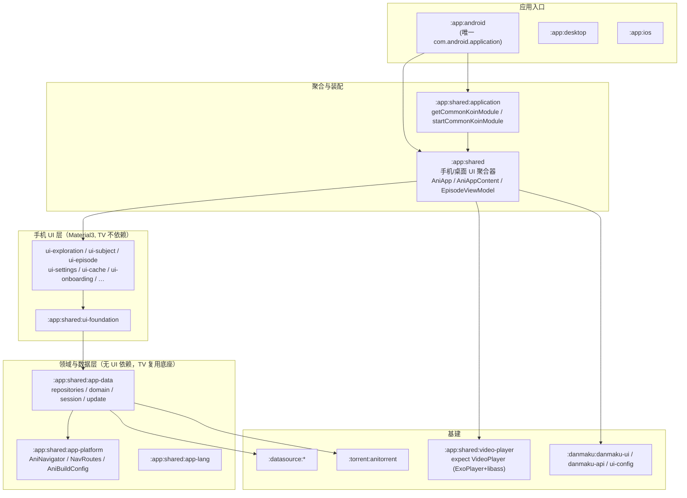
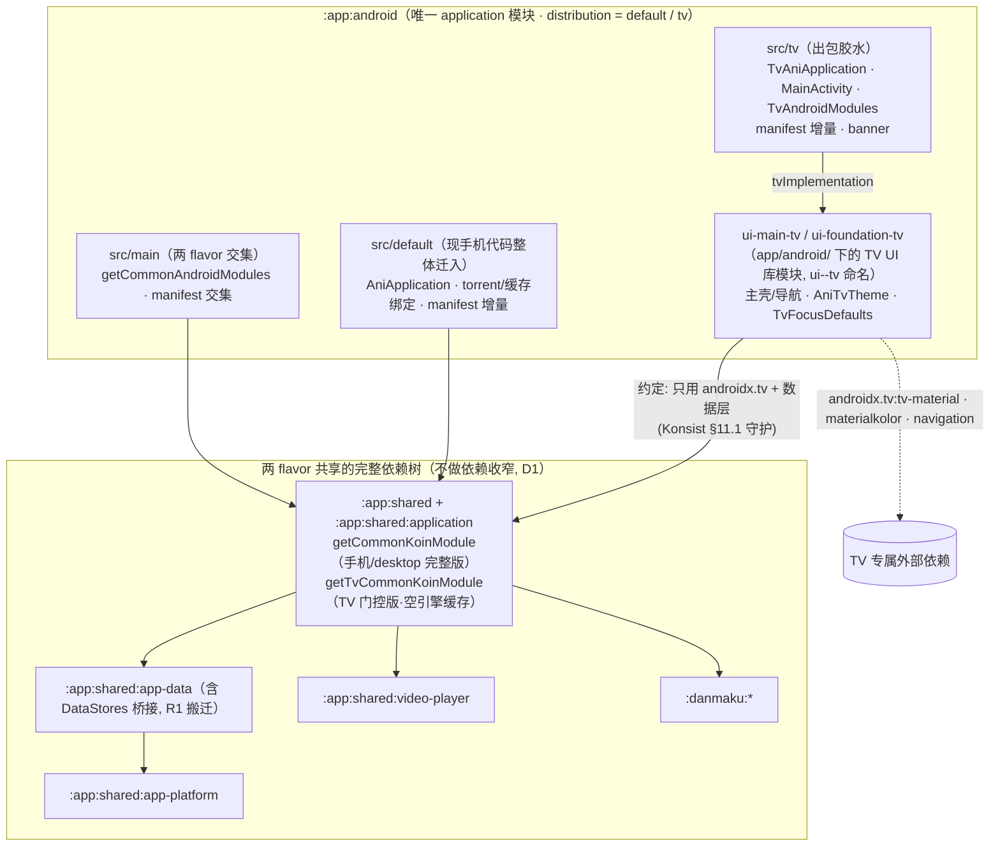

# Animeko Android TV 客户端架构设计

| | |
|---|---|
| 状态 | 草案（供评审） |
| 日期 | 2026-08-01 |
| 范围 | 新增 Android TV 客户端（定位**纯在线播放端**，功能裁剪见 §1.2），以 `:app:android` 的 `tv` flavor 出包；发布物为 **手机 APK + TV APK 两个安装包** |
| 交互参考 | [PR#3217](https://github.com/open-ani/animeko/pull/3217)（仅复用其 UI/UX 交互设计，**不采用其工程架构**）；UI/UX 稿已镜像至 claude.ai/design 项目 [「Animeko TV」](https://claude.ai/design/2a3b7d37-075a-400b-bedb-ef2072b6caf3)，作为实现期的可视化对照基准 |
| UI 技术 | Google 官方 Compose for TV：`androidx.tv:tv-material` 1.1.0（稳定）+ 标准 compose foundation lazy（TvLazy* 已废弃，无需 tv-foundation） |
| 基线 | 本文所有「现状」结论核对自 `main` 分支（kotlin 2.3.10 / AGP 9.0.1 / CMP 1.10.3 / minSdk 27 / compileSdk 36） |

---

## 1. 目标与非目标

### 1.1 目标

1. **独立 TV APK**：`:app:android` 在既有 `distribution` 维度新增 `tv` flavor（与 `default` 平级），applicationId 覆写为 `me.him188.ani.tv`，Leanback 启动器入口，可与手机版并存、独立更新。
2. **TV 界面全部基于 androidx.tv（tv-material3）**：焦点态、导航抽屉、轮播、卡片等交由官方组件承担，不在共享 Compose UI 上打补丁。
3. **最大化复用现有非 UI 资产**：`app-data`（仓库/领域/播放编排/弹幕/会话）、`app-platform`（导航契约/构建信息）、`app-lang`（多语言）、`video-player`（播放画面）、`danmaku-ui`（弹幕渲染）、datasource 在线源——**零改动或最小改动**复用；torrent/缓存链路在 classpath 上共存但**不进 TV 运行时**（DI 门控为空实现，见 §1.2/D4）。
4. **交互对齐 PR#3217 的 UX 设计**：沉浸式探索页（hero 轮播+backdrop）、正交按键时间表、锚点选集轮播、单一状态机播放器、返回键逐层语义、确认键长短按等。
5. **对手机端零行为变化**：手机构建任务名（`assembleDefaultRelease`）、产物路径、二进制行为完全不变；允许的改动仅限纯搬迁式重排（R1 `application` 内装配函数重构、R2 `:app:android` 源集重排与 manifest 分层，见 §4.3），以产物对比验收。

### 1.2 非目标（明确不做）

**功能裁剪 —— TV 定位为「纯在线播放端」**。以下能力**整体砍掉、不列路线图**（区别于「首版不做」）；架构上保留按模块复装的可能（缓存/BT 的装配被隔离为独立 Koin 模块，见 §4.3-R1）：

| 砍掉 | 理由 | 架构落点 |
|---|---|---|
| **缓存系统**（MediaCache 全链路：缓存页、缓存设置、HTTP/离线下载引擎） | 电视场景常开网络、盒子存储小，离线价值低；砍掉后省去缓存装配与启动期缓存恢复任务 | `getTvCommonKoinModule` 把缓存门控为空引擎实现（§4.3-R1）；`Caches`/`CacheDetail` 路由不注册（§6.3）；主壳无缓存入口（§6.4） |
| **BT 源播放**（torrent 引擎、Anitorrent、`:torrent_service` 前台服务进程） | TV ROM 后台限制下 BT 前台服务稳定性差（该风险随裁剪就地消除）；TV 因此保持**单进程**，manifest 大幅精简 | torrent 绑定归位 `src/default` 源集、tv variant 不编译（§4.3-R2）；选源仅 `MediaSourceKind.WEB`（§8.1）；tv variant 合并 manifest 无 torrent 服务与前台服务权限（§6.2） |
| **发送评论** | Turnstile 验证码依赖 WebView 交互，遥控器场景不适配 | 评论保留**只读**浏览（详情页/播放器面板）；`TurnstileState` 绑定 TV 亦注册但**永不调用**（Koin 惰性，D4）。注意：`CaptchaBrowserFactory`/`ImageCaptchaRecognizer` **需要注册**——M1 实施修正：它们是 Web 数据源解析链（`WebSessionManager`）的依赖，服务于播放取源而非评论（§6.1） |
| **Bangumi OAuth 网页授权** | 依赖 WebView/系统浏览器，TV 多数设备没有 | 登录仅邮箱 OTP（§7.7）；不声明 `ani://bangumi-oauth-callback`（§6.2）；Bangumi 绑定在手机端完成后经账号体系自然同步 |
| **编辑个人资料** | 低频且文本输入密集，10-foot 体验差 | 无入口；头像/账号处提示「请在手机端编辑」（§7.7） |

**架构非目标**：

- ❌ 不引入 PR#3217 的 `AniUiBehavior` 行为开关与 `Local*Variant` 页面插槽——共享 UI 模块不为 TV 加任何分支。
- ❌ 不复用手机端 Compose 界面树（`ui-exploration` / `ui-subject` / `ui-episode` 等的 Composable 一概不进 TV 依赖图；基建类例外，见 §5.6）。
- ❌ 不使用旧世代 `androidx.leanback`。
- ❌ 不自研焦点引擎（PR 的 `GridFocusController` / `resolveFocusRepeatedly` / `TvLongPressKey` 均以官方 API 等价替代，见 §5.4）。
- ❌ 首版不做（列入路线图后期）：一起看、屏保/主屏频道。

---

## 2. 现状架构速览（设计输入）

### 2.1 分层



### 2.2 与本设计直接相关的既有事实

| 主题 | 事实 | 出处 |
|---|---|---|
| 构建约定 | 库模块 = KMP + `com.android.kotlin.multiplatform.library` + 约定插件 `ani-mpp-lib-targets`（自动注入 CMP material3 等）；**没有** android application/library convention 插件；仅 `:app:android` 用 `com.android.application` | `buildSrc/src/main/kotlin/ani-mpp-lib-targets.gradle.kts` |
| Compose | 全仓库用 JetBrains CMP（`org.jetbrains.compose` 1.10.3），compiler 走 `kotlin.plugin.compose`，无 `composeCompiler{}` 定制 | 各模块 `build.gradle.kts` |
| DI | `getCommonKoinModule()`（约 30 个 UseCase + 30+ 服务绑定）在 `:app:shared:application`；其中**仅两处 UI 绑定**：`SubjectDetailsStateFactory`（ui-subject）、`TurnstileState`（ui-comment）；Android 平台绑定 `getAndroidModules()` 与 `AniApplication` 在 `:app:android` 内（包 `me.him188.ani.android`） | `app/shared/application/src/commonMain/kotlin/platform/CommonKoinModule.kt:569,571`；`app/android/src/main/kotlin/AndroidModules.kt:96` |
| 导航 | `AniNavigator`（接口 + default 实现，直接操作 `NavHostController`）与 `@Serializable sealed class NavRoutes`、`MainScreenPage` 均在 `:app:shared:app-platform` → **TV 可原样复用** | `app-platform/src/commonMain/kotlin/navigation/` |
| 播放编排 | `EpisodeFetchSelectPlayState`（换集/取源/选源/装载）、`EpisodeSession`、`PlayerSession`、`MediaFetchSelectBundle`、`EpisodeDanmakuLoader` **全部在 `app-data` domain 层**；手机 `EpisodeViewModel`（1118 行）只是在其上叠手机 presentation | `app-data/src/commonMain/kotlin/domain/episode/` |
| 页面数据源 | `TrendsRepository` / `RecommendationRepository` / `FollowedSubjectsRepository` / `AnimeScheduleRepository`(+`GetAnimeScheduleFlowUseCase`) / `SubjectSearchRepository`(Paging) / `SubjectCollectionRepository` / `EpisodeCollectionRepository` / `EpisodePlayHistoryRepository` / `SettingsRepository`(22 个 `Settings<T>`) / `UserRepository`(邮箱 OTP) / `SessionManager` — 全在 `app-data` | agent 调查报告 §4 |
| 手机 VM 耦合度 | `ExplorationPageViewModel` / `ScheduleViewModel` / `EmailLoginViewModel` 都是「注入 repo → 组装 State」的薄层（≤ 数十行核心逻辑）→ TV 自建薄 VM 成本低 | `app/shared/src/commonMain/kotlin/ui/main/` |
| 播放画面 | `expect fun VideoPlayer(player: MediampPlayer, modifier)`，Android actual = `ExoPlayerMediampPlayerSurface` + libass `AssSubtitleView`；倍速/画面比例/章节/**帧预览**走 `player.features[PlaybackSpeed / VideoAspectRatio / FramePreview / chapters]` | `app/shared/video-player/`；mediamp 0.2.1 |
| 弹幕渲染 | `DanmakuHost(state, modifier, baseStyle)` 纯 Canvas 绘制，material3 仅作为 `baseStyle` 默认参数 → TV 显式传 style 即可复用；播放器接线 `PlayerDanmakuHost` 约 50 行，可拷贝 | `danmaku/ui/src/commonMain/kotlin/DanmakuHost.kt:92` |
| 图片 | coil3；`AsyncImage` 封装与 `createDefaultImageLoader(context, ScopedHttpClient)` 在 ui-foundation，`LocalImageLoader` 由手机 `AniApp` 提供 → TV 需自行 provide | `ui-foundation/.../AsyncImage.kt:154` |
| 字符串 | `Lang` = CMP resources 生成的 `Res.string` 别名，源是 `app-lang/src/androidMain/res/values*/strings.xml`；android-only 模块直接依赖即可 `stringResource(Lang.xxx)` | `app/shared/app-lang/` |
| Manifest | torrent 前台服务实现于 `app-data` androidMain，但 `<service>` 声明**只在** `:app:android` 的 manifest（`:torrent_service` 进程）；FileProvider / InitializationProvider / 8 组权限亦然 → manifest 需按 flavor 分层：交集进 `src/main`、torrent 服务等手机专属进 `src/default`、TV 增量进 `src/tv`（§6.2） | `app/android/src/main/AndroidManifest.xml` |
| 更新 | `UpdateChecker` 向 Ani 服务端要 `downloadUrlAlternatives`（参数 `clientPlatform/clientArch/releaseClass`），**不是**扫 GitHub 资产；CI 产物命名 `ani-<ver>-<arch>.apk`（`buildSrc/ciHelperTasks.kt:102`） | `ui-settings/tools/update/` |
| CI | workflow 由 `.github/workflows/src.main.kts` 生成（github-workflows-kt）；Android 任务 `assembleDefaultRelease`；签名走 `signing_release_*` Gradle 属性 | `.github/workflows/src.main.kts` |
| androidx.tv 现状 | catalog 与全部模块中**无任何** androidx.tv/leanback 条目 | `gradle/libs.versions.toml` |

### 2.3 PR#3217 留下了什么

PR#3217 的资产分两类，本方案**只继承第一类**。其 UI/UX 稿已完整镜像到 claude.ai/design 项目 [「Animeko TV」](https://claude.ai/design/2a3b7d37-075a-400b-bedb-ef2072b6caf3)——PR 关闭后视觉/交互规格不依赖翻代码考古，实现与评审以该镜像为准：

| 类别 | 内容 | 本方案处置 |
|---|---|---|
| **UX 设计**（继承） | 沉浸式三页（backdrop 渐隐参数/hero 信息块/锚点卡片行/聚焦行吸顶）、时间表正交按键模型、详情页单列 10-foot + 固定锚点选集轮播、播放器三层状态机与全部按键语义、确认键长短按 500ms、返回键逐层、收藏长按菜单、TMDB 横版图/分集剧照的数据需求 | 作为交互规格逐页落实（§7/§8），参数速查见附录 A |
| **工程架构**（不继承） | `formFactor` flavor、`AniUiBehavior` 13 项开关、7 个 `Local*Variant` 插槽、自研焦点引擎（`GridFocusController`/`resolveFocusRepeatedly`/`restoreFocusAfter`/`TvLongPressKey`）、在共享 M3 组件里做 TV 分支 | 由「TV UI 独立库模块 + 打包层 flavor（共享 UI 零分支，与 PR 的 formFactor 方案本质不同，见 D1）+ androidx.tv 官方组件/焦点 API」整体替代（对照表见 §5.4） |
| 数据侧新增（择机另行评估） | `TmdbImageService`/`TmdbEpisodeMatcher`（横版 backdrop、分集剧照）、`BangumiSummaryService`（空简介兜底）、`StaleRefreshGate` | TV 沉浸式界面**需要**横版图数据；这部分是纯 `app-data` 扩展、与 UI 架构无关，建议按 PR 的数据实现独立成一个小 PR 合入 `app-data`（见 §9.2） |

---

## 3. 方案总览

### 3.1 核心决策

| # | 决策 | 结论 | 理由 |
|---|---|---|---|
| D1 | 双 APK 的产出方式 | **`:app:android` 在既有 `distribution` 维度新增 `tv` flavor**（`default`/`tv` 平级，**不加新维度**）；TV UI 用 androidx.tv 重写并**保持模块化**——库模块置于 `app/android/` 下、按 `ui-<feature>-tv` 命名（§4.1），出包胶水在 `src/tv` 源集 | 单维度保证手机任务名 `assembleDefaultRelease` 与产物路径零变化；版本/签名/SDK 单一台账；**两 flavor 共享完整依赖树**（数据层/装配全量共用，不做依赖收窄）——「TV 不得调用手机 UI」是**约定边界**，由本文档 + Konsist（§11.1）+ 清单守护（§10.2）看护，不由编译器强制；与 PR#3217 flavor 方案的区别：共享 UI 模块零分支、无行为开关，TV 差异收敛在 `ui-*-tv` 模块 + `src/tv` 胶水 + DI 门控（D4）。方案演进史与备选记录见 §4.5 |
| D2 | TV UI 技术 | `androidx.tv:tv-material:1.1.0`；列表用**标准 compose foundation lazy**（TvLazy* 已随 tv-foundation 1.0 移除，官方迁移路径即标准 lazy），锚点/吸顶滚动语义用自实现的 pivot 版 `BringIntoViewSpec`（compose foundation 1.7+ 内建该扩展点；`tv-foundation` 无需引入） | 官方稳定版；焦点视觉（scale/border/glow）、抽屉、轮播、TabRow 开箱即用 |
| D3 | 逻辑复用策略 | 数据层/装配全量共用；ViewModel **按适配性选用**——纯数据编排的手机 VM（如 `EmailLoginViewModel`）可直接复用，深度绑定手机交互形态的（如手机 `EpisodeViewModel` 的 presentation 层）由 TV 自建薄 VM 替代；UI 层必须用 androidx.tv 重写 | 手机依赖树对 tv variant 完整可见（D1），复用无技术障碍；取舍标准只看「该 VM 的状态形态是否适合 10-foot 交互」 |
| D4 | DI | **flavor 门控，不引入新模块**（§4.3-R1）：`:app:shared:application` 提供两个装配入口——`getCommonKoinModule`（手机/desktop，含完整缓存/BT，行为与历史一致）与 `getTvCommonKoinModule`（TV，缓存绑定为空引擎实现）；UI 绑定（`SubjectDetailsStateFactory`/`TurnstileState`）两端都注册，Koin 惰性绑定，TV 不使用即不实例化 | 缓存/BT 是被公共链路**主动注入**的基础设施（`MediaSourceManager`/`EpisodeProgressRepository` 直接 `get<MediaCacheManager>()`），「不用就行」不成立，必须有装配级开关；除此之外 TV 与手机装配完全一致 |
| D5 | 导航 | 复用 `AniNavigator` + `NavRoutes`（app-platform），TV 自建 NavHost 只注册 TV 支持的路由子集 | 路由类型是 `@Serializable` 纯数据；deep link `ani://subjects/{id}` 语义两端一致 |
| D6 | 主题 | `AniTvTheme`：复用 materialkolor 由 `ThemeSettings.seedColor`（默认 `#4F378B`）生成 M3 配色，**逐字段映射**到 `androidx.tv.material3.ColorScheme`；TV 默认深色（可设置跟随） | 品牌一致；TV 环境深色是行业惯例（PR `forceDarkInPlayer` 同理由） |
| D7 | 焦点视觉 | 交互语义严格对齐 PR；**视觉默认采用 tv-material 习语但调参贴近 PR**：`scale = 1f`（无缩放）+ `Border(2.5dp primary, inset 3dp)`（「色圈+留白」）+ 无 glow；集中在 `TvFocusDefaults` 一处 token，可整体切换回官方缩放风格 | 官方组件状态机免费拿到；PR 的无缩放描边风格已被实机验证 |
| D8 | 应用内更新 | MVP 阶段 TV 端**关闭**自动更新入口（提示到 GitHub Release）；待服务端 `clientPlatform` 支持 `android-tv` 后开启 | 更新源是 Ani 服务端接口而非 GitHub 资产扫描，需要服务端配合（§10.4） |
| D9 | TV 功能范围 | **纯在线播放端**：砍掉缓存系统、BT 源播放、评论发送、Bangumi OAuth 网页授权、编辑个人资料（§1.2） | 电视场景收益低或依赖 WebView/多进程前台服务；砍掉后 TV 单进程、无 torrent/缓存装配，依赖图更薄、ROM 兼容风险显著下降；装配以独立 Koin 模块隔离，日后按需可整体复装 |

### 3.2 总体架构



手机端感知面：① `:app:shared:application` 的 `getCommonKoinModule` 内部重构为「核心 + 缓存模块」组合（对外签名与行为不变，desktop/iOS 零感知），并新增 TV 门控入口 `getTvCommonKoinModule`；② `:app:android` 现有 `src/main` 整体迁入 `src/default`，交集上提回 `src/main` 并做 manifest 分层。均为纯搬迁：`assembleDefaultRelease` 任务名、产物路径与二进制行为不变（§4.3 验收）。

---

## 4. 模块设计

### 4.1 模块与源集布局

**TV UI 库模块**——UI 保持模块化，模块目录置于 `app/android/` 下，统一命名 **`ui-<feature>-tv`**（叶名独立，天然避开与 `:app:shared:ui-foundation` 的 Gradle 坐标冲突）；库模块不随 app variant 切换，IDE 始终可解析：

| 模块 | 目录 | namespace | 职责 |
|---|---|---|---|
| `:app:android:ui-foundation-tv` | `app/android/ui-foundation-tv` | `me.him188.ani.tv.ui.foundation` | TV 设计系统：`AniTvTheme`、`TvColorMapping`、`TvFocusDefaults`、`TvScreenScaffold`；（M1+）通用组件 `TvPosterCard`、`TvBackdropLayer`、`TvCenteredDialog`、`TvTextField`、`TvSlider`、`TvSeekBar` 等 |
| `:app:android:ui-main-tv` | `app/android/ui-main-tv` | `me.him188.ani.tv.ui` | 主壳/导航：`TvAniAppContent`（NavHost）、`TvMainShell`、`TvKoinModule`；M0 起步也承载页面，M1–M3 按 feature 增长后拆出 `ui-exploration-tv` / `ui-subject-tv` / `ui-episode-tv` 等同格式模块 |

插件形态：`com.android.library`（AGP 9 内置 Kotlin）+ `jetbrains.compose` + `kotlin.plugin.compose`；`ui-foundation-tv` `api(libs.androidx.tv.material)` 向上传递；`:app:android` 仅以 `"tvImplementation"(projects.app.android.uiMainTv)` 引入。

**`:app:android` 三源集**（`tv` flavor 在既有 `distribution` 维度内平级新增，不加新维度——两维度交叉会改变手机任务名 `assembleDefaultRelease` 的语义与产物路径）：

| flavor / 源集 | 内容 |
|---|---|
| `default`（现有） | 手机形态。现 `src/main` 的全部代码与手机专属 manifest 声明**整体迁入 `src/default`**（包名不变，git mv，§4.3-R2） |
| `tv`（新增） | applicationId 覆写 `me.him188.ani.tv`。`src/tv` 只放**出包胶水**：`TvAniApplication` / `MainActivity` / `TvAndroidModules` + manifest 增量 + banner + `app_name` 覆写 |
| `src/main`（交集） | 两 flavor 共用的 Android 绑定（`getCommonAndroidModules`，§4.3-R2）与 manifest 交集 |

### 4.2 约定边界（import 规则，非依赖隔离）

依赖图**不做隔离**（D1）：tv variant 与 default variant 共享 `:app:shared` + `:app:shared:application` 的完整依赖树，手机 UI、torrent/缓存、Turnstile 等全部**在 classpath 上可见**。边界是 **import 级约定**，由本节 + §11.1 Konsist + code review 看护：

| TV 代码（`ui-*-tv` 模块 + `src/tv` 胶水） | 规则 |
|---|---|
| `androidx.tv.material3.*` / compose foundation / navigation | ✅ TV UI 唯一允许的组件体系 |
| `app-data` / `app-platform` / `app-lang` / `video-player` / `danmaku-ui` 及可复用 VM（D3） | ✅ 数据层/领域层/基建全量共用 |
| `androidx.compose.material3.*` | ❌ **禁止 import**（唯一例外：`TvColorMapping.kt` 的色板类型桥接）——两套 MaterialTheme 不共存于同一子树 |
| `me.him188.ani.app.ui.*`（手机 UI 树） | ❌ **禁止 import**，白名单基建除外（见下）；手机 Composable 在 tv-material 主题下渲染错乱且无焦点支持 |
| torrent / `MediaCache` 具体实现类 | ❌ 不得直接引用——运行期由 DI 门控为空实现（D4），直接引用会绕过门控 |

> `app-data` 传递依赖 torrent 模块（classpath 上不可避免），tv variant **零装配、零实例化**（§4.3：`getTvCommonKoinModule` 空引擎门控，torrent 平台绑定在 `src/default`、tv variant 不编译），运行期不触碰 torrent/缓存类，也无 `:torrent_service` 进程。

**「ui-foundation(基建)」白名单**（`me.him188.ani.app.ui.*` 中 TV 允许 import 的例外，由 §11.1 的 Konsist 测试强制）：

```
me.him188.ani.app.ui.foundation.AsyncImage / LocalImageLoader / createDefaultImageLoader
me.him188.ani.app.ui.foundation.AbstractViewModel
me.him188.ani.app.ui.foundation.animation.*            (AniMotionScheme / MaterialEasing / AniAnimatedVisibility)
me.him188.ani.app.ui.foundation.widgets.Toaster / LocalToaster   (接口；TV 自己实现)
me.him188.ani.app.ui.foundation.navigation.BackHandler (若为 CMP 兼容封装)
me.him188.ani.app.ui.search.renderLoadErrorToastMessage (LoadError → 文案)
```

> 备选方案（记录备查）：若后续想彻底摆脱 material3 传递依赖，可把上述基建从 ui-foundation 下沉到新的 `:app:shared:ui-infra`。首版不做——搬迁面大、收益小，Konsist 守护已足够。

### 4.3 前置重构（唯一动手机侧的部分，均为纯搬迁）

**R1 — `:app:shared:application` 装配重构（无新模块，函数级拆分）**

| 动作 | 内容 |
|---|---|
| 拆分（缓存/BT，服务 D9） | `CommonKoinModule.kt` 内部：`single<MediaCacheManager>`（其引擎装配 `get<TorrentManager>().engines` + `HttpMediaCacheEngine`）与 `single<HttpDownloader>`（写缓存目录）从 `otherModules` 独立成 **`getMediaCacheKoinModule()`**；新增 **`getDisabledMediaCacheKoinModule()`**（空引擎 `MediaCacheManagerImpl`）——`MediaSourceManager` 的本地缓存源、`EpisodeProgressRepository` 等**直接注入 `MediaCacheManager` 的点**照常解析、行为自然为空（实施发现这类注入点不止选源一处，空实现比 getOrNull 手术更稳）；`startCommonKoinModule` 的缓存恢复段对 `HttpDownloader`/`MediaCacheManager` 做 `getOrNull` 判空 |
| 双入口 | `getCommonKoinModule` = 核心 + `getMediaCacheKoinModule()`——**手机（`AniApplication.kt:142`）/desktop（`AniDesktop.kt`）/iOS 调用点与行为零改动**；新增 **`getTvCommonKoinModule`** = 核心 + `getDisabledMediaCacheKoinModule()`——TV 唯一入口（flavor 门控，D4）。两个 UI 绑定（`SubjectDetailsStateFactory`/`TurnstileState`）保留在核心里，TV 注册但不使用（惰性） |
| 搬迁（实施发现） | `Context.dataStores` 桥接（`DataStores.kt` + 三端 `SettingsStore.*.kt`，共 4 个薄文件）从 `:app:shared` 聚合器搬入 `app-data`（包 `me.him188.ani.app.data.persistent` 不变，全仓 import 零改动）——持久化桥接本就属数据层，顺手归位 |
| 验收 | 手机 APK 依赖图与运行行为不变；**tv variant 无任何 torrent/缓存实例化**（classpath 存在但零装配、零类初始化，启动期无缓存恢复、无 `:torrent_service` 进程） |

**R2 — `:app:android` 源集重排（纯搬迁，git mv）**

现 `src/main` 整体迁入 `src/default`，再把两 flavor 交集**上提回 `src/main`**；`AndroidModules.kt`（`getAndroidModules`）随之按源集拆分：

| 归宿 | 内容 |
|---|---|
| `src/main`（交集）：`getCommonAndroidModules(scope)` | `PermissionManager`、`HlsPlaybackPreparer`、`MediampPlayerFactory`（ExoPlayer+libass 注册）。**M0 实施修正**：`MediaResolver`（手机实现耦合 torrent/offline 解析链）与 `AppTerminator`（手机实现引用 `AniTorrentService`）不是交集，按 flavor 各自实现；`MeteredNetworkDetector` 本就绑在 Koin 核心 commonMain |
| `src/default`（手机专属；tv variant 不编译） | 现有手机代码全量（`AniApplication`/Activity/通知等）；缓存/BT 链路绑定：`TorrentEngineAccess`、`TorrentServiceConnection`（及 serviceConnectionManager）、`TorrentManager`、`MediaSaveDirProvider`、`HttpMediaCacheEngine`、`OfflineDownloadEngine`；`MediaResolver`（含 torrent/offline 解析）、`AppTerminator`（停 torrent 服务）；`BrowserNavigator`（手机实现）、`CaptchaBrowserFactory` / `ImageCaptchaRecognizer`（WebView 验证码）、`UpdateInstaller`、`ExternalContentProviderFactory`（发行渠道相关） |
| `src/tv`（TV 专属）：`TvAndroidModules` | `BrowserNavigator`（暂用 `NoopBrowserNavigator`，M2 换二维码降级实现）、`AppTerminator`（finishAffinity + exitProcess，无服务停靠）；TV 版 `MediaResolver`（LocalFile/HttpStreaming/Web，无 torrent/offline）；`CaptchaBrowserFactory`/`ImageCaptchaRecognizer`（**M1 修正：必须注册**——Web 解析链 `WebSessionManager` 的依赖，服务于取源而非评论）；M2 补 `Toaster` TV 实现；`UpdateInstaller` 按 D8 暂缓 |

依赖（`build.gradle.kts`）：`implementation(projects.app.shared)` / `implementation(projects.app.shared.application)` 保持 common 作用域**不收窄**（D1，两 flavor 共享完整依赖树）；TV 专属 UI 栈以 `"tvImplementation"` 追加（tv-material / materialkolor / navigation-compose，完整脚本见 §10.1）。

验收：`assembleDefaultRelease` 产物与重排前对比无行为差异（任务名与输出路径本身不变）；`assembleTvDebug` 验证 tv 源集可编译（进 PR 检查，§10.2）。注意：手机符号对 tv variant 同样可见，越界 import 由 Konsist（§11.1）与 review 拦截，编译器不拦（D1 的取舍）。

**R3 — 数据补充（可与 M1 并行）**：从 PR#3217 摘取纯数据实现合入 `app-data`：`TmdbImageService`（横版 backdrop + 分集剧照，含持久缓存）、`TmdbEpisodeMatcher`、`BangumiSummaryService`、`StaleRefreshGate`。这是沉浸式 UI 的数据前提，与 UI 架构无关（PR 中这些文件本就位于 `app-data`，可近乎原样 cherry-pick）。

### 4.4 目录结构

```
app/android/                                 # 唯一 application 模块 + TV UI 库模块（§4.1）
├── src/
│   ├── main/                                # 交集
│   │   ├── AndroidManifest.xml              # manifest 交集（通用权限 / FileProvider / InitializationProvider）
│   │   └── kotlin/CommonAndroidModules.kt   # getCommonAndroidModules（§4.3-R2）
│   ├── default/                             # 手机：现 src/main 整体迁入（包名不变）
│   │   ├── AndroidManifest.xml              # 增量：torrent 双服务 · 手机专属权限差集 · oauth callback
│   │   └── kotlin/...                       # AniApplication · 手机侧 AndroidModules 等
│   └── tv/                                  # 出包胶水（包 me.him188.ani.tv）
│       ├── AndroidManifest.xml              # 增量：leanback 声明 · TV Application/Activity · banner
│       ├── kotlin/
│       │   ├── TvAniApplication.kt          # startKoin：getTvCommonKoinModule + 交集/TV 平台绑定
│       │   ├── MainActivity.kt              # BaseComponentActivity + AniTvTheme + TvAniAppContent · deep link
│       │   └── TvAndroidModules.kt          # TV 侧平台绑定（BrowserNavigator 降级 / AppTerminator 等）
│       └── res/
│           ├── drawable/tv_banner.xml       # 320×180 横幅（复刻 PR 视觉）
│           └── values/strings.xml           # app_name 覆写（"Animeko TV"，覆盖 :app:shared 库资源）
├── ui-foundation-tv/                        # :app:android:ui-foundation-tv（me.him188.ani.tv.ui.foundation）
│   └── src/main/kotlin/me/him188/ani/tv/ui/foundation/
│       ├── theme/    AniTvTheme.kt · TvColorMapping.kt ·（M1+）TvTypography.kt
│       ├── focus/    TvFocusDefaults.kt ·（M1+）InitialFocus.kt · AnchorBringIntoView.kt
│       ├── layout/   TvScreenScaffold.kt（统一 48dp 安全边距 / overscan）
│       └── widgets/ （M1+）TvPosterCard · TvBackdropLayer · TvHeroButton · TvCenteredDialog
│                     TvTextField · TvSlider · TvSeekBar · TvDropdownMenu · TvToastHost
└── ui-main-tv/                              # :app:android:ui-main-tv（me.him188.ani.tv.ui）
    └── src/main/kotlin/me/him188/ani/tv/ui/
        ├── main/         TvAniAppContent.kt（NavHost）· TvMainShell.kt（NavigationDrawer 主壳）
        ├── di/           TvKoinModule.kt（薄 VM 注册表）
        └──（M1–M3 按 feature 分包，增长后拆 ui-<feature>-tv 模块）exploration/ schedule/
                           search/ collection/ subject/ episode/(player/) settings/ login/
```

### 4.5 方案演进史与备选记录

本设计经历三轮收敛，记录备查（均可机械回退/前进）：

| 版本 | 方案 | 结局 |
|---|---|---|
| v1 | 独立 `:app:tv:application` 模块出包 | 不采用——双 application 模块 + 版本/签名台账重复；对比记录见 D1 |
| v2 | flavor 出包 + **编译期隔离**：`:app:shared:app-bootstrap` 无 UI 装配模块 + `defaultImplementation`/`tvImplementation` 依赖收窄 + TV UI 独立库模块（`:app:tv:ui*`）。曾完整实施并通过验收 | 按维护者决策回退——判断「TV 不调用手机 UI」用约定约束即可，不值得为编译期强制付出 3 个新模块与更复杂的依赖拓扑 |
| **v3（现行）** | flavor 出包 + **约定边界**：两 flavor 共享完整依赖树（不收窄），差异收敛为 DI 门控（`getTvCommonKoinModule`）+ manifest 分层 + Konsist/清单守护；TV UI 保持模块化——库模块置于 `app/android/` 下、`ui-<feature>-tv` 命名（叶名独立免坐标冲突），`src/tv` 只留出包胶水 | ✅ 现行方案（D1/D4） |

v2→v3 保留下来的实施资产：缓存/BT 的装配级开关（v2 证明「不用就行」对被注入的基础设施不成立）、manifest 三层分治、`DataStores` 归位 app-data、tv classpath 的 firebase 剔除、清单守护任务。若未来需要更硬的隔离（如 TV 包体成为问题），沿 v2 路线重新收窄依赖即可，装配开关无需改动。

---

## 5. TV UI 技术栈

### 5.1 依赖与版本

`gradle/libs.versions.toml` 新增：

```toml
[versions]
androidx-tv-material = "1.1.0"     # 2026-05 稳定

[libraries]
androidx-tv-material = { module = "androidx.tv:tv-material", version.ref = "androidx-tv-material" }
```

> 不引入 `androidx.tv:tv-foundation`：其 TvLazy* 已被移除，官方迁移指南明确「标准 compose foundation lazy + 自定义 `BringIntoViewSpec`」即完整替代，该库已无本项目需要的 API。

`settings.gradle.kts` 新增（沿用既有 `includeProject` 帮助函数，TV UI 模块统一 `ui-<feature>-tv` 命名）：

```kotlin
includeProject(":app:android:ui-main-tv", "app/android/ui-main-tv")
includeProject(":app:android:ui-foundation-tv", "app/android/ui-foundation-tv")
```

### 5.2 组件映射（PR UX 元素 → tv-material）

| PR UX 元素 | tv-material / 官方方案 | 备注 |
|---|---|---|
| 左侧可展开导航栏（收起图标列 ⇄ 聚焦展开文字） | `NavigationDrawer` + `NavigationDrawerItem` | 官方组件行为与 PR 设计几乎一致（焦点进入展开、离开收起）；头像项用自定义 `NavigationDrawerScope` 内容；PR 的 180dp 右缘羽化遮罩用 drawer 背景自定义还原 |
| 探索页 hero 轮播（6s 自动 + 指示器 + 手动左右） | `Carousel` + `CarouselDefaults.IndicatorRow` | `autoScrollDurationMillis = 6000`；焦点在内容按钮上时自动暂停轮播由 Carousel 自带 |
| 竖版海报卡（聚焦色圈+留白、无缩放、底部进度条） | `Surface`(clickable) / `Card` + `ClickableSurfaceDefaults.border/scale` | `Border(BorderStroke(2.5.dp, primary), inset = 3.dp, shape = RoundedCornerShape(11.dp))`，`scale(focusedScale = 1f)`；进度条自绘 2.5dp 胶囊 |
| Hero 操作按钮（立即观看/更多详情） | `Button` / `WideButton` | 聚焦反色由组件 colors 配置 |
| 追番分类 Tab（聚焦即选中 + 滑动指示条） | `TabRow` + `Tab` | tv-material TabRow 的焦点即选中语义与 PR 完全一致 |
| 时间表日期胶囊行（←→ 换天） | `TabRow`（胶囊样式）或 FilterChip 行 | 选中态三档（聚焦/选中未聚焦/普通）用 `TabDefaults`/自定义 colors |
| 收藏状态长按菜单 | `Surface` 长按（`onLongClick` 参数）+ 自建 `TvDropdownMenu`（Popup + tv `ListItem`） | tv-material `Surface` 原生支持 `onLongClick`，**替代 PR 的 tvLongPressKey**；弹出层内按键防连发由 Popup 焦点隔离天然解决 |
| 设置/面板列表行 | `ListItem` / `DenseListItem` | |
| 筛选胶囊 | `FilterChip` | |
| 播放器底部图标行 | `IconButton` + `Surface` | 聚焦标签槽自绘（18dp 占位） |
| 弹窗（收藏确认/评分/阅读全文/数据源选择） | `compose.ui.window.Dialog` + tv `Surface` 内容（封装为 `TvCenteredDialog`） | tv-material 无 Dialog 组件；尺寸沿用 PR：0.72×0.85 / 0.45 宽 / 380dp 评分窗，圆角 16，`surfaceContainerHigh@94%` |
| 列表滚动 | **标准** `LazyColumn/LazyRow/LazyVerticalGrid` | TvLazy* 已废弃移除 |
| 锚点行/吸顶（聚焦项钉在行首/行吸视口顶） | `LocalBringIntoViewSpec provides TvPivotBringIntoViewSpec(parentFraction = 0f)`——自实现的 pivot 语义 `BringIntoViewSpec`（约 20 行，官方迁移指南给了样例实现），放在 `ui-foundation/focus/AnchorBringIntoView.kt` | **官方扩展点替代 PR 的 animateScrollToItem 手工驱动**；`parentFraction = 0f` = 聚焦项对齐容器起点 |
| 聚焦丢失恢复 | `Modifier.focusRestorer(fallback)` + `FocusRequester` | 官方 API，替代 PR 的 restoreFocusAfter |

### 5.3 tv-material 缺口 → `ui-foundation-tv` 自建件

| 缺口 | 自建件 | 设计 |
|---|---|---|
| TextField | `TvTextField` | `BasicTextField` + tv `Surface` 外壳（聚焦 2.5dp primary 描边、primary 光标）；配合系统软键盘（`ImeAction.Search/Send`）；用于搜索、邮箱登录、弹幕发送、评分评语 |
| Slider | `TvSlider` | 聚焦态下 ←→ 步进（`onPreviewKeyEvent`），↑↓ 放行给焦点系统；用于弹幕设置 7 项、音量、弹幕时间校准（±30s） |
| 进度条/Seek | `TvSeekBar` | 播放器专用：整行单焦点、6dp 轨、缓冲段/已播段分色、聚焦圆点、拖拽预览锚点回调（§8.3） |
| Dialog | `TvCenteredDialog` | 见 §5.2；打开后 300ms 内请求初始焦点（对话框窗口不自动分配焦点，PR 结论仍适用） |
| DropdownMenu | `TvDropdownMenu` | `Popup` + tv `ListItem` 列，锚点定位复刻 PR（卡片右下角） |
| Toast | `TvToastHost` | 实现 ui-foundation 的 `Toaster` 接口并 provide `LocalToaster`；视觉沿用 PR（`surfaceContainerHigh` 胶囊、跟随主题） |

### 5.4 焦点工程：PR 自研 → 官方 API 对照

| PR#3217 自研机制 | 问题域 | 本方案（官方 API） |
|---|---|---|
| `GridFocusController` + `resolveFocusRepeatedly`（设目标→请求→上报→滚动重试→按键放弃） | Lazy 网格「聚焦第 N 项」没有原语、焦点事务被静默拒绝 | ① item 侧挂 `FocusRequester`，`LaunchedEffect` 中 `lazyGridState.scrollToItem(n)` 后 `requestFocus()`（item 已组合则一次成功）；② 行/网格容器挂 `Modifier.focusRestorer { firstItemRequester }` 处理「进入容器落到上次位置」；③ 恢复场景（返回本页）统一封装成 `rememberInitialFocus(key)` 工具（`ui-foundation/focus/InitialFocus.kt`），内部即 ①，不做轮询重试——tv-foundation 1.0 时代的 lazy+focus 兼容性已由官方修复，若实测仍有竞态再加受限重试 |
| BringIntoView 全局禁用 + `animateScrollToItem` 手工驱动（锚点行/吸顶） | 聚焦卡吸附行首、聚焦行吸视口顶 | `CompositionLocalProvider(LocalBringIntoViewSpec provides TvPivotBringIntoViewSpec(0f, 0f))` 包住对应 LazyRow/LazyColumn——滚动由焦点系统驱动、对齐点声明式给出（`TvPivotBringIntoViewSpec` 为按官方迁移样例自实现的 `BringIntoViewSpec`，见 §5.2） |
| `restoreFocusAfter`（弹窗关闭找回焦点） | 弹层关闭后焦点丢失 | `Modifier.focusRestorer()`；Dialog 场景：打开前记录 `FocusRequester`，`onDismissRequest` 后 `requestFocus()`（封装进 `TvCenteredDialog`） |
| `TvLongPressKey`（repeatCount==0 判据）+ `consumeHeldConfirmKey`（菜单免疫残余连发） | 确认键长短按、长按弹层被连发误点 | tv `Surface(onClick, onLongClick)` 原生长按；弹出层用 `Popup(focusable = true)` 独立焦点域，按住期间的重复 KeyDown 不会穿给新窗口的 KeyUp 语义（实现时以 UI 测试锁定该行为，见 §11.2） |
| `FOCUS_REQ_DELAY_MILLIS = 300` | 弹窗/布局变化后过早请求焦点失败 | 保留该经验值：`TvCenteredDialog` 内 `LaunchedEffect { delay(300); requester.requestFocus() }` |
| 播放器根部唯一按键路由 `onPreviewKeyEvent` | 媒体键/方向键全局语义 | **保留此设计**（这是交互架构而非焦点补丁）：TV 播放器同样在根 `onPreviewKeyEvent` 收敛（§8.2） |
| 返回键分层 BackHandler | 逐层退出 | 标准 `BackHandler(enabled) {}` 按层注册，同 PR 语义 |

**锚点行示例**（选集轮播 / 探索页卡片行通用）：

```kotlin
// AnchorBringIntoView.kt —— pivot 语义的 BringIntoViewSpec（官方迁移指南样例的封装，~20 行）
class TvPivotBringIntoViewSpec(
    private val parentFraction: Float, // 焦点项在视口中的锚点位置：0f=起点(锚点行/吸顶)
    private val childFraction: Float = 0f,
) : BringIntoViewSpec {
    override fun calculateScrollDistance(offset: Float, size: Float, containerSize: Float): Float =
        (offset + size * childFraction) - containerSize * parentFraction
}

@Composable
fun TvAnchoredRow(state: LazyListState, content: LazyListScope.() -> Unit) {
    CompositionLocalProvider(
        LocalBringIntoViewSpec provides remember {
            TvPivotBringIntoViewSpec(parentFraction = 0f) // 聚焦项吸附行首
        },
    ) {
        LazyRow(
            state = state,
            horizontalArrangement = Arrangement.spacedBy(16.dp),
            // 行尾留整行空白，末卡也能吸附行首（PR 结论沿用）
            contentPadding = PaddingValues(start = 48.dp, end = rowEndPaddingForAnchor()),
            modifier = Modifier.focusRestorer(),
            content = content,
        )
    }
}
```

### 5.5 主题系统 `AniTvTheme`

```kotlin
// :app:android:ui-foundation-tv  theme/AniTvTheme.kt
@Composable
fun AniTvTheme(themeSettings: ThemeSettings, content: @Composable () -> Unit) {
    // 1) 复用 materialkolor（与手机同一算法、同一种子色，品牌一致）
    val m3 = dynamicColorScheme(
        primary = themeSettings.seedColor,           // 默认 #4F378B
        isDark = true,                               // TV 默认深色；设置项可开「跟随手机端语义」
        isAmoled = themeSettings.useBlackBackground,
        style = PaletteStyle.TonalSpot,
    )
    // 2) 逐字段映射到 androidx.tv.material3.ColorScheme
    val tvColors = m3.toTvColorScheme()              // TvColorMapping.kt
    MaterialTheme(                                    // androidx.tv.material3.MaterialTheme
        colorScheme = tvColors,
        typography = AniTvTypography,                 // M3 刻度 + 10-foot 微调（正文不小于 12sp）
        content = content,
    )
}

// TvColorMapping.kt —— tv ColorScheme 比 m3 多 border/borderVariant，取 outline/outlineVariant
fun androidx.compose.material3.ColorScheme.toTvColorScheme() =
    androidx.tv.material3.darkColorScheme(
        primary = primary, onPrimary = onPrimary, primaryContainer = primaryContainer, /* …全字段… */
        border = outline, borderVariant = outlineVariant, scrim = scrim,
    )
```

配套：

- `LocalThemeSettings`：TV 在 `MainActivity` 用 `SettingsRepository.themeSettings.flow` 提供（不复用手机 `AniTheme`——那是 m3 `MaterialTheme`）。
- **两套 MaterialTheme 不共存于同一子树**：TV 代码只 import `androidx.tv.material3.MaterialTheme`；Konsist 禁 `androidx.compose.material3`（§11.1）。
- 字面色 token（PR 实测值）进 `TvColors.kt`：hero 文字 `#F1F1F1`/`#B4B5B7`、hero 按钮底 `#31363D`/`#17191C`、播放器控制层白/黑 alpha 系（§8）。
- `TvFocusDefaults`（唯一焦点视觉出口）：

```kotlin
object TvFocusDefaults {
    val scale = 1f                       // PR 风格：无缩放；切官方风格改 1.05f 一处生效
    @Composable fun cardBorder() = Border(
        border = BorderStroke(2.5.dp, MaterialTheme.colorScheme.primary),
        inset = 3.dp, shape = RoundedCornerShape(11.dp),
    )
    @Composable fun cardGlow() = Glow.None
}
```

### 5.6 其余基建复用方式

| 能力 | 方式 |
|---|---|
| 图片 | 依赖 ui-foundation 的 `AsyncImage`/`LocalImageLoader`；`TvAniApplication`/`MainActivity` 用 `createDefaultImageLoader(context, scopedHttpClient)` 提供（手机 `AniApp.kt:198` 同款装配，约 10 行） |
| 占位 shimmer | `:app:shared:placeholder` 的 `Placeholder.kt`/`PlaceholderHighlight.kt`（纯 foundation 层，**不用** PlaceholderMaterial3） |
| 字符串 | 直接 `stringResource(Lang.xxx)`；TV 专属新串加进 `app-lang`（PR 已铺好 49 条 TV 文案 key，可沿用命名） |
| 动效 | `AniMotionScheme`/`MaterialEasing`/`AniAnimatedVisibility` 原样复用 |
| 错误呈现 | `LoadError`（app-data）+ `renderLoadErrorToastMessage`；错误卡片 TV 自绘（tv `Surface` + 文案） |
| backdrop 渐隐曲线 | PR 的 `tvBackdropFadeToBlackStops`/`tvBackdropFadeFromBlackStops` 两个纯函数照搬进 `TvBackdropLayer.kt`（数学与 UI 框架无关） |

---

## 6. 应用骨架

### 6.1 进程与启动

```kotlin
// :app:android src/tv  TvAniApplication.kt —— tv variant 的 android:name（经 src/tv manifest 增量声明）
class TvAniApplication : Application() {
    override fun onCreate() {
        super.onCreate()
        AndroidLoggingConfigurator.configure(filesDir.resolve("logs").absolutePath)
        val scope = createAppRootCoroutineScope()
        startKoin {
            androidContext(this@TvAniApplication)
            // 共享装配 + 空引擎缓存门控（D4）—— TV 无缓存/BT，选源池自然无 LocalCache 源（§1.2）
            modules(getTvCommonKoinModule({ this@TvAniApplication }, scope))
            modules(getCommonAndroidModules(scope))                  // src/main 交集（无 torrent 绑定）
            modules(getTvAndroidModules())                           // src/tv — BrowserNavigator 降级 / AppTerminator
            modules(getTvKoinModule())                               // src/tv ui/di — 薄 VM 注册表
        }.startCommonKoinModule(this, scope)                          // proxy/Session 后台任务；缓存恢复段判空自动跳过
    }
}
```

`getTvKoinModule()`（`ui-main-tv` 的 `di`）注册各页 ViewModel（`viewModel { ... }`）；`getTvAndroidModules()`（`src/tv`）注册：`BrowserNavigator` 降级实现（暂 Noop，M2 换二维码对话框）、TV 版 `AppTerminator`、TV 版 `MediaResolver`（仅在线链路）、`CaptchaBrowserFactory`/`ImageCaptchaRecognizer`（Web 解析链依赖，服务取源，M1 修正）；`UpdateInstaller` 按 D8 暂不注册；`TurnstileState` 绑定虽注册但无调用方（评论发送裁剪，D4）。

### 6.2 Activity 与 Manifest

单 Activity（`MainActivity : BaseComponentActivity`，横屏、`singleTask`），Compose 全屏；`BaseComponentActivity` 来自 `:app:shared:application` androidMain（两 flavor 共用）。

**Manifest 三层分治**（合并方向：flavor 增量 → `src/main` 交集，**纯加法**，不需要任何 `tools:node="remove"` 手术）：

| 层 | 内容 |
|---|---|
| `src/main`（交集） | 通用权限：`INTERNET` / `ACCESS_NETWORK_STATE` / `WAKE_LOCK` / `REQUEST_INSTALL_PACKAGES`；`AppLocalesMetadataHolderService`、`InitializationProvider(ProcessLifecycleInitializer)`、`FileProvider(@xml/file_paths)`；`<application>` 通用属性（`largeHeap`/`usesCleartextTraffic` 等） |
| `src/default`（手机增量） | 现手机清单减去交集：torrent 双服务（`:torrent_service` 进程/前台类型）、权限差集（`FOREGROUND_SERVICE(_DATA_SYNC/_MEDIA_PLAYBACK)` / `POST_NOTIFICATIONS` / `VIBRATE`）、`ani://bangumi-oauth-callback` intent-filter、手机 `AniApplication`/Activity 声明 |
| `src/tv`（TV 增量） | 见下：Leanback 声明、TV Application/Activity、banner |

拆分验收：**default variant 合并后 manifest 与现状 diff 为空**（对比 `processDefaultReleaseManifest` 产物，进 CI 一次性校验后可移除）。

`src/tv/AndroidManifest.xml`：

```xml
<manifest>
    <!-- TV 形态声明 -->
    <uses-feature android:name="android.software.leanback" android:required="true"/>
    <uses-feature android:name="android.hardware.touchscreen" android:required="false"/>

    <!-- android:name 覆写 main 的 <application>（flavor 增量优先级更高） -->
    <application android:name="me.him188.ani.tv.TvAniApplication"
        android:banner="@drawable/tv_banner">

        <activity android:name="me.him188.ani.tv.MainActivity" android:exported="true"
            android:launchMode="singleTask" android:screenOrientation="landscape">
            <intent-filter>
                <action android:name="android.intent.action.MAIN"/>
                <category android:name="android.intent.category.LEANBACK_LAUNCHER"/>
            </intent-filter>
            <intent-filter> <!-- 与手机端同 scheme：ani://subjects/{id} -->
                <action android:name="android.intent.action.VIEW"/>
                <category android:name="android.intent.category.DEFAULT"/>
                <data android:scheme="ani" android:host="subjects"/>
            </intent-filter>
        </activity>
    </application>
</manifest>
```

> 注意：模块 namespace 仍是 `me.him188.ani`（namespace 为模块级），TV 源集包 `me.him188.ani.tv` 在 manifest 中写**全限定类名**；`ani://bangumi-oauth-callback` 与 torrent 服务都在 `src/default` 增量里，tv variant 合并结果**天然不含**它们（网页 OAuth/BT 已裁剪，§1.2）——合并后无任何 `<service>`，保持单进程；`tv_banner.xml` 复刻 PR 的 320×180 视觉（`#2F3943` 底 + `#7EBBED` 圆环 + 白圆 + 黑「あ」）。

### 6.3 导航

- 复用 `AniNavigator`（app-platform）：TV `MainActivity` 内 `rememberNavController()` → `aniNavigator.setNavController(...)`，业务代码统一走 `LocalNavigator.current.navigateXxx(...)`——与手机端习惯一致。
- `TvAniAppContent` 注册 **TV 路由子集**：

| NavRoutes | TV 落点 | 说明 |
|---|---|---|
| `Main(initialPage)` | `TvMainShell`（探索/追番 两 tab） | |
| `Schedule` | `TvScheduleScreen` | 独立目的地（同 PR） |
| `SubjectSearch` | `TvSearchScreen` | |
| `SubjectDetail` / `EpisodeDetail` | `TvSubjectDetailsScreen` / `TvEpisodeScreen` | |
| `Settings(tab)` | `TvSettingsScreen`（子集） | 未覆盖的 tab 显示「请在手机端配置」占位 |
| `EmailLoginStart/Verify` · `Welcome` | `TvEmailLoginScreen` · 精简欢迎页 | Onboarding 完整流程不搬，首启只做「登录或跳过 + 主题确认」 |
| 其余（`Caches`/`CacheDetail`/`SubjectCaches`/`TorrentPeerSettings`/`BangumiAuthorize`/`EditMediaSource`/…） | 不注册；入口在 TV 界面不出现（缓存/BT/OAuth 均为 §1.2 裁剪项；资料编辑无独立路由，在账号界面直接不放入口） | |

- **返回语义**（PR 继承）：主壳内非探索 tab → 回探索；探索 → 退出应用。页内逐层（面板→覆盖层→页面）由各层 `BackHandler` 表达。
- deep link：`MainActivity.handleStartIntent` 解析 `ani://subjects/<id>` → `navigateSubjectDetails`（照抄手机实现）。

### 6.4 主壳 `TvMainShell`

`NavigationDrawer`（tv-material）+ 内容区：

- 条目自上而下：头像（登录态/未登录 AccountCircle）→ 搜索 → 探索 → 追番 → 设置——复用 `MainScreenPage.getIcon()/getText()`（app-platform，Icon 为纯 ImageVector 可直接用于 tv 组件）；无缓存条目（§1.2）。
- 收起态宽 48dp，内容区 `padding(start = 48.dp)`（与 PR 对齐，详情页内容左缘同值）。
- 焦点门控：drawer 仅响应内容区「按左」进入（`focusProperties { onEnter }` 过滤方向）；进入落点固定「探索」；返回/右键回内容区上次焦点（`focusRestorer`）。
- 当前 tab 不做常驻高亮（PR 结论：聚焦高亮与选中高亮并存会误导）。

---

## 7. 页面架构

通用约定：每页 = `TvXxxScreen(state, onIntent)`（纯展示）+ `TvXxxViewModel : AbstractViewModel, KoinComponent`（薄编排）；页面骨架统一 `TvScreenScaffold`（48dp 安全边距、overscan 兼容）；卡片/网格用 §5 组件；聚焦条目驱动 hero 区更新一律 **300ms 防抖**（媒体请求）+ **500ms 文字交叉淡化** + **600ms backdrop crossfade**（PR 参数，进 `TvMotion` 常量）。

### 7.1 探索页 `TvExplorationScreen`

| 维度 | 设计 |
|---|---|
| 数据 | `TrendsRepository.trendsInfoPager()`（hero 轮播 ≤20 项）、`FollowedSubjectsRepository`（继续观看行）、`RecommendationRepository`（推荐分页，12 张/行循环）、`TmdbImageService`（backdrop） |
| 结构 | 层叠：`TvBackdropLayer`（右上 16:9、0.66 屏高、左/下缘渐隐，hero/卡片双态 400ms 插值）→ 内容列（hero 信息块 200/240dp + `Carousel` 驱动 + 按钮列）→ 卡片区（`TvAnchoredRow` × N，聚焦行吸顶 = 外层 LazyColumn 也套 pivot 0f） |
| 按键 | hero 上 ←→ 切轮播（Carousel 自带）；↓ 进卡片区；卡片区行内 ←→ 列表滑动（锚点行）；顶行 ↑ 回 hero；确认短按 → 详情，长按 → 收藏菜单（`onLongClick`）；播放键 → 续播/直接播（根 `onPreviewKeyEvent` 拦 `MediaPlayPause`），hero/继续观看上长按播放键 → 强制刷新 + toast |
| 状态 | 图 shimmer；trending 空 → 无指示器；错误静默重试（PR 同） |

### 7.2 新番时间表 `TvScheduleScreen`

| 维度 | 设计 |
|---|---|
| 数据 | `GetAnimeScheduleFlowUseCase(today, timeZone)` → 15 天窗口；本地每分钟重算「现在」分界 |
| 结构 | `TvFullScreenBackdropLayer`（整屏 Crop + 背景色 46% 压暗、无边缘渐隐）→ 日期胶囊行（TabRow 胶囊样式，一屏 n 整枚+半枚露头的宽度反推算法照搬 PR）→ 概况行（18dp 定高）→ 当天网格（列数由「2 行铺满」反推，整行吸附滚动） |
| 按键 | **正交模型**（PR 核心设计）：胶囊行 ←→=换天（聚焦即切换）、↓ 进网格；网格 ←→=顺播出时间线性走、全天两端跨天、↑顶行回胶囊；返回逐层（非首卡→首卡→胶囊行→退出）；长按确认=收藏菜单+窥视（其余卡淡出 220ms） |
| 备注 | 跨天焦点交接：换天导致网格整批重建 → 目标卡 `FocusRequester` + `LaunchedEffect(dayIndex)` 落焦（替代 PR 的 1dp 隐形锚点方案） |

### 7.3 搜索 `TvSearchScreen`

| 维度 | 设计 |
|---|---|
| 数据 | `SubjectSearchRepository.searchSubjects()`（Paging，`paging-compose` 模块复用）、`SubjectSearchHistoryRepository`、补全 `SubjectSearchCompletionRepository`（300ms 防抖） |
| 结构 | 输入态（`TvTextField` 0.55 宽 + 系统软键盘 + 历史/补全列）⇄ 结果态（backdrop + hero 230dp + `LazyVerticalGrid` Adaptive 112dp）500ms 渐隐互切；筛选 `TvCenteredDialog`（0.62×0.8，排序/最低评分/标签 FilterChip 词表，仅「确认」按钮，返回=取消） |
| 按键 | 网格严格同列 ↑↓（`focusProperties` 显式接线）；行首 ← → drawer；返回：非首卡→首卡→输入态→退出（深链进入直接退出） |

### 7.4 追番 `TvCollectionScreen`

| 维度 | 设计 |
|---|---|
| 数据 | `SubjectCollectionRepository.subjectCollectionsPager(type)` + `subjectCollectionCountsFlow()`；hero 观看状态行取 `EpisodeProgressRepository`/`EpisodePlayHistoryRepository`（剩余分钟） |
| 结构 | 顶部 `TabRow`（想看/在看/搁置/看过/抛弃，聚焦即选中 + 数量角标）→ hero 240dp（个人观看状态行 primary 色）→ Adaptive 网格（在看卡带进度条）；跨 tab 网格横滑 560ms（`AnimatedContent`） |
| 按键 | 行末 → = 下一分类同行最左卡（行对齐跨页）；长按=五态菜单+「取消追番」二次确认（`TvCenteredDialog`，无取消按钮）；改状态走 `SetSubjectCollectionTypeOrDeleteUseCase`，成功后焦点落相邻卡 |

### 7.5 条目详情 `TvSubjectDetailsScreen`

| 维度 | 设计 |
|---|---|
| 数据 | `SubjectCollectionRepository.subjectCollectionFlow(id)`、`EpisodeCollectionRepository.subjectEpisodeCollectionInfosFlow`、`SubjectRelationsRepository`（角色/Staff/关联）、`EpisodeCommentRepository`（只读预览）、`TmdbImageService`（backdrop+分集剧照）、评分 `SubjectCollectionRepository.updateRating` |
| 结构 | 单列 10-foot 信息流：Hero 首屏（全屏 backdrop + 贴底三列信息带：圆钮行+播放钮 / 年月·统计·标签墙 / 评分直方图+摘要）→ 选集整页（**锚点轮播** = `TvAnchoredRow`，256×144 剧照卡）→ 角色/Staff → 作品信息/关联/评价；区块吸附滚动（LazyColumn + pivot spec，snap 24dp） |
| 按键 | ↑↓ 区块间；播放钮长按=跳当前集卡；选集卡长按=本集详情弹窗（剧照满幅+看过按钮）；评分块确认 → `TvRatingDialog`（380dp，星星行整行单焦点 ←→ 调分 0..10，评价词表沿用 PR 文案，仅「确认」出口）；返回三级（下方区块→选集→Hero→退出） |
| 进页焦点 | 播放按钮（`rememberInitialFocus`） |

### 7.6 设置（TV 子集）`TvSettingsScreen`

覆盖：播放（`videoScaffoldConfig`）、弹幕（`danmakuConfig` 7 项 `TvSlider` + 类型 chips + 正则过滤开关）、网络与代理（`proxySettings`，含连通性测试展示）、数据源（**只做启停/排序**，编辑提示去手机端；BT 类数据源不展示，§1.2）、主题（种子色圆盘 + 深色策略）、播放历史同步、关于/版本。**不含**缓存管理与 BT/端口设置（对应能力已裁剪，§1.2）。全部走 `SettingsRepository` 的 `Settings<T>.flow/update`——与手机共享同一份 DataStore 语义（注意：TV 是独立应用有独立数据目录，配置不跨端同步，见 §13）。

### 7.7 登录 `TvEmailLoginScreen`

复刻手机 `EmailLoginViewModel`（仅注入 `UserRepository` + `SessionManager`，可近乎照抄到 TV 模块）：邮箱输入（`TvTextField`+软键盘）→ `sendEmailOtpForLogin` → 6 位验证码输入 → `registerOrLoginByEmailOtp`。Bangumi OAuth 授权与个人资料编辑均已裁剪（§1.2），账号页仅展示只读资料 + 「请在手机端编辑/绑定」提示；Bangumi 绑定在手机端完成后经账号体系对 TV 自然生效。

---

## 8. 播放器详设 `TvEpisodeScreen`

### 8.1 状态编排（复用 domain，全新薄 VM）

```kotlin
class TvEpisodeViewModel(subjectId: Int, initialEpisodeId: Int) : AbstractViewModel(), KoinComponent {
    private val player: MediampPlayer = get<MediampPlayerFactory<*>>().create(...)

    // 核心：与手机端共用同一套播放编排（app-data domain）
    private val fetchPlayState = EpisodeFetchSelectPlayState(
        subjectId, initialEpisodeId, player, backgroundScope,
        extensions = tvPlayerExtensions,   // 复用手机端扩展工厂：进度保存/自动标记看过/自动连播/自动跳过
    )
    val episodeSession get() = fetchPlayState.episodeSessionFlow      // 条目/分集信息 + 取源选源
    val mediaSelector  get() = fetchPlayState.mediaSelectorFlow       // 数据源面板数据
    val videoLoading   get() = fetchPlayState.playerSession.videoLoadingState

    private val danmakuLoader = EpisodeDanmakuLoader(/* selectedMedia, infoBundleFlow, DanmakuRepository */)
    val danmakuEvents get() = danmakuLoader.danmakuEventFlow          // → DanmakuHostState

    suspend fun switchEpisode(id: Int) = fetchPlayState.switchEpisode(id)
    // 倍速/画面比例/章节/帧预览：player.features[PlaybackSpeed / VideoAspectRatio / chapters / FramePreview]
}
```

**仅在线源**（§1.2 裁剪在播放链路的落点）：TV 未装配缓存模块（§4.3-R1）→ `MediaSourceManager` 无 `LocalCache` 源；TV 启动时把 `mediaSelectorSettings.preferKind` 固定写为 `WEB`（TV 独立 DataStore，不影响手机），配合默认开启的 `fastSelectWebKind` 实现「Web 源就绪即快速选源」；数据源选择弹窗仅展示 `WEB` 源分组。M1 实测：18 个默认订阅源并发查询，fast-select 在首批 Web 源完成后 ~5s 容忍期内选中 1080P WEB 源。

**三个必须的生命周期接线**（M1 实机调试确认，缺一个整条链路就静默卡死，全部拷自手机 EpisodePage 语义）：

1. **`fetchPlayState.onUIReady()`**（页面首帧调用）——扩展系统的启动开关：不调则 AutoSelect/自动连播/进度记忆/倍速全部不挂载，表现为「取源结果永远没人选」。
2. **订阅 `mediaFetchSession.cumulativeResults` 保活**——`MediaFetchSession` 是**冷流**，没有订阅者就不会向任何数据源发起请求（手机端在 `EpisodePageState` 有同款保活收集，注释「保证数据源会一直查询」）；TV VM 在 `init` 里 `episodeSessionFlow.collectLatest { it.fetchSelectFlow.flatMapLatest { it?.mediaFetchSession?.cumulativeResults ?: flowOf(emptyList()) }.collect() }`。
3. **`mediaResolver.ComposeContent()`**（播放页组合内调用）——挂载 WebView 解析器；不挂则选源成功后报 `WebVideoSourceResolver not attached`。

**明确不引入**的手机 presentation：`MediaSelectorState`（TV 自建简化列表）、`SubjectDetailsStateFactory`、`TurnstileState`、评论发送、截图分享。

### 8.2 覆盖层状态机（PR 语义 1:1 继承）

```
TvPlayerLayer = HIDDEN | CONTROLS | DETAILS          （互斥三层）
正交子态: activePanel(5 面板) · focusRegion · episodeStripExpanded · scrub(拖拽预览)
```

按键全部收敛在根 `Modifier.onPreviewKeyEvent`（唯一路由，PR 架构中被验证的部分予以保留）：

| 层 | 键 | 行为（同 PR，参数见附录 A） |
|---|---|---|
| HIDDEN | 确认短按 | 播↔停（暂停时唤出 CONTROLS） |
| HIDDEN | 确认长按 500ms | 2.5x 倍速（`player.features[PlaybackSpeed]`），松开还原 |
| HIDDEN | ←→ 单按 | ±5s 静默 seek + 中央闪烁；~620ms 窗口内连按 → 升级拖拽预览 |
| HIDDEN | ↑↓ | 唤出 CONTROLS（焦点进度条） |
| CONTROLS | 区间移动/面板/选集条/自动隐藏 5s（暂停不隐藏） | 同 PR §2 全表 |
| DETAILS | 返回 / 顶部↑ | 回纯视频 / 回选集条 |
| 全局 | MediaPlayPause/FF/RW | 播停 / 下一集 / 上一集 |

### 8.3 组件构成

| 部件 | 实现 |
|---|---|
| 视频面 | `VideoPlayer(player)`（`:app:shared:video-player` expect/actual，ExoPlayer surface + libass 字幕） |
| 弹幕层 | `DanmakuHost(state, baseStyle = TvTypography.danmaku)`（danmaku-ui）+ 拷贝 `PlayerDanmakuHost` 接线（~50 行） |
| 控制层 | 顶部信息（标题/集数/源/时钟）+ 底部 [胶囊行 → `TvSeekBar` → 图标行]；scrim 380/180dp 黑渐变；字面白/黑 alpha 色系进 `TvPlayerColors` |
| 选集条 | `TvAnchoredRow` 4 卡/屏（204×114.75dp，剧照卡三态），slide+fade 250ms |
| 浮出面板 ×5 | 弹幕列表/评论(只读)/推荐/角色/Staff：胶囊上方透明宿主 + 玻璃条目（black 55%/80%），`LazyColumn(reverseLayout)` 吸底 |
| 拖拽预览 | `TvSeekBar` 圆点 + 160×90 浮窗；帧图优先 `player.features[FramePreview]`（mediamp 能力），不可用则退化纯时间胶囊——**不再自接 media3 FrameExtractor**（PR 方案仅当 mediamp 能力不满足时作为后备记录） |
| 居中弹窗 | 数据源选择（0.72 宽，`MediaSelector` 数据自建简化列表，仅 WEB 源分组，§8.1）/ 弹幕设置（0.45 宽，`TvSlider`×7）/ 选集 sheet |

---

## 9. 数据与领域层复用清单

### 9.1 直接复用（零改动）

| 层 | 复用件 | TV 用途 |
|---|---|---|
| 播放编排 | `EpisodeFetchSelectPlayState` / `EpisodeSession` / `PlayerSession` / `MediaFetchSelectBundle` / 播放器扩展工厂 | §8.1 |
| 选源 | `MediaSelector` / `MediaFetchSession` / `MediaSourceManager` | 数据源面板/自动选源 |
| 弹幕 | `EpisodeDanmakuLoader` / `DanmakuRepository` / `DanmakuConfig`(ui-config) / `DanmakuRegexFilterRepository` | 渲染+设置+源管理 |
| 页面数据 | Trends/Recommendation/FollowedSubjects/AnimeSchedule/SubjectSearch/SubjectCollection/EpisodeCollection/EpisodePlayHistory 各 Repository + 对应 UseCase | §7 各页 |
| 会话 | `SessionManager` / `SessionStateProvider` / `UserRepository`(邮箱 OTP) / `TokenRepository` | 登录/鉴权 |
| 设置 | `SettingsRepository`（22 个 `Settings<T>`）/ `PlatformDataStoreManager` / Room `AniDatabase` | 设置页/全局配置 |
| 导航 | `AniNavigator` / `NavRoutes` / `MainScreenPage` | §6.3 |
| 更新 | `UpdateManager`（清理旧包）；`UpdateChecker` 待服务端支持后启用 | §10.4 |

> **明确不复用**（§1.2 裁剪对照）：`MediaCacheManager` / `HttpMediaCacheEngine` / `HttpDownloader` / torrent 全链路（含 `:torrent_service` 进程模型）——TV 无缓存与 BT；`TurnstileState` / 评论发送链路——评论只读；Bangumi OAuth 授权流程与资料编辑接口——仅只读展示。这些代码不删除、不修改，仅不进 TV 装配。

### 9.2 需要新增/扩充（均落在 `app-data`，与 UI 无关）

| 件 | 说明 |
|---|---|
| `TmdbImageService` / `TmdbEpisodeMatcher` / `BangumiSummaryService` / `StaleRefreshGate` | 从 PR#3217 摘取（其实现本就位于 app-data 目录约定内），提供横版 backdrop、分集剧照、空简介兜底；探索/时间表/搜索/追番/详情/播放器选集条全部依赖 → **R3 前置项** |
| `ThemeSettings.tvXxx` 降级开关（可选） | 低端盒子关闭沉浸布局/完整过渡（PR 设置项设计可沿用，字段放 `ThemeSettings` 尾部，不影响手机端序列化） |

---

## 10. 构建与发布

### 10.1 `:app:android` 构建脚本改动要点

```kotlin
android {
    // namespace/compileSdk/minSdk/targetSdk/versionCode/versionName/splits/签名/buildTypes 全部沿用现状——单一台账，零双份维护
    flavorDimensions += "distribution"                       // 现状已有（build.gradle.kts:116）
    productFlavors {
        create("default") { /* 现状不动 */ }
        create("tv") {
            dimension = "distribution"
            applicationId = "me.him188.ani.tv"               // 整体覆写（非 suffix），与手机并存
            // debug 沿用全局 applicationIdSuffix（.debug2）→ me.him188.ani.tv.debug2
        }
    }
}
dependencies {
    // 两 flavor 共用完整依赖树（D1：不做依赖收窄），现有依赖声明零改动
    implementation(projects.app.shared)
    implementation(projects.app.shared.application)
    // ... 其余现有依赖不变 ...

    // ── TV UI 库模块（仅 tv variant classpath；tv-material/materialkolor/navigation 经其 api/implementation 封装） ──
    "tvImplementation"(projects.app.android.uiMainTv)
}
```

> 手机 flavor 名沿用 `default` 是刻意的：改名（如 `mobile`）会连累 CI 任务名 `assembleDefaultRelease` 与产物路径，违背零变化目标（§1.1-5）。

M0 实施补充的两个坑（均已落在构建脚本注释中）：

1. **Firebase 泄漏**：`:utils:analytics` 经 app-platform api 传递 gitlive firebase，会混入 tv variant 的 manifest（AD_ID/AdServices 权限 + measurement 服务）——tv classpath 上 exclude `dev.gitlive` firebase 桥 + `com.google.firebase` + `com.google.android.gms`（TV 端 Analytics 永不初始化）；同时禁用 `processTv*GoogleServices` 任务（google-services.json 只含手机包名）。
2. **app_name 覆写**：`:app:shared` 库资源的 `app_name`（"Animeko"）在 tv variant 同样可见，`src/tv/res/values/strings.xml` 以应用资源优先级覆写为 "Animeko TV"；`ic_launcher` 直接复用库资源，无需自备。

### 10.2 CI 改造（改 `.github/workflows/src.main.kts` 后重新生成 yml）

| 项 | 改动 |
|---|---|
| 构建 | Android 构建步骤追加 `:app:android:assembleTvRelease`（同 job，共享缓存与签名注入）；**手机任务 `assembleDefaultRelease` 名称、行为、产物路径零变化**（单维度设计的关键收益，D1） |
| 上传 | `ci-helper` 仿照 `uploadAndroidApk` 增加 `uploadAndroidTvApk`，扫描 `app/android/build/outputs/apk/tv/release`（手机路径 `apk/default/release` 不变） |
| 命名 | `ReleaseArtifactNames` 增加 `androidTvApp(fullVersion, arch) = "ani-tv-$fullVersion-$arch.apk"`（避免与手机 arch 名冲突） |
| PR 检查 | `check` 流水线增加 `:app:android:assembleTvDebug`（单 ABI）——同时承担交集源集纯净性的编译期验证（§4.3-R2）：`src/main` 越界引用手机符号在此步直接失败 |
| 清单守护 | tv variant 合并 manifest 断言：无 `<service>`、权限集合 ⊆ 白名单——防手机侧新增声明误入 `src/main` 静默泄漏进 TV（§13 风险 #10） |

### 10.3 版本与并存策略

- versionCode/versionName 同一模块天然同源（同一次 release 同步出双包，无需属性对齐样板）。
- flavor 覆写 applicationId（`me.him188.ani.tv`）→ 同设备可并存、更新互不影响；代价：**不共享登录态与本地数据**（TV/手机本就是不同设备场景，接受；跨端同步依赖既有服务端能力：收藏/进度经 Bangumi/Ani 账号自然同步）。
- debug 构建：全局 `applicationIdSuffix`（`.debug2`，`build.gradle.kts:111`）自动作用于两个 flavor → `me.him188.ani.tv.debug2`，避免与正式包冲突。

### 10.4 应用内更新

现链路：`UpdateChecker → Ani 服务端 v1/updates/incremental/details(clientPlatform, clientArch, releaseClass) → downloadUrlAlternatives`。TV 需要：

1. 服务端新增 `clientPlatform = "android-tv"` 分发 `ani-tv-*` 资产（服务端工作项，跟踪于路线图 M4）；
2. TV 端在此之前隐藏「检查更新」执行入口，仅显示当前版本 + GitHub Release 地址二维码；
3. 开启后复用 `FileDownloader` + `AndroidUpdateInstaller`（TV 遥控器场景默认「下载完成自动拉起安装」，即 PR `autoInstallUpdates` 的产品结论，作为 TV 端固定行为而非开关）。

---

## 11. 质量保障

### 11.1 架构守护（Konsist，跑在 `:app:android` test 里）

D1 放弃编译期隔离后，**Konsist 是 §4.2 约定边界的主要机械守护**（编译器不再拦越界 import），M1 起随首批 TV 页面落地：

```kotlin
@Test fun `tv code must not import phone material3 or phone ui`() {
    // TV 代码 = ui-*-tv 模块 + src/tv 胶水（§4.1）
    val tvScope = Konsist.scopeFromDirectory("app/android/ui-main-tv") +
        Konsist.scopeFromDirectory("app/android/ui-foundation-tv") +
        Konsist.scopeFromDirectory("app/android/src/tv")
    tvScope.files.assertFalse { file ->
        if (file.name == "TvColorMapping.kt") return@assertFalse false // 唯一例外: 色板类型桥接（§4.2）
        file.imports.any {
            it.name.startsWith("androidx.compose.material3.") ||
            (it.name.startsWith("me.him188.ani.app.ui.") && it.name !in UiFoundationInfraAllowList)
        }
    }
}
```

`src/main` 与 `src/default` 不需要守护（本就是手机/交集代码）；torrent/`MediaCache` 实现类的直接引用禁令（§4.2）可加第二条同型测试，M1 视需要补。

### 11.2 测试策略

| 层 | 手段 |
|---|---|
| 焦点/按键交互 | Compose UI test + `performKeyInput { pressKey(Key.DirectionRight) }`：锁定 ①锚点行吸附 ②长按 500ms 阈值与长按后 KeyUp 不触发 click ③弹层打开时按住确认键的残余连发不误点首项 ④返回逐层 ⑤网格同列上下 |
| 播放器状态机 | `TvPlayerOverlayState` 纯 JVM 单测（层×键→行为表逐条断言，PR 的表即测试用例来源） |
| 薄 VM | 复用 app-data 现有 test fixtures（repository fake） |
| 截图回归（可选） | Roborazzi 对 tokens/卡片态出图 |
| 设备矩阵 | Android TV 模拟器 1080p（API 34）· 低配 4K 盒子（实机）· NVIDIA Shield（Android 11）· 手动清单沿用 PR README 的已知问题项（Android ≤10 焦点、数据源侧栏返回键） |

### 11.3 性能预算

- 冷启动到探索页首帧 ≤ 2.5s（中端盒子）；图片：海报 `imageLarge`、backdrop 用 TMDB w1280 上限，coil 内存缓存 10MB 沿用；1080p 合成分辨率（4K 盒子按密度缩放，不出 4K 位图）。
- 弹幕：低端盒子默认密度档下调（`DanmakuConfig` 初值按设备内存分档，M3 阶段调参）。
- LazyGrid `beyondBoundsPageCount` 保持默认，避免 TV 上过度预组合。

---

## 12. 实施路线图

| 里程碑 | 内容 | 验收 |
|---|---|---|
| **M0 骨架**（前置重构 + 可运行空壳）✅ 已完成 | R1/R2 重构（`application` 装配双入口 + `:app:android` 源集重排 + manifest 三层分治）；`tv` flavor + `ui-main-tv`/`ui-foundation-tv` 库模块；banner；`AniTvTheme` + `TvFocusDefaults`；主壳 NavigationDrawer + 空页面路由；CI 增加 `assembleTvDebug` 与清单守护 | 手机 APK 二进制行为不变（default variant 合并 manifest 与基线语义等价 78 元素一致）；TV APK 真机安装通过、抽屉焦点导航/返回语义正常（魅族 18X 实测） |
| **M1 看番主链路** 🔶 主链路已通（真机验证） | ✅ 探索页（hero 聚焦驱动 + 趋势/推荐行真实数据）；✅ 详情页（评分/简介/选集/续播按钮）；✅ 播放器 MVP（自动选源 WEB→WebView 解析→ExoPlayer+libass 渲染→弹幕显示→控制层/暂停/seek/进度条）；扩展已挂载（自动连播/进度记忆/倍速）。**未完**：R3 TMDB 数据合入（backdrop 仍用海报）、锚点行吸附（现为普通 LazyRow）、拖拽预览、数据源选择弹窗、选集条、hero 轮播自动播、返回后焦点恢复（focusRestorer）、冷启动初始焦点治理 | 从打开 TV 应用到「选番→看完一集→自动下一集」全程仅遥控器完成（自动连播完整周期待整集实测） |
| **M2 内容面完整** 🔶 三页已通（真机验证） | ✅ 追番（五 tab 聚焦即选中+数量角标+Adaptive 网格+空态）；✅ 搜索（TvTextField 精简版+软键盘 Search 提交+Paging 结果网格）；✅ 时间表（15 天胶囊行聚焦即换天+初始焦点落今天+当天网格）；主壳三态重构+时间表抽屉入口。**未完**：行对齐跨页、长按收藏管理、搜索历史/补全/筛选弹窗、播放历史续播、播放键全局语义、BrowserNavigator 二维码 | PR UX 附录 A 的交互清单逐项对照通过 |
| **M3 账号与管理** | 邮箱 OTP 登录；设置子集；弹幕设置面板/弹幕源管理/时间校准；帧预览（FramePreview 能力接入）；低端机降级开关 | 未登录/登录/弱网/无源等状态全覆盖 |
| **M4 系统集成与收尾** | 屏保 DreamService、主屏频道（Watch Next/热门）——纯 Android 服务，可参考 PR 对应实现移植；应用内更新（依赖服务端 `android-tv` 支持）；性能调优；发布流水线全量（release 出双 APK） | 正式版随手机版同步发布 |

依赖关系：M0 是唯一动共享代码（`application` 装配重构、`:app:android` 源集重排）的阶段，须单独成 PR 先行合入；M1 起全部改动局限在 `app/android/ui-*-tv/**`、`app/android/src/tv/**` 与 `app-lang` 文案。

---

## 13. 风险与开放问题

| # | 风险/问题 | 影响 | 对策 |
|---|---|---|---|
| 1 | 双端 UI 双份维护（同一页面手机/TV 两套 Compose） | 长期成本 | 边界清晰化已把重复面压到「纯视图层」；领域/数据/文案单份；页面级规格以本文 §7/§8 + 附录 A 为共同事实源 |
| 2 | tv-material 组件缺口（TextField/Slider/Dialog） | 自建件质量 | §5.3 三件套集中在 ui-foundation，UI 测试覆盖；关注 androidx.tv 后续版本补齐后替换 |
| 3 | 标准 lazy + 焦点在个别厂商 ROM 上的兼容性（PR 实测 Android ≤10 焦点请求易失败） | 低版本盒子不可用 | 设备矩阵含 Android 9/10 盒子；问题复现时在 `rememberInitialFocus` 内加受限重试（≤40 次），作为兼容层而非默认路径；README 沿用 PR 的版本建议话术 |
| 4 | 应用内更新依赖服务端 `android-tv` 平台支持 | TV 端更新体验 | D8 过渡策略（二维码指向 GitHub Release）；服务端工作项进 M4 |
| 5 | 约定边界依赖人工遵守：手机 UI / torrent 符号对 tv variant 完整可见（D1 放弃编译期隔离），误用不会编译失败 | TV 界面混入手机组件（渲染错乱、无焦点）或绕过 DI 门控直接触碰 torrent 类 | Konsist import 禁令（§11.1，M1 随首批页面落地）+ review 检查表；若边界侵蚀成为现实问题，按 §4.5 v2 路线重新收窄依赖，装配开关无需改动 |
| 6 | TMDB 图片走代理场景（PR 发现：代理不当 → 图全挂） | 沉浸式界面白屏感 | 复用 PR 的「代理测试加入 TMDB 探测」改动（已在 main？若未合入则并入 R3）；无图退化路径在 §7 各页已定义 |
| 7 | 同 versionCode 双包在 Play Store 单一 listing 的策略（若未来上架） | 分发 | 当前 GitHub 分发不受影响；上架时再评估「同 applicationId + leanback 分包」方案（需要放弃并存安装），本文不预设 |
| 8 | 功能预期落差：手机端重度 BT/缓存用户可能期待 TV 同能力（§1.2 裁剪） | 口碑 / issue 压力 | README 与发布说明明确「TV = 纯在线播放端」定位；TV 界面不出现任何缓存/BT 入口（避免"有入口但不可用"的观感）；架构上缓存/BT 装配已隔离为 `getMediaCacheKoinModule()` + `src/default` torrent 绑定（§4.3），若定位变化可整体复装，无需重构 |
| 9 | `distribution` 维度语义混用：`tv` 是形态而非发行渠道（D1 权衡的残留代价） | 未来手机需要第二发行渠道（如商店分发）时，`tv × 渠道` 无法在单维度表达 | 当前 GitHub 单渠道下零成本；届时把形态拆为独立 dimension 或回退 §4.5 备选方案——重排是机械性的（flavor 结构调整 + CI 任务名同步），无架构返工 |
| 10 | manifest 错放导致静默泄漏：手机侧新增声明误入 `src/main` 交集清单会自动带进 TV | TV 包携带多余权限/服务，精简性回退 | CI 清单守护断言 tv variant 合并清单无 torrent 声明、权限 ⊆ 白名单（`verifyTvManifestPurity`，§10.2）；代码侧同风险见 #5（约定边界） |

> 原风险「评论发送/Bangumi OAuth 依赖 WebView」「torrent 前台服务在 TV ROM 的后台限制」随 §1.2 功能裁剪就地消除，不再列为风险。

---

## 附录 A · PR#3217 UX 参数速查（TV 端交互事实源）

> 完整逐页规格见 PR#3217 评审时产出的 8 份规格文档；UI/UX 视觉稿镜像于 claude.ai/design 项目 [「Animeko TV」](https://claude.ai/design/2a3b7d37-075a-400b-bedb-ef2072b6caf3)（逐页可交互对照，M1–M3 验收时与本附录参数互为事实源）。此处摘迁移必需的常量。

| 类别 | 参数 |
|---|---|
| 时序 | 长按阈值 500ms · seek 步长 5s · seek 连按升级窗口 ~620ms · 控制层自动隐藏 5s（暂停不隐藏） · 对话框焦点延迟 300ms · hero 媒体防抖 300ms · hero 文字淡化 500ms · backdrop crossfade 600ms · backdrop 双态插值 400ms · 选集条滑入 250ms · 详情层 fade 300/500ms · 长按窥视 220ms · 轮播自动 6000ms |
| 焦点视觉 | 海报卡：2.5dp primary 描边 @ 圆角 11dp（=8+3），内容常驻内缩 3dp，无缩放；按钮/胶囊：整块反色；播放器系：白底黑内容反色 |
| 度量 | 侧栏收起 48dp（=内容左缘）· 海报卡 112dp/0.72/圆角 8/间距 10 · backdrop 0.66~0.70 屏高 16:9 贴右上 · hero 标题 0.5 宽 / 简介 0.4 宽 · 底缘遮罩 90dp smoothstep→95% · 选集卡 256×144(详情)/204×114.75(播放器) · 播放器 scrim 380/180dp · 面板 420/240dp 宽 max300dp · 居中弹窗 0.72×0.85 / 0.45 / 380dp |
| 渐隐曲线 | `fadeFromBlack`: smoothstep 15 停点；`fadeToBlack`: quintic smootherstep^2.5 21 停点（两个纯函数直接从 PR 移植） |
| 按键语义 | 确认短按=点击 / 长按=收藏菜单(列表页)、倍速(播放器)；播放键=直接播（列表页）/播停（播放器），长按=强制刷新；返回=逐层；←→ 在 hero=切轮播、在锚点行=滑列表、在时间表网格=时间线（跨天）、在播放器 HIDDEN=seek |
| 文案 | `app-lang` 中 PR 铺设的 49 条 `*_tv_*` key 沿用（立即观看/正在刷新…/这一天没有新番/播放键继续播放 · 长按选择键编辑收藏 等） |

## 附录 B · 术语

| 术语 | 含义 |
|---|---|
| 10-foot UI | 3 米观看距离的电视界面设计（大字号、强焦点、少层级） |
| 锚点行 | 聚焦卡固定在行首、按键滚动列表本身的横向列表（Prime Video 式） |
| 拖拽预览 (scrub) | 进度圆点脱离播放位置移动、确认才 seek 的预览态 |
| overscan | 电视裁切画面边缘的历史行为，安全边距 48dp 由 `TvScreenScaffold` 统一处理 |
| CMP | Compose Multiplatform（org.jetbrains.compose） |
