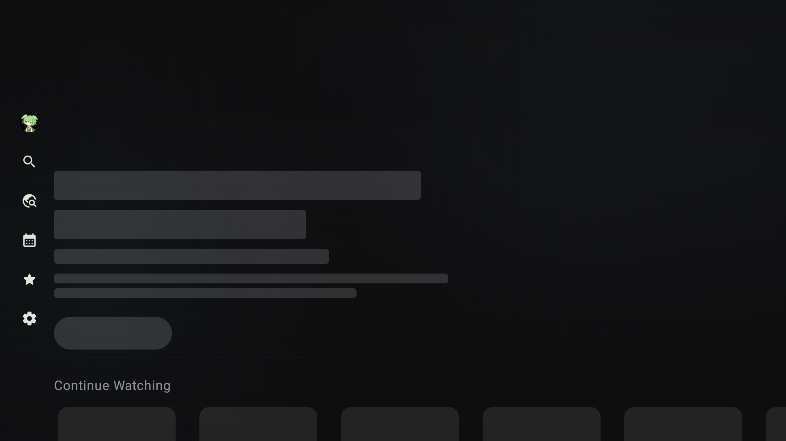
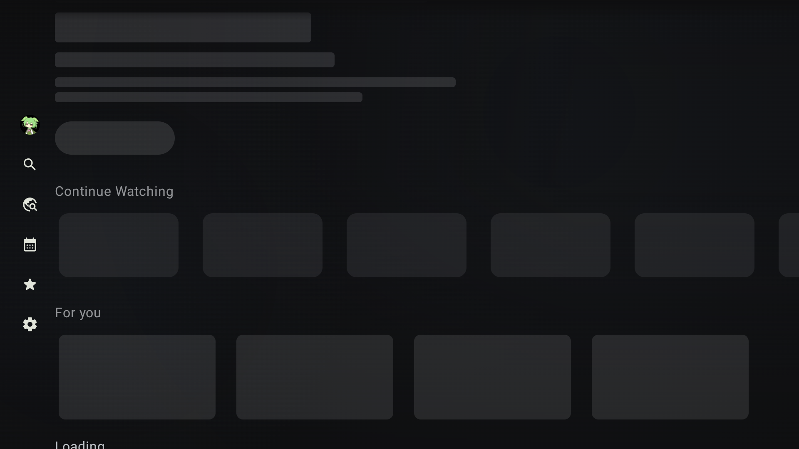
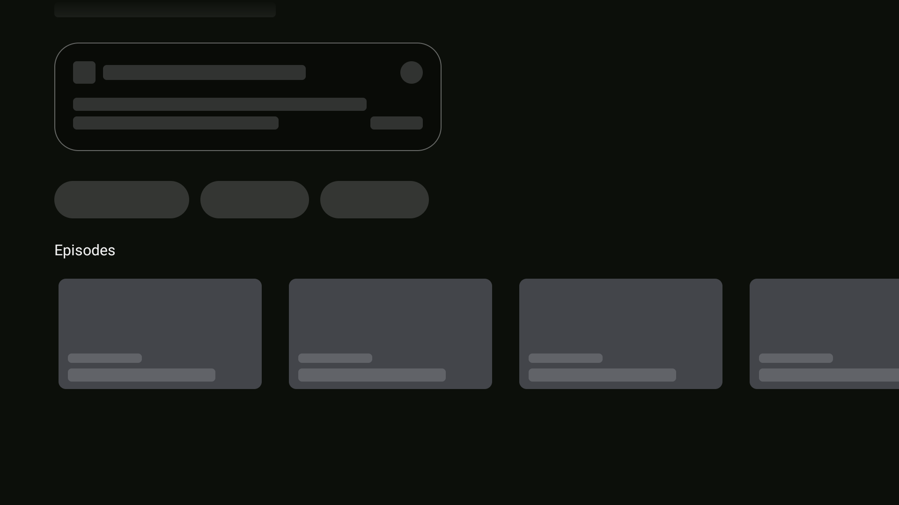
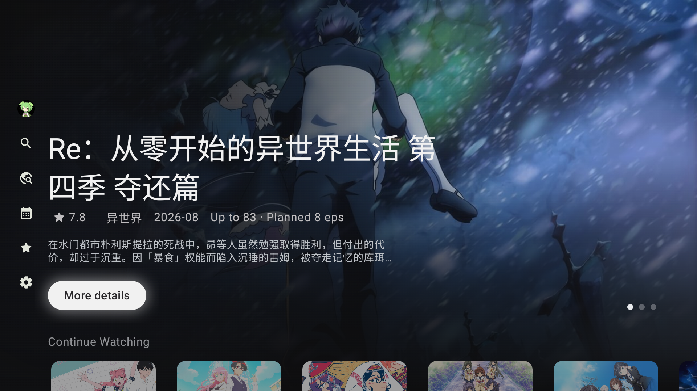
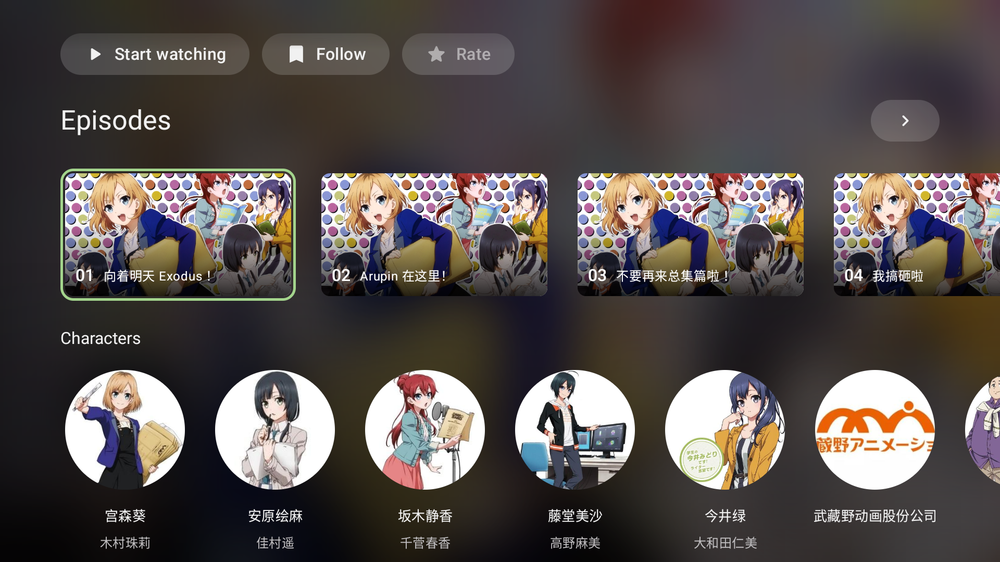
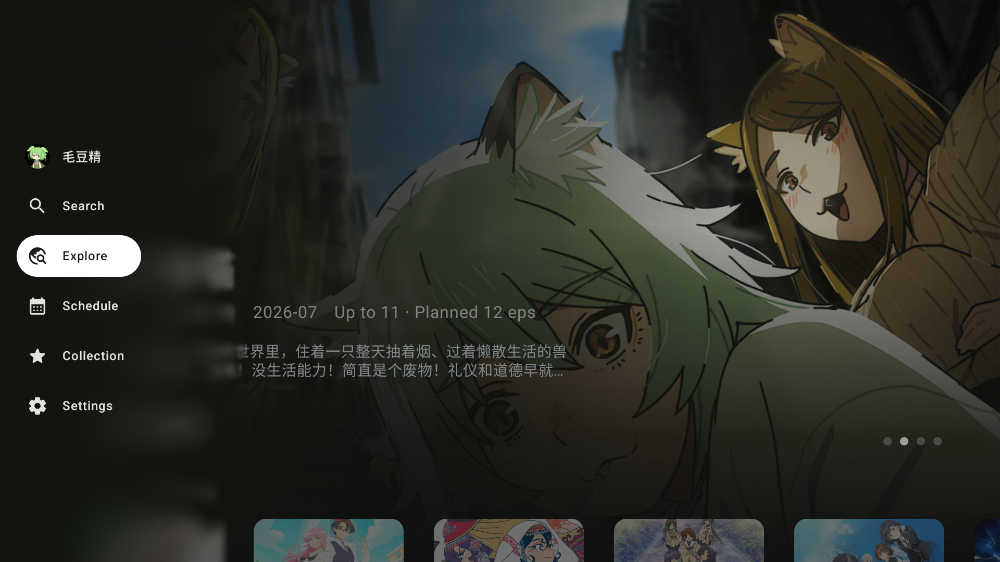

# Android TV 加载占位

TV 加载占位使用 `TvPlaceholderBlock` 和 `Modifier.tvPlaceholder`，两者共用
`ui.external.placeholder.placeholder` 与 `PlaceholderHighlight.fade`。独立占位块不接收焦点；
操作控件的占位覆盖整个药丸，保留控件的布局、焦点节点和加载语义，并在加载期间拦截点击。

探索页分别读取 Hero、继续观看和为你推荐的 Paging refresh 状态。模块首屏加载时显示对应的
标题、文字或卡片骨架；已有条目刷新时继续显示原内容。上下键跳过正在加载的卡片行，
其他模块完成加载时保留用户当前的焦点。

详情页的开始观看、收藏状态和评分分别读取对应的加载状态。剧集列表的初始页面与部分加载
状态共用 `tvDetailsEpisodePlaceholders`，卡片尺寸和间距与真实剧集一致。用户在剧集加载入口
等待时，加载完成会把焦点交给第一集；用户已移到其他区域时不抢回焦点。

详情页的内容挂载只取决于数据状态。窗口尚未获焦或页面仍在转场时，Hero 的三个操作、
剧集和其他区块照常显示内容或骨架。焦点建立前后使用相同的布局。

`TvDetailsFocusState` 独立协调初始焦点、弹层返回和列表刷新后的焦点恢复。恢复请求等待
目标行的数据与滚动位置就绪，窗口获焦和节点布局由 `TvFocusScope` 统一处理；保存的剧集焦点等待
剧集数据就绪后恢复。目标已删除时选择相邻条目，列表为空时返回该行入口。方向键或确认键
取消等待中的请求，打开弹层也会取消底层页面的恢复。

## 安装版样例

以下图片是 `tvDebug` APK（`me.him188.ani.tv.debug2`）在 Android TV API 36、x86_64 模拟器中的
原始截图，显示尺寸为 1920 × 1080、320 dpi。加载态通过临时增加模拟器网络延迟捕捉，
使用应用的实际数据请求。截图后恢复网络和显示设置。自动化测试中的合成数据未用于这些图片。

| 状态 | 截图 |
| --- | --- |
| Hero 与继续观看加载中 |  |
| 继续观看与推荐区各自的卡片骨架 |  |
| 三个主要操作与剧集行加载中 |  |
| 探索页加载完成 |  |
| 剧集加载完成 |  |
| 悬浮导航展开，模糊在屏幕左侧 25% 处消退 |  |

## 回归验证

`TvExplorationUiTest` 覆盖模块独立加载、刷新保留条目、跳过占位行和异步更新后的焦点保留。
`TvSubjectDetailsUiTest` 覆盖三个操作分别结束加载、加载期间禁止提交、剧集占位语义和加载完成后的焦点交接，
以及窗口等待期间的完整渲染、焦点建立前后的布局一致性、用户导航取消待恢复焦点、保存的剧集位置和弹层返回。
