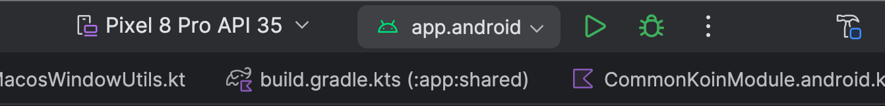
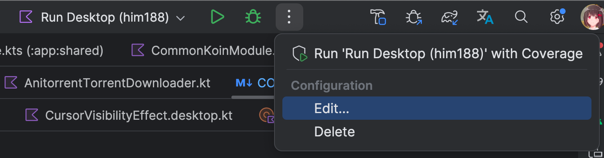

# 运行和调试 APP

以下各个小节分别说明如何运行各个平台的调试 APP (支持断点)
。最推荐的方式是[运行 PC APP](#如何运行-pc-app)，支持热重载。

注意，调试版本的性能远低于发布版本，很多动画都会变迟钝和不流畅，如需测试性能，请使用发布版本。

## 什么是 Run Configuration (运行配置)

项目自带一些运行配置，方便你运行测试版 APP，可以在 Android Studio 顶部找到：



`app.android` 就是一个运行配置，使用它即可运行 Android APP (下面有说明)。

> [!WARNING]
> **如何编辑一个运行配置**
>
> 一般来说你不需要修改配置。如果你需要，必须先复制一份再修改：
>
> 
>
> 打开后，将配置复制一份，然后修改复制的配置。因为默认配置是由 Git 管理的，除非有很强的理由，
> 否则不要修改默认配置。

## 如何运行 PC APP

PC 版本有三种启动方式：

- 热重载（推荐）的调试版本：选择配置 `Run Desktop (Hot Reload)` 点击按钮运行或调试即可。热重载版本会自动检测
  IDE 里的代码更新，自动编译并热加载到 APP 中。无需重启即可调试。
- 普通运行调试版本：选择配置 `Run Desktop (Normal)` 点击按钮运行或调试即可。此版本没有热重载功能，修改代码后需要手动重启
  APP。
- 运行发布版本：双击 Control，输入 `./gradlew runReleaseDistributable` 可运行发布版本。发布版本有激进的优化，运行很快，但会无法调试。

> [!TIP]
> 将 PC 版本窗口调小到手机大小，可以模拟手机的效果。

## 如何运行调试版本 Android APP

在 Android Studio 或 IntelliJ IDEA 中，选择运行配置 `app.android`，点击按钮运行或调试即可。

> [!TIP]
> **Android 调试版本 (Debug) 的性能*远低于*发布版本 (Release)**
>
> 由于调试版本禁用了一切优化，而且包含 Compose 额外的调试信息，性能会比发布版本低很多。
> 所有手机都会非常卡。如果你要测试性能，请切换到发布版本。

## 如何运行 iOS APP

只有 macOS 才能运行 iOS APP。

先在 `local.properties` 中加入：

```properties
ani.enable.ios=true
ani.build.framework=true
```

1. 在 App Store 安装 Xcode
2. 在 Xcode 中打开项目 `app/ios/Animeko`
3. 在 Xcode 内运行

在 Android Studio 中，也可以选择运行配置 `Run iOS Debug`，点击按钮运行即可。
