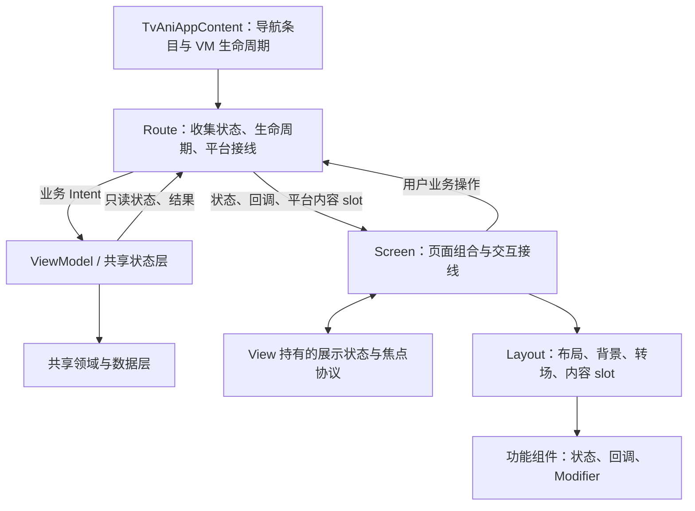

# TV 页面开发范式

> AI 辅助整理，依据截至 2026-09-08 的 TV 播放页实现、维护者裁定和 Android 官方文档。
> 本文用于指导 TV 新页面和已有页面的修改，不代表所有现有页面都已按此完成验收。

开发顺序是：**对照共享端行为 → 划分状态职责 → 设计遥控器与焦点路径 → 组合 TV 视图 → 验证状态和交互**。
共享端提供功能语义，Android TV 规范指导观看距离、导航与反馈，项目基础组件保证页面之间一致。
播放页的目录和实现入口见 [TV 播放页](code/tv-playback.md)，历史裁定见 [TV 架构文档](../../atv-architecture.md#14-开发规范与约束实施期裁定汇总)。

## 1. 先对照共享端，再做 TV 设计

实现之前找到手机/桌面的对应 UI、状态对象和业务入口，按同一功能逐项对照：

| 对照项 | 必须弄清楚的问题 |
|---|---|
| 可用条件 | 是否需要登录、权限、特定媒体能力或房间角色？ |
| 数据与状态 | 初次加载、刷新、分页、空内容、失败分别如何表示？ |
| 操作过程 | 点击后发起什么请求？是否可重试、取消？中间状态如何反馈？ |
| 操作结果 | 成功后更新什么？失败后保留什么？是否影响其他端共享的设置？ |
| 内容与文案 | 是否已有资源、状态映射、图标、格式化函数和富文本渲染能力？ |
| TV 差异 | 哪些只是输入与展示差异，哪些是产品明确确认的功能差异？ |

优先复用共享状态、领域逻辑、模型、格式化与资源；视图按 TV 重新组织。共享 API 不适合复用时，先整理公共接口并同步适配原消费者。
参考其他 TV 应用或历史 PR 时，借鉴布局和遥控器交互；功能行为仍以当前共享实现及已确认的产品要求为准。

播放页的经验：

- 选源、解析、缓冲和失败恢复是完整流程，不能只复制最终的播放按钮和错误文字。
- 帧预览加载使用与共享端一致的 circular loading；内容列表初次加载使用符合卡片结构的 skeleton。两者表达的等待对象不同。
- 评论是 BBCode，需要沿用共享 `RichText` 的内容模型和渲染语义，覆盖格式、链接、遮罩等能力；不能直接显示原始标记或简单删掉标记。
- 播放器读取新的 `MediampPlayer.state`，区分 `playWhenReady`、实际播放、缓冲和媒体状态。其他页面也应保留共享状态模型的语义，避免自行折叠成含义不清的布尔值。

## 2. MVI：业务状态、展示状态与焦点各有归属

状态只提升到需要共同读写它的层级，复杂的纯 UI 逻辑可以由普通 state holder 承担。这与 [Compose 状态提升规范](https://developer.android.com/develop/ui/compose/state-hoisting) 一致。
本项目在此基础上采用以下分工：



| 职责 | 所有者 | 典型内容 |
|---|---|---|
| 业务数据和请求 | VM / 复用的状态或领域层 | 加载、分页、错误、收藏提交、选源决策、房间操作、持久化设置 |
| 页面展示 | View 内的 state holder | 当前面板、详情层级、确认提示、浏览 tab、展开状态 |
| 焦点和滚动 | View / TV 焦点基础设施 | 焦点身份、返回目标、滚动位置、锚点附着、导航取消 |
| 动画与布局 | Layout / 局部组件 | 转场进度、可用宽度、文本折叠、背景和间距 |
| 影响业务的交互状态 | VM 或其管理的共享状态 | 搜索查询、提交表单、参与帧预览和自动跳过的 seek 状态 |

同一份状态只有一个权威来源。例如 seek 预览既影响显示又参与播放器请求，就不能在 VM 和 View 中各存一份再互相同步。
纯展示状态使用本地回调；业务动作才发 Intent。简单局部状态保留在组件，需要跨组件协调时再提升，需要恢复时使用 `rememberSaveable` / `SaveableStateHolder`。
恢复的是面板、目标 ID 和浏览位置等有意义的状态，不是 `FocusRequester`、协程任务或尚未释放的长按操作。

实现边界：

- `Route` 接收 VM，使用 `collectAsStateWithLifecycle` 收集状态，处理生命周期、导航和平台渲染接线。
- `Screen` 和子组件接收所需状态与回调，不接收 VM，不查询 Repository、服务或 Koin。
- `LaunchedEffect` 和 `rememberCoroutineScope` 可以处理动画、滚动和焦点，不能成为直接发起业务请求的旁路。
- 多层面板与互斥显示使用明确的展示状态机和 action，集中定义合法转换，避免多个布尔值形成不可能的组合。
- 异步结果携带必要的操作或对象身份；View 判断当前上下文是否仍相关，避免旧请求完成后关闭新面板、显示过期提示或恢复旧焦点。

TV VM 在 `TvAniAppContent` 对应导航条目内通过 `tvViewModel { ... }` 显式构造，依赖由 `TvAppDependencies` 传入。
禁止在 Koin 注册 TV VM、在 Route/Screen 内创建 VM，或创建不受导航生命周期管理的嵌套 VM。
优先复用合适的共享 VM/状态；适配差异大时使用薄 TV VM 组合共享能力，不强行引入整套手机页面状态机。

## 3. 按功能归属组织模块和包

TV UI 放在对应功能模块的 `src/androidTv/kotlin`，由独立 `tv` 子模块编译。
例如一起看属于 `ui-watchtogether`，播放页只组合它，不能因入口在播放页就把整个功能放入 `ui-episode`。
功能模块可以依赖 `ui-foundation-tv`；基础设施不能反向依赖具体页面。

```text
ui-feature/
├── src/commonMain/             共享模型、状态与公共能力
├── src/androidTv/kotlin/       TV UI
├── src/androidTvTest/kotlin/   TV 状态、规则测试
├── src/androidTvDeviceTest/    需要 Android Compose 环境的 UI 测试
└── tv/build.gradle.kts         TV 子模块接线
```

`androidTv` 等是目录约定，不是 KMP target 或 KotlinSourceSet；分别接入 TV 子模块自己的 `androidMain`、`androidHostTest`、`androidDeviceTest`。
TV 专用依赖只进入 TV 模块的 Android 源集，应用仅在 `tv` flavor 引入。完整规则见 [KMP 文档](kmp.md#编译时会发生什么)。

大型页面按功能分包，同一功能的状态、组件、文案映射、placeholder 和测试相邻维护。
根包保留 Route、Screen、VM 和必要的聚合接口；`presentation` 放展示协调，`components` 放页面内部共享容器。
不要把所有文件平铺，也不要求简单页面复制播放页的全部子包。只有确实跨页面复用的能力才提升到 `ui-foundation`。

通用构建配置归 convention plugin，业务模块只声明自己的源目录与依赖。
例如设备测试的 Kotlin JUnit 适配排除已经集中在 [ani.kmp-library.gradle.kts](../../build-logic/src/main/kotlin/ani.kmp-library.gradle.kts)，按设备测试 compilation 配置相应 classpath；新增 TV 模块沿用该约定，不再复制局部 workaround。

## 4. 复杂页面采用 slotting

遵循 **Screen 接线 → Layout 骨架 → 功能内容**：容器提供 slot，调用方决定具体内容。
这沿用 [Compose slot API](https://developer.android.com/develop/ui/compose/layouts/basics) 的组合方式。

| 层级 | 负责 | 不应承担 |
|---|---|---|
| Screen | 状态拆分、业务回调、页面按键与焦点关系、功能组合 | 所有卡片的绘制细节 |
| Layout | 尺寸、对齐、背景、滚动容器、过渡动画、内容 slot | 根据业务类型决定请求或操作 |
| 功能组件 | 本功能内容、局部状态、明确的事件回调 | 了解整个页面的 VM 和导航状态机 |

优先抽 slot 的场景：共用侧栏、带固定标题/操作区的页面、相同列表外壳、多个内容区动画切换、需要替换原生内容的测试。
页面私有焦点 key 留在协调层，纯视图通过 `Modifier` 或 slot 获得锚点和按键接线。
避免向组件传整个页面 UiState，也不要让通用容器内部出现一长串按功能类型判断的分支。
简单行或一次性的小布局不必增加多层抽象。

播放页可参考：

- [TvPlayerPanelList](../../app/shared/ui-episode/src/androidTv/kotlin/ui/episode/components/TvPlayerPanelList.kt)：统一列表布局与空态，通过 `LazyListScope` 接收内容。
- [TvBottomControllerLayout](../../app/shared/ui-episode/src/androidTv/kotlin/ui/episode/components/TvBottomControllerLayout.kt)：控制器和推荐条目通过两个 slot 切换，背景只由父容器绘制一次。
- [TvEpisodeRoute](../../app/shared/ui-episode/src/androidTv/kotlin/ui/episode/TvEpisodeRoute.kt)：通过 slot 接入视频、解析器和弹幕渲染，测试可以替换这些平台内容。
- [TV options 与覆盖层](code/tv-options.md)：播放页和详情页共用的按钮行、面板外观、窗口坐标锚定和页面内模态覆盖层。

## 5. 把焦点路径作为页面设计的一部分

TV 交互需要方向键、确认和返回形成可预测的路径；所有可操作内容应可达，当前焦点应清楚可辨。参见 [Android TV 导航规范](https://developer.android.com/training/tv/get-started/navigation)。
布局稿完成前，至少写清下面的焦点契约：

| 场景 | 必须定义的行为 |
|---|---|
| 首次进入 | 默认落在哪个有意义的控件，何时可以送焦？ |
| 从其他页面返回 | 恢复哪个业务 ID 和视口；目标消失时回哪里？ |
| 跨区块导航 | 上下左右各到哪里，边缘是否交给主壳？ |
| 打开/关闭面板 | 面板入口、关闭后的目标、未加载时如何返回？ |
| 二级页面 | Back 返回哪个父层级，父层级恢复哪一项？ |
| 内容更新 | 插入、删除、重排、分页时如何保留当前焦点？ |
| 动画期间 | 哪一层接收输入；用户已经导航后旧送焦是否取消？ |

### 统一使用焦点基础设施

- 页面使用 `TvFocusScope`，在拥有 scope 的位置安装 `Resolver()` 与导航信号处理。
- 使用 `tvFocusAnchor` 标识节点，`tvFocusLink` / enter gate / exit / hotkey 声明跨区块和边缘关系；简单连续列表内部可使用空间导航。
- 页面不直接取底层 requester，也不散落裸 `requestFocus()`。涉及多个组件的协议集中在一个 state holder 或协调文件。
- 列表 item key、焦点 key 和返回记忆采用稳定业务身份。实时列表不能以 index、当前排序或翻译后的文本作为身份。

入口参考 [TvFocusScope](../../app/shared/ui-foundation/src/androidTv/kotlin/ui/foundation/focus/TvFocusScope.kt) 与 [TvPlayerFocusEffects](../../app/shared/ui-episode/src/androidTv/kotlin/ui/episode/presentation/TvPlayerFocusEffects.kt)。

### 送焦等待真实事件，并允许用户取消

程序化送焦必须基于生命周期 `RESUMED`、数据完成、目标附着或动画完成等确定性信号。
Lazy 目标先按业务 ID 定位并滚动使其组合，再请求焦点；使用 `requestPrepared` 将准备过程和送焦一起纳入取消机制。
用户新的导航会取消旧的滚动准备和焦点请求，内容或面板身份改变也应使旧请求失效。
禁止 `delay(300)`、逐帧重试、固定次数轮询、猜测超时后抢焦点；动画自身的时长不用于推算送焦时间。

定制焦点滚动通过 `BringIntoViewSpec` 表达，不在 `onFocusChanged` 中同时启动另一套滚动。
嵌套横向/纵向容器各自拥有适用的滚动策略，不把某个页面的锚定位置应用到全项目。
离散操作消费完整按键周期，长按连发不重复打开/关闭页面；连续调节类操作按其功能语义单独处理。

### 更新数据不等于重新进入页面

刷新、追加或实时更新应保留聚焦 item 的身份与节点，不因整个列表重新发射就执行默认入口送焦。
正在聚焦的按钮进入忙碌状态时，尽量保留同一个交互节点，只替换 icon/progress 等内容；是否允许取消按共享业务语义决定。
当前项确实消失时，按契约选择邻近项或业务默认项，不让系统随机落到页面第一个按钮。

普通容器和标题无需为接收 Back 而变成焦点停靠点，父层可以处理子项的按键。
加载/空态确实需要独立承接输入时，设置一个有状态语义的入口并定义内容就绪后的交接；不要让每块 skeleton 都可聚焦。
全屏播放器控件隐藏时用根节点接收遥控器，是特殊场景，不能推广为所有 panel root 都可聚焦。

### 返回按层级处理

Back 优先处理最内层的详情、确认或弹窗，再关闭所属面板，最后交给页面导航。
TV 页面通常不额外摆放屏幕返回按钮；必要的“取消”操作仍可保留，参见 [官方返回导航说明](https://developer.android.com/training/tv/get-started/navigation)。
左键首先承担方向导航；仅在明确约定的区域或边界才等价于退出，不能全局映射为 Back。

播放页右侧面板的一级内容按 Back/左关闭，评论详情和弹幕列表的 Back 返回父层级。
退出推荐回进度条、进度条向下优先下一集再 fallback 到播放/暂停，都是播放页的明确落点，其他页面需要定义自己的对应规则。

## 6. 视觉一致、布局自适应，动画不改变输入语义

官方焦点系统允许描边、颜色、缩放等不同反馈；本项目选择统一描边/反色，**不增加焦点 scale**。
这是项目视觉约定，不是 Google 禁止缩放。参见 [官方焦点系统](https://developer.android.com/design/ui/tv/guides/styles/focus-system)。

- 使用 `AniTvTheme`、现有 TV 卡片/操作行和 `TvFocusDefaults`。Material3 与 tv-material 都可使用，选组件后仍需正确接入项目主题和焦点协议。
- 明确区分默认、聚焦、按下、选中、禁用和忙碌；聚焦不自动等于业务选中，只有页面明确设计为“聚焦即切换”时例外。
- 黑色面板要同时适配标题、次要文字、图标、分隔线、错误、骨架和聚焦反色后的内容颜色，使用对应容器的颜色体系。
- 组件参数归入 `XxxDefaults`；可供调用方调整的尺寸和颜色暴露为参数，内部细节保留在组件内。不要到处复制魔数。
- 基于父容器实际可用宽度布局，考虑侧栏、间距、内边距、长翻译和字体缩放。不要仅以设备横竖屏或总屏宽判断。
- 紧凑操作行放不下文字时可整体收缩为仅图标，仍保留可访问名称、足够的焦点区域和稳定位置；主操作不应因文字或间距挤占而消失。内容卡片横排仍可使用 `LazyRow`。
- 测量自适应布局时避免组合两份真实可聚焦控件；测量文字和尺寸，与实际交互节点分开。
- 标题按场景选择单行省略或聚焦时跑马灯；不要依靠无限扩宽挤掉状态和操作，也不要让装饰性提示参与焦点导航。

内容切换的背景、遮罩放在共同父容器；只有需要替换的区域参与显隐动画，持续内容保持稳定。
退出中的内容即使还在组合，也不能继续接受失效操作或成为错误焦点目标。焦点协调观察同一转场状态，不能另开计时器。
播放页保留顶部标题、只切换底部 controller/recommendation，是此原则的一个实例，不是其他页面必须复制的布局。

## 7. 内容状态、富文本与 i18n 都要完整

加载反馈根据等待对象设计：

| 状态 | 表现与交互 |
|---|---|
| 首次加载内容列表 | 与真实卡片几何接近的 skeleton，进入后仍可返回 |
| 已有内容刷新 | 保留可用内容和焦点，按共享状态补充刷新反馈 |
| 分页加载 | 反馈出现在追加区域，不重建已有列表 |
| 单次操作或帧预览加载 | 使用对应 progress 反馈；按钮身份尽量保持稳定 |
| 加载成功但无内容 | 明确空态，停止 skeleton |
| 失败 | 显示相应错误和可执行的恢复入口，保留有用上下文 |

文字、图标和进度需要表达共享端已有的状态含义，不能把多个失败统一成无法操作的“加载中”。
富文本先对照共享渲染能力再设计 TV 阅读和展开方式；保留内容语义，补齐遥控器可达性，不能为避免焦点设计而删掉功能。

i18n 规则：

1. 先按**功能语义**对照共享资源，同一功能以共享端文案为准，并保持操作图标含义一致。
2. “目前只有 TV 调用”不等于“TV 专用”。新的一般性功能文案也应进入共享资源。
3. 只有遥控器提示或确实独有的 TV 功能文案进入 `app-lang/src/androidMain/res/values*/tv.xml`，不要复制已有资源换一个 `tv_` 名字。
4. UI 负责把错误类型和格式化参数解析成资源文案，避免 VM 固化当前语言的文字。内容标题、用户名等用户/服务端内容不作为界面资源翻译。
5. 维护 `values`、`values-zh-rCN`、`values-zh-rHK`、`values-zh-rTW` 的源资源；派生语言目录由 [app-lang 构建任务](../../app/shared/app-lang/build.gradle.kts) 同步。
6. 仅图标按钮仍有本地化的可访问名称；已有文字的装饰性 icon 避免重复朗读。布局测试覆盖长文案，不能只验证中文默认宽度。

## 8. 用状态测试和合成遥控器输入验收

先用纯测试验证展示 reducer、状态转换和 fallback 规则；再用 `runAniComposeUiTest` 组合实际 Screen，以 `sendKeyEvent` 等合成输入走完整路径。
焦点测试应检查实际聚焦节点、业务 ID、滚动后可见性和触发的 Intent，不能只检查函数被调用。
测试数据应能主动制造插入、删除、乱序完成、慢加载和动画期间的新输入。

重点回归：

- 首次进入与返回恢复；目标存在、尚未组合、已删除三种情况。
- 每个主要控件的方向路径，面板一级退出、二级返回以及退出后的具体焦点。
- 加载、成功、空态、失败、重试、取消；实时更新与追加时焦点不重置。
- 过渡期间按方向/返回、长按连发，旧请求不抢焦点，同一次按键不穿透到新页面。
- 侧栏展开和窄布局下所有操作仍可达；长翻译、字体缩放、深色背景与各种焦点状态。
- 富文本显示、遮罩和交互；涉及共享逻辑的修改覆盖原消费者行为。

可复用的测试示例位于 [播放页 UI 测试目录](../../app/shared/ui-episode/src/androidTvDeviceTest/kotlin/ui/episode)。
优先保留截图回归。注意当前 [Android 测试适配](../../utils/ui-testing/src/androidMain/kotlin/AniComposeUiTest.android.kt) 的 `assertScreenshot` 是空实现，调用成功不代表图像已比较；该环境需另行捕获/核对图像，并保留可自动断言的尺寸和焦点检查。
使用测试视频 slot 只能证明 UI 行为，不能据此宣称 VLC/mpv、解析器、真实播放或多人同步已验证。
WebView、原生播放、系统输入法及设备差异按 [仓库验证约定](../../AGENTS.md#ui-verification) 使用对应 skill 补充设备证据。

提交代码前运行受影响模块的编译/测试，以及 [TV 架构约束中的必需检查](../../atv-architecture.md#146-工程与流程)。
其中 `TvArchitectureTest` 检查依赖、VM 构造和部分焦点接线规则，不能替代 MVI 逻辑 review 或交互测试。
测试报告区分“构建通过”“合成 UI 测试通过”“真实链路验证通过”，不要合并成笼统的“已验证”。

## 9. 开发与 review 清单

- [ ] 已定位共享端对应实现，说明复用入口与必要的 TV 差异。
- [ ] 加载、空态、失败恢复、权限与操作结果的语义一致。
- [ ] 业务状态、展示状态、焦点和交互状态各有唯一所有者，业务操作统一经 Intent。
- [ ] 代码属于正确功能模块；复杂容器使用 slot，基础组件不依赖业务页面。
- [ ] 已写清进入、退出、返回、目标消失与动画期间的焦点契约。
- [ ] 动态列表使用稳定身份；焦点请求基于事件，可取消，不轮询、不延时抢焦点。
- [ ] 统一主题和焦点视觉，没有新增 scale；颜色、窄布局和仅图标状态完整。
- [ ] 文案优先共享，TV 独有资源放 `tv.xml`；富文本、可访问名称和内容状态齐全。
- [ ] 有适当的自动化回归；报告清楚说明设备验证范围和未覆盖部分。

播放页是实现参考，后续页面应复用其中的职责划分和基础设施，再根据自身内容定义布局与焦点路径。
已确认的播放页产品特例，例如推荐广告项目当前点击 no-op，不能外推为其他页面的默认行为。
