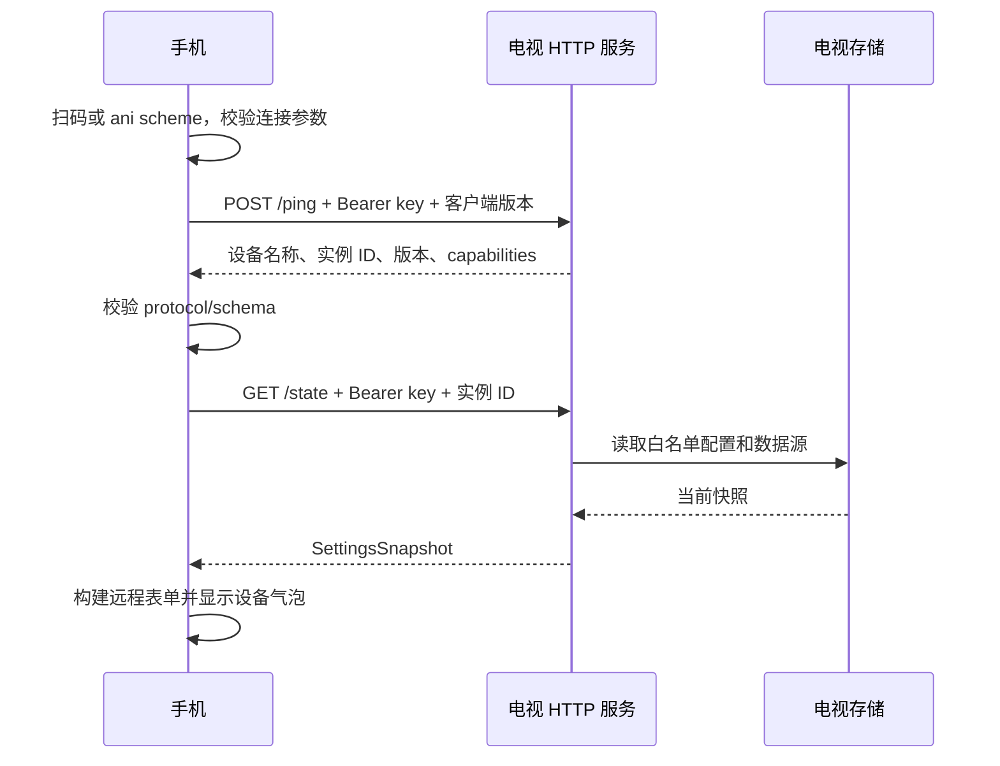
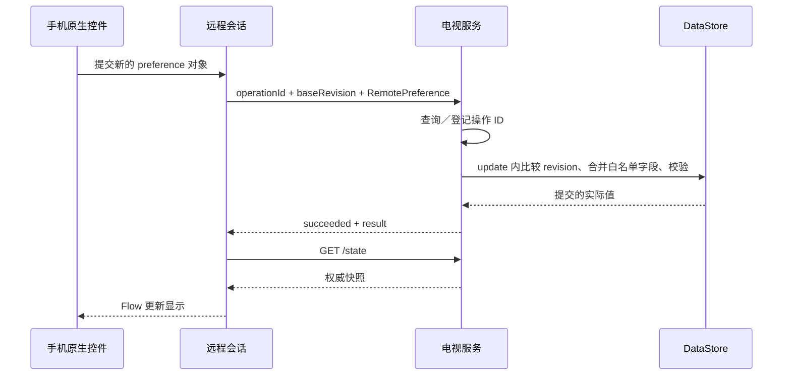

# TV 局域网远程设置

本文描述电视 HTTP 服务、手机原生设置会话、配置写入一致性、权限、接口与验证方式。协议版本与配置 schema 版本均为 `1`。

## 1. 功能边界

手机通过电视设置页的二维码建立临时连接，使用原生表单编辑电视上的配置。所有提交、订阅刷新、数据源持久化和备份恢复都在电视进程执行。手机负责表单、扫码、复制、分享和连接状态。

| 入口／行为 | 约定 |
| --- | --- |
| 电视入口 | 设置页分区列表第一项“手机配置”，详情区显示二维码 |
| 手机入口 | 设置页 top app bar 右上角扫码按钮 |
| 外部扫码器 | `ani://remote-settings` scheme，直接进入握手流程 |
| 会话身份 | 以 `/ping` 返回的设备名称和服务实例为准 |
| 页面范围 | 播放器、数据源、资源选择、存储、日志、设置备份 |
| 持续提示 | 页面底部设备气泡，显示目标设备和退出按钮；保存期间图标位置显示进度环，气泡高度不变 |
| 气泡退出 | 关闭远程会话，返回进入远程配置前的页面 |
| 页面返回 | 沿用设置详情及数据源编辑页的返回层级；离开设置根页时确认，确定后断开并退出远程设置 |
| 服务生命周期 | 电视 Application 启动时创建；权限允许后监听，覆盖进程存活期间 |
| 账号关系 | 手机与电视不要求登录同一账号，二维码 user UUID 只提供身份信息 |
| 版本兼容 | 校验 protocol/schema；不要求 appVersion 字符串完全相同 |

电视不提供浏览器管理页面、公网发现、云端中转、文件系统浏览或远程播放控制。TV 本身不支持的媒体下载缓存、BT 引擎、手机横竖屏操作不作为远程设置能力。

系统杀进程、冻结进程、网络隔离或设备休眠期间，服务可能不可达。服务不通过前台服务和唤醒锁维持后台运行。

## 2. 分层与依赖边界

```mermaid
flowchart LR
    Scan[扫码 / ani scheme] --> Route[NavRoutes.RemoteSettings]
    Route --> UI[RemoteSettingsScreen / 现有编辑页面]
    UI --> VM[RemoteSettingsViewModel]
    VM --> Pref[RemotePreferenceRepository]
    VM --> Session[RemoteSettingsSession]
    Pref --> Session
    Session --> API[生成的 RemoteSettingsApi]
    API --> Server[RemoteSettingsServer]
    Server --> Backend[LocalRemoteSettingsBackend]
    Backend --> Registry[RemotePreferenceRegistry]
    Registry --> Local[电视 SettingsRepository]
    Backend --> Stores[电视共享 DataStore]
    Backend --> Updater[订阅更新服务]
    Local --> Flow[DataStore Flow]
    Stores --> Flow
    Flow --> TV[电视设置 / 播放器 / 数据源管理器]
```



`NavRoutes.RemoteSettings` 是独立的导航入口，持有不含凭据的随机 entry ID。`RemoteSettingsScreen` 与 `RemoteSettingsViewModel` 管理连接、电视表单状态、日志、订阅和备份操作。本机 `SettingsViewModel` 只管理本机仓库；本机设置页提供通用顶栏 actions 插槽，导航装配层通过该插槽放置扫码入口。

全局 `SettingsRepository` 始终提供当前设备的本地配置。每个远程目标持有独立的 `RemoteSettingsSession`、`RemotePreferenceRepository` 和子协程 scope；切换电视时关闭旧会话并取消旧目标的任务。网络失败保留电视快照及错误状态，不会让远程表单写入手机仓库。

远程页的列表只组合允许远程配置的六个导航项，布局、列表样式、详情导航与滚动行为共用 `SettingsPageLayout`。详情直接使用现有 `PlayerGroup`、`WatchTogetherGroup`、`MediaSourceSubscriptionGroup`、`MediaSourceGroup`、`MediaSelectionGroup`、`DanmakuCacheSettings`、`BackupSettings` 和 `LogTab`。`RemoteSettingsFormState` 为组件提供相同的 `SettingsState`、`MediaSourceGroupState`、`EditMediaSourceState` 接口。

共享设置组件只暴露通用能力参数、内容插槽与数据读写接口，默认值遵循当前设备的本机行为。TV 的选项范围、着色器开关、订阅菜单与备份提示由 `remote/RemoteSettingsControls.kt` 组合；共享 Group 和数据源编辑器不依赖远程会话类型。存储直接复用弹幕缓存控件，备份通过 form 的回调操作固定会话，无需构造带有手机权限和目录能力的 `CacheDirectoryGroupState`。日志页通过插槽展示电视日志操作，各平台的本机日志实现各自保持独立。

`RemoteSettingsSessionHost` 为远程设置及其数据源编辑子页提供设备气泡、连接／错误提示与根页退出确认。Navigation 3 的共享 store provider 以 RemoteSettings entry ID 持有 ViewModelStore，数据源编辑子页 `NavRoutes.RemoteEditMediaSource` 携带所属 entry ID，获取同一个 `RemoteSettingsViewModel`；只有远程 entry 出栈才清理 store。本机设置 entry 使用自身的普通 ViewModelStore。每次连接以 session 对象区分表单，编辑子页在整个生命周期内固定绑定打开时的远程 adapter。

### 2.1 模块划分

| 模块 | 职责 |
| --- | --- |
| `app/shared/remote-settings-contract` | OpenAPI schema、二维码连接信息、协议常量 |
| `app/shared/remote-settings` | 复用 `app-data` 现有模型的协议 wrapper、生成客户端、schema 导出、远程会话、preference adapter 与配置校验 |
| `app/tv-remote-settings-server` | 本地 backend、JVM Ktor CIO listener、路由鉴权、请求边界、操作记录与 revision 签名 |
| `app/android/src/tv` | Application 生命周期、LAN 地址、LAN 权限、电视固定日志文件 |
| `app/shared/ui-settings` | `RemoteSettingsViewModel` 管理远程会话；`RemoteSettingsScreen` 复用设置布局、详情 Group 与编辑页 |
| `app/shared/ui-onboarding` | 通用扫码页 `QrCodeScanScreen`、相机权限、局域网权限入口 |
| `app/shared` | 远程设置与远程数据源编辑的导航入口 |
| Android / iOS 平台入口 | scheme 解析后把临时目标交给远程会话 |

HTTP server 仅由 Android TV flavor 引用，手机 APK 不启动 listener。OpenAPI 与生成客户端可供 Android、iOS 和桌面编译使用。桌面没有扫码入口。

### 2.2 关键代码地图

- [协议与连接信息](../../app/shared/remote-settings-contract/src/commonMain/kotlin/me/him188/ani/remote/settings/RemoteSettingsProtocol.kt)
- [OpenAPI](../../app/shared/remote-settings-contract/openapi.json)
- [客户端生成任务](../../app/shared/remote-settings/build.gradle.kts)
- [强类型协议模型](../../app/shared/remote-settings/src/commonMain/kotlin/domain/settings/remote/RemoteSettingsModels.kt)
- [Schema 导出](../../app/shared/remote-settings/src/desktopTest/kotlin/domain/settings/remote/GenerateRemoteSettingsOpenApi.kt)
- [RemoteSettingsSession](../../app/shared/remote-settings/src/commonMain/kotlin/domain/settings/remote/RemoteSettingsSession.kt)
- [RemotePreferenceRepository](../../app/shared/remote-settings/src/commonMain/kotlin/domain/settings/remote/RemotePreferenceRepository.kt)
- [RemotePreferenceRegistry](../../app/shared/remote-settings/src/commonMain/kotlin/domain/settings/remote/RemotePreferenceRegistry.kt)
- [命令和备份 DTO](../../app/shared/remote-settings/src/commonMain/kotlin/domain/settings/remote/RemoteSettingsCommands.kt)
- [LocalRemoteSettingsBackend](../../app/tv-remote-settings-server/src/jvmMain/kotlin/me/him188/ani/tv/remotesettings/RemoteSettingsBackend.kt)
- [服务端与操作记录](../../app/tv-remote-settings-server/src/jvmMain/kotlin/me/him188/ani/tv/remotesettings/RemoteSettingsServer.kt)
- [AndroidRemoteSettingsHost](../../app/android/src/tv/kotlin/AndroidRemoteSettingsHost.kt)
- [Settings 页面](../../app/shared/ui-settings/src/commonMain/kotlin/ui/settings/SettingsScreen.kt)
- [RemoteSettingsViewModel](../../app/shared/ui-settings/src/commonMain/kotlin/ui/settings/remote/RemoteSettingsViewModel.kt)
- [RemoteSettingsScreen](../../app/shared/ui-settings/src/commonMain/kotlin/ui/settings/remote/RemoteSettingsScreen.kt)
- [远程表单组合](../../app/shared/ui-settings/src/commonMain/kotlin/ui/settings/remote/RemoteSettingsControls.kt)
- [远程会话容器](../../app/shared/ui-settings/src/commonMain/kotlin/ui/settings/remote/RemoteSettingsSessionHost.kt)
- [电视表单状态 adapter](../../app/shared/ui-settings/src/commonMain/kotlin/ui/settings/remote/RemoteSettingsState.kt)
- [数据源自动保存](../../app/shared/remote-settings/src/commonMain/kotlin/domain/settings/remote/RemoteMediaSourceEditor.kt)
- [数据源配置读写接口](../../app/shared/app-data/src/commonMain/kotlin/domain/mediasource/MediaSourceConfigurationEditor.kt)
- [电视二维码分区](../../app/shared/ui-settings/src/androidTv/kotlin/ui/settings/TvRemoteSettingsPane.kt)
- [远程导航入口](../../app/shared/src/commonMain/kotlin/ui/main/RemoteSettingsNavigation.kt)

## 3. 电视进程服务

### 3.1 启动与网络

`TvAniApplication` 完成本地服务装配后创建并启动 `AndroidRemoteSettingsHost`，通过 Koin 暴露只读 `RemoteSettingsHost.state` 给设置页。服务不依赖设置页是否打开。Backend 与 HTTP server 在 Host 的 IO 协程中、获得局域网权限之后创建，不占用 Application 启动的主线程。

服务创建时生成两个 UUID：

- `accessKey`：本进程的 bearer key。
- `serverInstanceId`：本进程的会话实例标识。

CIO 使用 `0.0.0.0:0` 监听，由操作系统分配可用端口。Host 读取实际端口生成二维码。客户端退出、离开“手机配置”分区或退出电视设置页都不停止服务。

Host 在获得局域网权限前每 2 秒检查一次权限；权限被撤销时系统会结束进程，授权后不再检查。获得权限后启动 listener，之后通过 `ConnectivityManager` 网络回调跟踪 Wi-Fi／Ethernet 地址，并观察 user UUID，二者变化时更新二维码，其余时间状态不变。只有 RFC 1918 私有 IPv4 地址进入二维码，排除 VPN transport。没有可用地址时保留进程服务，页面显示连接网络的说明。服务启动或状态更新异常进入重试，重试间隔 10 秒。

进程结束时 listener 随进程结束；根协程取消时显式关闭 engine。重新启动产生新的 key、实例标识与随机端口，旧二维码不保证继续有效。

### 3.2 二维码分区

“手机配置”是 `TvSettingsSection.Remote`，与其他分区共用设置页的列表／详情双栏布局、焦点锚点和焦点记忆。焦点移到该分区时，详情区的标题、说明下方显示 `TvRemoteSettingsPane`：左侧是三个连接步骤，右侧是 200 dp 的 `TvQrCode` 和电视的局域网地址；服务未就绪时二维码位置显示状态图标和说明。

详情区没有可聚焦内容，焦点始终留在分区列表上，方向键右和确认键不进入详情。在该分区按确认键会请求局域网权限（未授予时）。

布局以 960 × 540 dp 为基准，沿用设置页的安全边距；文本层级和颜色取自 TV 主题，随深浅色主题变化。参考 [Android TV 布局规范](https://developer.android.com/design/ui/tv/guides/styles/layouts) 与 [TV 交互原则](https://developer.android.com/design/ui/tv/guides/foundations/design-for-tv)。

### 3.3 与电视本地操作共享存储

`Context.dataStores` 是电视仓库使用的共享 `PlatformDataStoreManager`。Backend 使用这一实例的 source、subscription、danmaku DataStore，以及同一 `SettingsRepository`。

DataStore 更新完成后，电视现有 Flow 订阅者收到变更：

- preference 消费者读取新的播放器、选源和存储配置；
- 数据源管理器重建／更新 source instance；
- TV 设置界面显示新的值；
- 订阅更新器仍按照电视的网络和调度运行。

Backend 不创建第二套同路径 DataStore，不持有手机本地仓库。部分播放器设置按照现有消费者的生命周期生效，例如下一次播放器初始化时读取内核相关配置。

## 4. 二维码与握手

### 4.1 URI

```text
ani://remote-settings?ip=192.168.1.20&port=49152&accessKey=<uuid>&appVersion=4.9.0&userUuid=<uuid-or-empty>&protocolVersion=1
```

使用 URL builder 编码参数。连接模型不是 data class，`toString()` 隐去 key；完整 URI 不进入应用日志、导航参数或持久化状态。

| 参数 | 校验与含义 |
| --- | --- |
| `ip` | 私有 IPv4 字面量；拒绝公网、DNS、loopback、非标准数字形式 |
| `port` | 十进制，`1..65535` |
| `accessKey` | UUID 格式 |
| `appVersion` | `1..128` 字符，用于显示电视版本 |
| `userUuid` | 当前电视用户 UUID；未登录时为空字符串 |
| `protocolVersion` | 当前为 `1` |

URI 最大 2048 字符；要求 scheme/host 正确；拒绝额外路径、fragment、userinfo 以及必需参数重复或缺失。`/` 根路径可接受。

客户端只按经校验的 `ip` 和 `port` 构造 HTTP 地址，不从 URI 接受任意 URL。每个远程会话创建自己的 HTTP client，关闭重定向，绕过应用配置代理。Android/桌面 OkHttp 明确使用 `Proxy.NO_PROXY` 并关闭连接自动重试；iOS Darwin 使用独立 session、空代理配置和有限超时。

### 4.2 握手顺序



`POST /ping` 返回 200 表示密钥和版本检查通过；完整初始快照成功解码后才显示可编辑页面。读取失败不会显示手机配置作为占位值。

`appVersion` 用于双端版本信息展示；可兼容性由显式的 `protocolVersion` 和 `schemaVersion` 决定。破坏现有请求、字段含义或必需 snapshot 结构的变更需要升级相应版本。

所有后续请求带 `X-Ani-Server-Instance`。若电视检测到不匹配，返回 `SERVER_RESTARTED`，提示重新扫码。

## 5. HTTP 接口

权威接口文件是 `openapi.json`。独立于云 API，不修改 `ani-api-server`，也不手写 endpoint HTTP client。

生成方式：

```shell
./gradlew :app:shared:remote-settings:generateRemoteSettingsOpenApi
./gradlew :app:shared:remote-settings:generateRemoteSettingsClient
```

生成目录为模块的 `src/commonMain/generated`。生成的 `RemoteSettingsApi` 负责请求路径、请求体与响应 DTO；session 负责调度、结果确认和错误转换。

### 5.1 端点表

| 方法 | 路径 | 请求 | 响应／副作用 |
| --- | --- | --- | --- |
| POST | `/ping` | `PingRequest` | 校验 key 和协议，返回设备身份 |
| GET | `/state` | 无 | 白名单 preference、sources、subscriptions、filters、表单元数据 |
| POST | `/preference` | `PreferenceRequest` | 条件写入一个 preference 对象 |
| POST | `/media-source` | `MediaSourceRequest` | source 和订阅命令 |
| POST | `/danmaku-filter` | `DanmakuFilterRequest` | 条件替换弹幕过滤规则列表 |
| POST | `/backup` | `BackupRequest` | 导出、预览、确认恢复 |
| GET | `/log` | 无 | 固定电视日志文件的有界快照 |
| GET | `/operations/{operationId}` | 无 | 查询已接收操作的执行结果 |

所有端点，包括 ping、日志和操作查询，都要求 `Authorization: Bearer <accessKey>`。路由在读 body 之前鉴权，响应带 `Cache-Control: no-store`。不启用 CORS，并拒绝带 Origin 的请求。

### 5.2 核心 DTO

```kotlin
VersionedValue<T>(revision: String, value: T)
PreferenceRequest(operationId: String, baseRevision: String, value: RemotePreference)
MediaSourceRequest(operationId: String, command: MediaSourceCommand, baseRevision: String?)
DanmakuFilterRequest(operationId: String, command: ReplaceDanmakuFilters, baseRevision: String?)
BackupRequest(operationId: String, command: RemoteBackupCommand, baseRevision: String?)
OperationResult(operationId: String, status: String, result: RemoteOperationPayload?, error: RemoteError?)
```

`RemotePreference` 是 sealed interface，各个 wrapper 的 `value` 直接引用现有配置 data class，例如 `VideoScaffoldConfig`、`WatchTogetherSettings`。`type` discriminator 唯一决定配置类型和写入目标；请求没有独立的字符串 key。

`SettingsSnapshot.preferences` 是 `RemotePreferencesSnapshot`，每个属性为对应配置类型的 `VersionedValue<T>`；数据源、订阅与弹幕规则分别使用 `VersionedValue<List<MediaSourceSave>>`、`VersionedValue<List<MediaSourceSubscription>>`、`VersionedValue<List<DanmakuRegexFilter>>`。表单与 ViewModel 直接读取这些模型。

三个命令请求共享 `RemoteCommandRequest` 接口；各请求是具体的可序列化 data class，生成客户端即使擦除请求体静态类型，也能通过请求类取得完整 serializer。

`RemoteOperationPayload` 用 sealed wrapper 表达操作完成、数据源导出、备份导出、预览及恢复结果，初次响应与 operation 查询使用同一模型。会话提供 `exportBackup()`、`previewBackup()`、`applyBackup()` 等具体返回类型的方法。

`templates` 是 `List<RemoteSourceTemplate>`，包含 factory ID、名称、描述、是否允许多实例，以及字符串、布尔、枚举参数和显示条件，不传可执行 callback、引擎或网络 client。

已有 `MediaSourceConfig.serializedArguments` 由各 factory codec 定义，按原模型序列化。JSON tree 操作限制在这种原有动态字段、revision 规范化和 schema 导出工具内；配置和命令的传输容器使用强类型。

客户端在 `remote-settings` 模块编译，直接引用 `app-data` 的既有配置、数据源与订阅模型。OpenAPI 的 schema 从运行时 serializer descriptor 导出；`schemaMappings` 将生成的 API 签名绑定到这些类型。schema 导出与客户端生成按上面的两条命令依次执行，编译和普通测试使用检入的生成代码。

### 5.3 成功、等待与失败

- 操作在 1 秒内结束：HTTP 200，`status=succeeded` 或 `failed`。
- 操作已接收但仍在执行：HTTP 202，`status=pending`。
- 手机等待 1 秒后查询原 `operationId`，最多查询 120 次。
- HTTP 401：key 无效。
- HTTP 403：带 Origin 的客户端请求。
- HTTP 409：版本／服务实例不兼容，或同一操作 ID 被用于不同内容。
- HTTP 413：请求过大。
- HTTP 429：操作记录容量已满。
- HTTP 400：JSON、命令、Content-Type 等请求格式错误。
- 业务执行失败由 `OperationResult.error` 表示，不能把所有 HTTP 200 都解释为写入成功。

请求体要求 `application/json`，UTF-8 解码，未知字段由严格 serializer 拒绝。读取最大 `2 MiB + 1`，超过 2 MiB 拒绝；读取超时 10 秒。业务操作最多运行 120 秒。

## 6. 写入一致性与失败处理

### 6.1 revision

revision 是资源名称和规范化 JSON 的 HMAC-SHA256。规范化递归排序 JSON object key，保留数组顺序；密钥由电视进程随机生成。

revision 具有以下性质：

- preference 与集合分别管理；修改日志、订阅不影响无关 preference 的 revision。
- 电视本地修改和其他手机修改都会使相应 revision 变化。
- revision 不直接暴露配置内容，尤其是数据源访问凭据。
- 重启后 revision 失效，不跨进程持久化。

比较 revision 与实际写入必须在同一次 `Settings.update`／`DataStore.updateData` 中完成。比较失败返回 `REVISION_CONFLICT`，不覆盖电视已有值。

### 6.2 一次 preference 操作



客户端不把发起 HTTP 请求、协程启动或 Job 结束视为保存成功。表单使用电视确认过的值，初始 snapshot 已完整加载，`SettingsState` 不把实际初始值误判为 loading placeholder。

### 6.3 操作 ID 与幂等性

每次用户提交生成一个 operation UUID。服务端记录 payload fingerprint 和根 scope 内的 Deferred：

- 同 ID、同 payload：返回同一执行结果。
- 同 ID、不同 payload：拒绝。
- 接受后的操作属于 Application scope，HTTP 请求方断开不取消它。
- 完成记录保留至少至下次清理时满足 10 分钟 TTL，容量 1024。
- 电视重启后记录清空；手机不能凭旧 ID 猜测是否执行过。

手机遇到写入响应丢失时，只查询原 operation ID，不自动重新 POST。无法查询、等待超时或确认后的 snapshot 获取失败时，提示结果不确定，并要求成功刷新后才能继续写入。电视明确拒绝的写入（revision 冲突、校验失败等）没有不确定性：会话随即重新读取快照，读取成功后可以直接继续编辑。

### 6.4 客户端协程和并发

`RemoteSettingsSession` 持有 child SupervisorJob、互斥锁、确认快照、busy 与 error flow。读取、日志和写入共用同一把锁；等待发送的数据源、弹幕规则和备份调用可以取消，已经发送的写入会等待结果确认及快照回读，再允许下一项操作。

preference 控件每次提交整个配置对象。每个配置对应一个 `RemotePreferenceSettings`：在电视确认或拒绝之前，`current` 是最新提交的值，否则是电视的值。表单在点击时读取 `current` 构造新对象，并在同一线程上调用 `submit`（`SettingsState` 以 `UNDISPATCHED` 启动提交），因此每次编辑都基于前一次编辑的值。`submit` 记录它所基于的值，并在会话 scope 内按提交顺序排队，调用者离开不会取消排队的提交。发送时电视的值与所基于的值一致才带上当前 revision 发出，否则以 `REVISION_CONFLICT` 结束，不覆盖手机没有见过的修改。连续切换同一配置对象的多个开关会依次生效。

设置控件原有 `MonoTasker` 可能取消前一个调用者协程。远程提交在 ViewModel／session 自己的 scope 中执行，已发出的请求不依赖控件临时任务的生命周期。

远程 entry 出栈时取消目标子协程 scope，关闭 HTTP client，释放 key 和内存快照。扫码页由连接状态决定是否呈现，连接任务由远程 ViewModel 控制。已被电视接受的操作仍按服务端规则完成。手机进程被杀后不会自动恢复带凭据的远程会话。

处于 STARTED 的远程页面每 5 秒刷新一次快照；执行写入期间暂停轮询。刷新失败保留最后一份确认的快照，并显示错误。

## 7. 可远程配置的 preference

`RemotePreferenceRegistry` 是服务端允许读取和写入的唯一 preference 表。手机 adapter 只暴露同一组 typed `Settings<T>`。

| type discriminator | 表单／字段 |
| --- | --- |
| `videoScaffoldConfig` | 播放器基础配置、弹幕输入行为、选集、片头片尾、音频、HLS、速度等 |
| `playerKernelConfig` | 仅 `exoPlayerInitEffectGraphInAdvance` |
| `danmakuFilterConfig` | 弹幕过滤配置 |
| `mediaSelectorSettings` | 选源流程；TV `preferKind` 必须为 WEB |
| `defaultMediaPreference` | 默认资源偏好 |
| `videoResolverSettings` | 视频解析设置 |
| `watchTogetherSettings` | 仅 `enabled`、`followHost` |
| `mediaCacheSettings` | 仅 `danmakuCacheStrategy` |

部分字段投影仍使用原 data class：允许字段保留电视值，其余字段取默认值；例如 `WatchTogetherSettings` 的房间名与 rememberedSession 不包含电视的私有内容。服务端拒绝携带非默认受限字段的请求，并在事务中通过显式 `copy()` 仅合并允许字段，保留电视当前的完整本机状态。手机不展示账号、更新、外观、代理、PikPak、BT 下载等本地专属页面。

服务端校验播放速度范围、有限片头片尾时长和 TV 存储约束。电视启动时固定偏好 WEB，并将不支持的“下载媒体时缓存弹幕”默认值归一为不缓存。远程存储页提供“不缓存弹幕”与“播放正在追番的剧集时缓存弹幕”。

## 8. 数据源与订阅

所有源操作使用 `POST /media-source`。命令 `type` 与 Kotlin sealed DTO 一一对应。

| type | 含义 | revision |
| --- | --- | --- |
| `add` | 增加 source save，验证 factory 与参数 | sources |
| `edit` | 编辑指定 instance 配置 | sources |
| `delete` | 删除一组 instance ID | sources |
| `enable` | 批量启用／禁用 | sources |
| `reorder` | 按给定 ID 顺序重排 | sources |
| `import` | 通过电视 codec 解码剪贴板 source 导出格式，创建新 ID | sources |
| `export` | 使用电视 codec 导出指定 sources | 不写入 |
| `subscriptionAdd` | 增加订阅 | subscriptions |
| `subscriptionEdit` | 编辑 URL、更新周期和启用状态 | subscriptions |
| `subscriptionDelete` | 删除订阅，保留已添加的数据源 | subscriptions |
| `subscriptionRefresh` | 刷新一个或全部已启用订阅 | subscriptions |

资源操作直接在电视共享 store 的事务内比较 revision。校验包括 source ID 唯一、factory 支持、多实例约束、订阅归属、参数类型、枚举、URL 和有限更新周期。

上限：1000 个 sources、100 个 subscriptions；订阅更新间隔至少 1 分钟。

订阅启用状态变更调用电视 source manager 同步关联实例的 enabled 状态。订阅刷新复用 `MediaSourceSubscriptionUpdater`，网络请求在电视执行，支持指定 subscription ID。若订阅在下载期间被禁用、URL 或周期被编辑，旧请求不会按旧配置写回更新结果。

### 8.1 编辑器

- Selector 和 RSS source 进入 `NavRoutes.RemoteEditMediaSource`，分别使用完整的 `EditSelectorMediaSourceScreen` / `EditRssMediaSourceScreen` 及其原有 ViewModel。本机的 `NavRoutes.EditMediaSource` 不感知远程会话。
- 编辑器 ViewModel 通过可选的 `MediaSourceConfigurationEditor` 接口读取配置、提交参数和观察保存状态；未提供实现时使用本机 source manager。远程入口注入实现该接口的 `RemoteMediaSourceEditor`，共享编辑器仅依赖接口。编辑控件、导入导出、自动保存提示、测试页和返回导航保持共用。
- 其他 factory 将电视参数元数据映射为 `MediaSourceParameters`，使用原有 `EditMediaSourceState` 和 `EditMediaSourceDialog`。
- 自动保存合并 500 ms 内的输入；请求发送后按顺序完成，新输入不会取消已发出的写入。最后一次输入在编辑页关闭后仍由 Settings 的目标 scope 保存；断开会话取消该 scope。
- 编辑时捕获打开表单时的 revision，仅使用该编辑器成功写入后的确认快照推进 revision。后台轮询不能把旧草稿绑定到外部修改后的 revision；冲突时保留输入并提示重新打开编辑器。
- 编辑器与编辑页 entry 同生命周期，entry 重新进入组合时沿用同一个编辑器；电视上已没有该数据源时编辑页直接返回。自动保存尚未完成时气泡的“退出”不可用。
- 编辑页和设置列表保留各自的滚动状态。子页始终显示同一个设备气泡，正常返回保留远程会话；气泡退出会弹出远程 entry 及其子页，回到进入远程配置前的页面。
- 编辑器的测试与预览使用手机网络、WebView 和验证码环境。数据持久化、订阅刷新及播放应用配置在电视执行；手机预览不能证明电视的网络、登录状态或解码能力。

## 9. 弹幕过滤

`POST /danmaku-filter` 接受 `ReplaceDanmakuFilters`，配合规则集合 revision。手机使用现有原生规则表单提供增加、删除、开关、导入、导出，状态 adapter 同时支持按 ID 编辑。

服务端验证数量不超过 1000、ID 唯一、名称最多 256 字符、正则最多 4096 字符，并在持久化前编译检查正则语法。失败不修改电视规则。

弹幕通用开关使用 `/preference` 的 `danmakuFilterConfig`；规则列表使用独立端点，二者不混用存储。

## 10. 日志

`GET /log` 只读取电视固定的 `files/logs/app.log`。请求不接受文件路径、目录或任意文件名。

返回 `LogSnapshot(fileName, content, truncated)`：

- 文件不存在时返回可显示的说明。
- 最多读取文件末尾 2 MiB；超出时设置 `truncated=true`。
- 手机使用现有日志页的“复制日志”和“分享文件”操作；点击后获取电视日志，再执行对应操作。
- 请求期间禁用重复操作，复制与分享使用本次获取的完整有界内容。
- Android 分享写入专用 cache 子目录，通过 FileProvider 提供；iOS 使用临时文件和原生分享面板；桌面使用保存文件对话框。

日志可能包含用户配置与访问记录，仅经带 key 的请求返回。手机不会读取本机 `app.log` 来填充电视日志页。

## 11. 设置备份

远程备份使用 `RemoteSettingsBackup`，其 preferences 为 `List<RemotePreference>`，其余字段直接复用 source saves、subscriptions 与 danmaku filters 的现有模型。重复 preference 类型在预览时拒绝。排除账号 token、认证 store、PikPak、代理、设备路径、缓存文件与内部运行状态。数据源自身的配置可能包含站点凭据。

### 11.1 导出和预览

`POST /backup {type: export}` 由电视生成 JSON，手机复制到剪贴板。订阅的临时刷新状态不进入备份。

恢复流程：复制备份到剪贴板 → 点击现有恢复设置入口 → 原生覆盖确认框 → 手机解析 → `{type: preview, backup}` → 电视完整校验 → 返回 plan ID → `{type: apply, planId}`。确认框和完成提示复用本机 `BackupSettings`，文案明确目标是电视。

预览不修改设置。电视将经过验证的备份与当前 revision 快照放入内存，最多 8 个计划，TTL 为 5 分钟。手机不能把任意新 payload 与旧 plan ID 拼接提交。

### 11.2 确认恢复

`{type: apply, planId}` 消费一次预览计划，并按资源分别提交：

1. 各白名单 preference。
2. subscriptions。
3. mediaSources；订阅恢复失败时跳过相关 source 恢复。
4. danmaku filters。

每个资源比较预览时 revision。预览后电视设置变化会产生冲突。多份 DataStore 之间不承诺整体原子事务；响应明确包含 `applied` 与 `failed`；界面区分成功与部分失败，完整确认快照展示已生效的数据。

重复网络请求使用相同 operation ID 返回相同结果；不同 operation ID 不能重复消费同一 plan。

## 12. 手机导航、权限和生命周期

### 12.1 导航

`NavRoutes.RemoteSettings` 的导航参数只有随机 entry ID。平台入口校验 scheme 后，把连接目标放入 `RemoteSettingsConnectionRequests` 的内存槽；`RemoteSettingsViewModel` 在创建时以及远程页面恢复 RESUMED 时消费并清除，由外部链接创建的页面直接进入握手，不呈现扫码页，也不请求相机权限。已有远程 entry 时回到该 entry，没有时创建；凭据不进入导航参数、保存状态或日志。

本机顶部扫码按钮导航到 RemoteSettings，远程页在未连接时呈现共用的 `QrCodeScanScreen`，由远程入口提供连接信息解析与提示文案。外部 scheme 通过相同的权限门和连接逻辑握手。无效扫码结果使用资源化提示，不显示原始内容。连接失败可重试；新的连接成功后才释放原有电视会话。

详情页和数据源编辑页按原有层级返回；远程根页的系统返回和顶栏返回弹出退出确认。取消继续留在原位置，确定后弹出 RemoteSettings entry。气泡“退出”也会弹出所属的远程 entry 及其子页，恢复原页面及其滚动状态；从外部链接进入时可直接返回原页面。页面退出不重新打开相机。

远程 ViewModel 清理时取消连接任务、目标任务并关闭 session。设置及编辑子页在可见生命周期内刷新快照，隐藏页面不轮询。手机进程重建后只有不含凭据的 route 可恢复，远程根页显示扫码入口；恢复的远程编辑子页回到根页，不允许回退为本机编辑。

### 12.2 Android

Manifest 声明 INTERNET、网络状态和 `ACCESS_LOCAL_NETWORK`。Android 37 及以上在进入远程连接流程时通过 Activity Result 请求局域网权限；低版本直接继续。相机权限由扫码组件按需请求。

权限拒绝页提供重试和打开系统设置的入口，并在回到前台时重新读取权限。TV Activity 请求同一 LAN 权限；Host 等待授权后启动 listener。

### 12.3 iOS

Info.plist 包含 `NSCameraUsageDescription` 和 `NSLocalNetworkUsageDescription`；ATS 声明本地联网以及三个私有 IPv4 网段的 HTTP 例外，不使用全局任意 HTTP 放行。

iOS 没有与 Android 相同的通用 LAN 运行时请求 API。扫码页先说明同网要求，首次真实连接电视由系统触发局域网授权；session 配置允许等待连接并保留有限超时。拒绝后可在系统设置允许，再重试连接。

平台依据：[Apple Local Network Privacy](https://developer.apple.com/documentation/technotes/tn3179-understanding-local-network-privacy)、[ATS 本地网络](https://developer.apple.com/documentation/bundleresources/information-property-list/nsapptransportsecurity/nsallowslocalnetworking)、[ATS 域名与 IP 例外](https://developer.apple.com/documentation/bundleresources/information-property-list/nsapptransportsecurity/nsexceptiondomains)、[Android LAN 权限](https://developer.android.com/privacy-and-security/local-network-permission)。

### 12.4 文案与语言

新增界面文案通过 `app-lang` 的 `strings_remote_settings.xml` 提供英文、简体中文、香港繁体与台湾繁体；其他中文地区沿用项目的 locale 复制任务。扫码入口及说明、权限页、设备气泡、连接与退出提示、订阅编辑、日志分享、备份确认和电视二维码状态均在展示时解析 `Lang` 资源。设备名称使用占位参数，不通过拼接构造句子。

协议错误保留稳定的 code 和用于诊断的英文 message。客户端将错误映射为 `RemoteSettingsFailure`，UI 再映射到 `StringResource`；服务端语言及诊断内容不决定手机的提示文案。电视 Host 状态是密封类型 `RemoteSettingsHostState`（`Ready` 携带二维码连接信息，其余为启动中、需要权限、无网络、不可用），由 TV UI 解析本机语言。iOS 的相机与局域网系统权限说明通过四种语言的 `InfoPlist.strings` 本地化，并加入 Xcode 资源构建阶段。

## 13. 安全与资源约束

| 项目 | 约束 |
| --- | --- |
| 访问能力 | 持有电视二维码 key 的局域网客户端可以读取并修改开放配置 |
| key 生命周期 | 随电视进程创建，手机仅内存持有 |
| URI | 私有 IPv4、范围内端口、UUID、长度和重复参数校验 |
| HTTP | 所有路由 bearer 鉴权，不启用 CORS，拒绝 Origin |
| 重定向和代理 | 专用 client，禁止重定向，直接连接目标 |
| body | 2 MiB，10 秒读取超时 |
| operation | UUID、payload fingerprint、1024 条记录、120 秒执行超时 |
| 集合 | 1000 sources、100 subscriptions、1000 regex rules |
| 恢复计划 | 8 个、5 分钟、一次性消费 |
| 日志 | 固定文件、最多末尾 2 MiB |
| 写入目标 | 白名单 registry 与显式领域命令，无通用属性反射／文件操作接口 |

HTTP 不提供 TLS 链路保密性。二维码 key 是访问授权，不能抵御同一网络中能够窃听 HTTP 的攻击者；服务适用于用户选择的可信局域网。

## 14. 验证与维护

### 14.1 自动化验证

| 测试 | 验证内容 |
| --- | --- |
| `RemoteSettingsLinkTest` | URI round-trip、私有地址、重复参数、诊断脱敏 |
| `RemoteSettingsServerTest` | 每个端点鉴权、Origin、实例／版本、操作去重、HMAC revision；生成客户端对各类命令、快照、备份结果和轮询响应的强类型联调 |
| `RemotePreferenceRegistryTest` | 电视本地修改引发冲突、并发 CAS、敏感字段脱敏与本机字段保留、字段注入拒绝、配置 wrapper round-trip、未知／不匹配类型拒绝 |
| `RemoteSettingsSchemaTest` | 检入的 OpenAPI schema 与实际 Kotlin serializer 一致 |
| `RemoteSettingsSessionTest` | 写入响应丢失、pending 轮询、确认后读取失败、协议失败、连续写入排序、取消调用者后已提交的 preference 仍按序完成、基于过期值的编辑被拒绝且之后无需刷新即可重试 |
| `RemoteMediaSourceEditorTest` | 输入合并、关闭编辑器后保存最后输入、连续自动保存推进 revision、轮询不覆盖打开时的 revision |
| `RemoteSettingsScreenTest` | 中英文远程页的截图及交互；写入仅影响 TV、导航到 RemoteEditMediaSource、设备气泡、错误提示及退出确认 |
| `AniNavigatorTest` | 首次连接创建独立 RemoteSettings entry；重复连接复用该 entry 并弹出子编辑页，保留本机设置返回目标 |
| `TvRemoteSettingsPaneTest` | 二维码解码、焦点留在分区列表、确认键请求权限及授权后出现二维码、大字体下的状态布局 |

```shell
./gradlew :app:shared:remote-settings-contract:desktopTest
./gradlew :app:tv-remote-settings-server:desktopTest
./gradlew :app:shared:remote-settings:desktopTest
./gradlew :app:shared:ui-settings:desktopTest --tests '*RemoteSettingsScreenTest'
./gradlew :app:shared:app-platform:desktopTest --tests '*AniNavigatorTest'
./gradlew :app:shared:ui-settings-tv:connectedAndroidDeviceTest -Pandroid.testInstrumentationRunnerArguments.class=me.him188.ani.tv.ui.settings.TvRemoteSettingsPaneTest
./gradlew :app:android:assembleTvDebug :app:android:assembleDefaultDebug -Pani.android.abis=x86_64
```

### 14.2 原生联调范围

Android 36 TV 和 Android 36.1 手机模拟器用于验证真实 APK。两个 emulator 位于各自 NAT 网络，联调通过 ADB 转发连接到真实 TV listener，手机 URI 使用 host alias；这个环境验证原生客户端、HTTP 服务和电视存储，不等同于物理路由器下的双设备发现或 Android 37 权限验证。

验证点包括：电视启动与首项二维码、二维码解码、鉴权与握手、数据读取、preference 写入回读／恢复、重复操作、旧 revision 拒绝、日志、source 增删改／禁用／排序、备份导出／预览／恢复、订阅增删改和电视局域网刷新、弹幕规则写入／恢复与非法规则拒绝、手机 scheme 连接与重复打开、selector 编辑器、设备气泡和退出确认、退出后返回本地设置且不触发相机权限、扫码入口的相机权限与说明文案。

iOS 源码与权限配置需要在 macOS/Xcode 构建和真机 LAN 权限环境进一步验证；Windows 无法提供这部分运行结果。

### 14.3 增加配置项时

1. 确认目标 TV 实际支持此能力，定义稳定的配置 key／字段范围。
2. 在 `RemotePreference` 增加包裹原模型的分支，在 typed snapshot 和 registry 增加属性、投影与服务端校验。
3. 在 remote repository 提供 typed `Settings<T>`，由确认 snapshot 驱动 Flow。
4. 复用显式传入状态的表单；避免注入手机本地仓库或本地网络测试引擎。
5. 从 serializer 重新导出 OpenAPI，再生成客户端；schema 一致性测试覆盖协议字段变更。
6. 增加针对持久化结果、并发或平台行为的测试，明确 schema 兼容策略。

增加 source 命令时应同时补齐 sealed command、Backend 事务／revision、表单和操作结果测试。增加备份资源时需明确覆盖范围、敏感字段、跨 store 的失败报告与恢复顺序。
